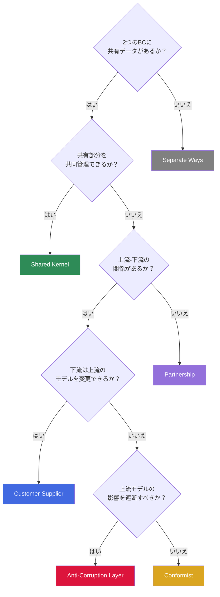
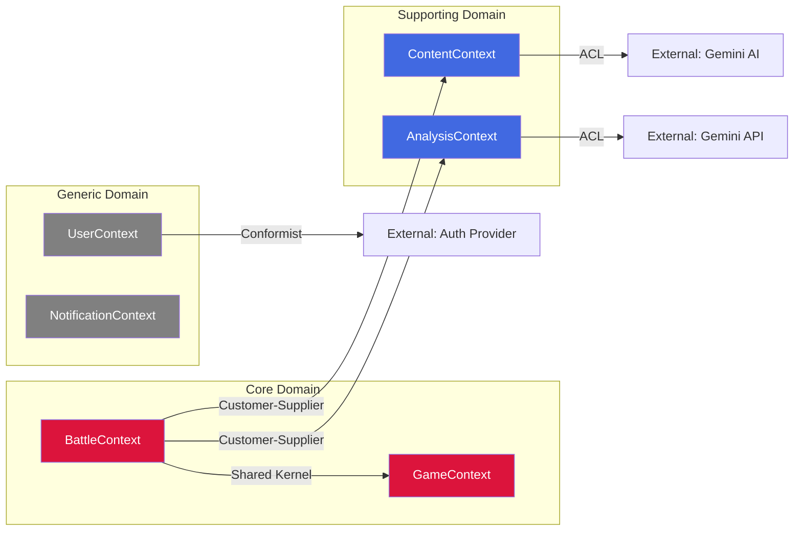
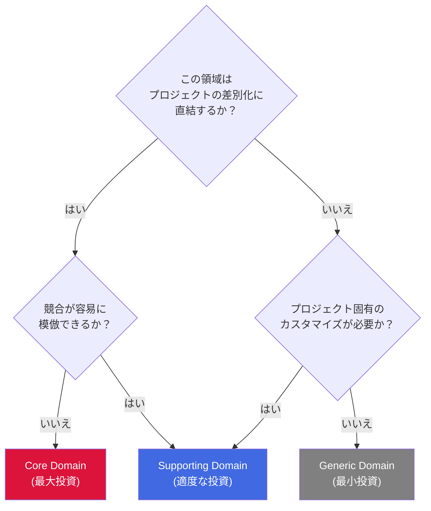
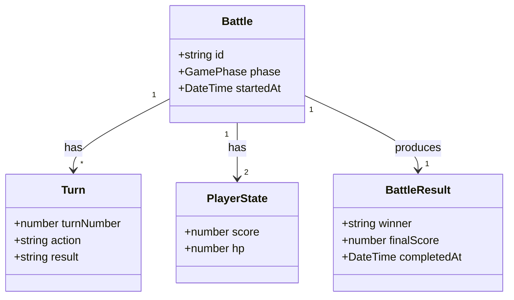
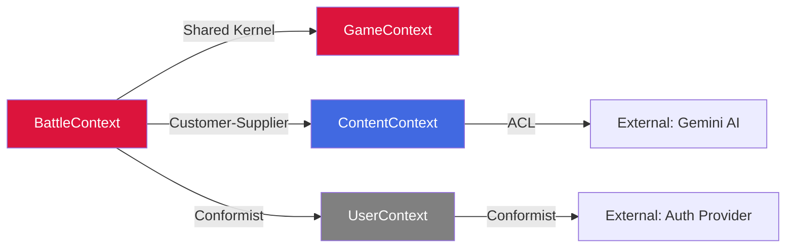

# DDD Strategic Patterns ガイド

> **用途**: `domain-modeler` スキルの3段階（Strategic DDD）および4段階（Ubiquitous Language）で参照するパターンリファレンス。
> Eric Evans の Domain-Driven Design の戦略的パターンを プロジェクト プロジェクト向けに整理したガイドです。

---

## 1. Bounded Context の識別方法

### 1.1 Bounded Context とは

Bounded Context（BC）は、特定のドメインモデルが適用される明確な境界です。同じ用語でも BC が異なれば意味が異なる場合があります（例: 「Item」は Review BC ではレビュー対象、Inventory BC では在庫品目）。

### 1.2 識別の判断基準

以下の指標を使用して BC の境界を識別します:

| 指標                     | 説明                              | 例                                              |
| ------------------------ | --------------------------------- | ----------------------------------------------- |
| **言語の境界**           | 同じ用語が異なる意味を持つ場所    | 「ターン」= ゲームターン vs APIリクエストターン |
| **チームの境界**         | 異なるチーム/責任者が管理する領域 | ゲームロジックチーム vs インフラチーム          |
| **データの境界**         | 独立して変更可能なデータの集合    | ユーザープロフィール vs 対戦履歴                |
| **ビジネスルールの境界** | 異なるルールが適用される領域      | 対戦ルール vs スコア計算ルール                  |
| **変更頻度の境界**       | 異なる頻度で変更される領域        | UIレイアウト vs AI対戦アルゴリズム              |

### 1.3 識別プロセス

```
Step 1: BRIEF.md からドメイン用語を全て抽出
    ↓
Step 2: 用語をグルーピング（意味的に関連するものをまとめる）
    ↓
Step 3: グループ間の依存関係を確認
    ↓
Step 4: 依存が弱いグループ間に境界線を引く
    ↓
Step 5: 各グループに BC 名を付与（英語 PascalCase）
    ↓
Step 6: 既存 BC との重複・統合を検討
```

### 1.4 BC の粒度ガイドライン

| 粒度         | 判断基準                        | 対応                   |
| ------------ | ------------------------------- | ---------------------- |
| **細かすぎ** | BC 内に Aggregate が1つしかない | 隣接 BC との統合を検討 |
| **適切**     | BC 内に 2-5 個の Aggregate      | そのまま維持           |
| **粗すぎ**   | BC 内に 6 個以上の Aggregate    | 分割を検討             |

**注意**: プロジェクト プロジェクトでは、機能単位（Feature）と BC が1対1で対応しないこともあります。1つの Feature が複数の BC にまたがる場合や、複数の Feature が1つの BC に属する場合があります。

---

## 2. Context Map パターン

### 2.1 パターン一覧

BC 間の関係を以下のパターンで定義します:

| パターン                  | 関係性         | 説明                                          | 使用場面               |
| ------------------------- | -------------- | --------------------------------------------- | ---------------------- |
| **Shared Kernel**         | 対等           | 両 BC が共有するモデル/コードを持つ           | 密結合が許容される場合 |
| **Customer-Supplier**     | 上下流         | Supplier が Customer のニーズに合わせて提供   | API 提供者-利用者関係  |
| **Conformist**            | 上下流（従属） | Downstream が Upstream のモデルにそのまま従う | 外部サービス利用時     |
| **Anti-Corruption Layer** | 防御的         | 変換層を挟んで外部モデルの影響を遮断          | レガシー/外部との統合  |
| **Open Host Service**     | 公開           | 標準化されたプロトコルで公開                  | 複数利用者向け API     |
| **Published Language**    | 標準化         | 共有の言語/フォーマットで通信                 | JSON スキーマ等        |
| **Separate Ways**         | 独立           | BC 間に統合なし、それぞれ独立                 | 依存不要な場合         |
| **Partnership**           | 協力           | 両チームが協力して同期的に開発                | 同時開発が必要な場合   |

### 2.2 パターン選択フローチャート



### 2.3 Mermaid での Context Map 表現



---

## 3. Core / Supporting / Generic Domain 分類

### 3.1 分類基準

| 分類                  | 定義                                 | 判断基準                           | 投資方針                     |
| --------------------- | ------------------------------------ | ---------------------------------- | ---------------------------- |
| **Core Domain**       | 競争優位性を生むプロジェクトの中核   | 「これがなければ製品の価値がない」 | 最大限の投資、独自実装       |
| **Supporting Domain** | Core を支援するが差別化要素ではない  | 「必要だが競合も持っている」       | 適度な投資、効率重視         |
| **Generic Domain**    | 汎用的で既存ソリューションで代替可能 | 「業界標準の方法で解決できる」     | 最小限の投資、既存ツール活用 |

### 3.2 分類フローチャート



### 3.3 プロジェクト プロジェクトの分類例

| 分類           | BC 例        | 理由                                           |
| -------------- | ------------ | ---------------------------------------------- |
| **Core**       | Battle, Game | AI対戦ロジックが最大の差別化要素               |
| **Core**       | Strategy     | AI戦略選択は独自のゲーム体験を提供             |
| **Supporting** | Content      | AIコンテンツ生成は重要だが、手法自体は汎用的   |
| **Supporting** | Analysis     | 対戦分析の基盤だが、分析手法自体は外部サービス |
| **Generic**    | User         | 認証・プロフィール管理は汎用的な認証で代替     |
| **Generic**    | Notification | 通知は汎用的なパターン                         |

---

## 4. Ubiquitous Language 構築ガイド

### 4.1 Ubiquitous Language とは

Ubiquitous Language（ユビキタス言語）は、ドメインエキスパートと開発者が共有する統一された言語です。コード内の命名、ドキュメント、会話で一貫して使用されます。

### 4.2 構築プロセス

```
Step 1: BRIEF.md からドメイン用語を抽出
    ↓
Step 2: 既存コードベースの命名パターンを確認
    ↓
Step 3: 用語の定義を明確化（曖昧さを排除）
    ↓
Step 4: 日英対応（EN/JA）を設定
    ↓
Step 5: 用語間の関係をマッピング
    ↓
Step 6: 所属 BC を特定
```

### 4.3 用語テーブルの作成規則

| ルール                     | 説明                             | 例                                    |
| -------------------------- | -------------------------------- | ------------------------------------- |
| **英語が正**               | コード内で使用する正式名称は英語 | `BattleResult` (not `TaisenKekka`)    |
| **PascalCase**             | クラス名・型名は PascalCase      | `BattleSession`                       |
| **camelCase**              | 変数名・メソッド名は camelCase   | `startBattle()`                       |
| **日本語はドキュメント用** | UI 表示・ドキュメントで使用      | 「対戦」                              |
| **1用語1定義**             | 曖昧さを排除し、BC 内で一意      | 「ターン」= ゲームターン（Battle BC） |

### 4.4 テーブルフォーマット

```markdown
| Term (EN)    | 日本語         | Definition                                      | Context       |
| ------------ | -------------- | ----------------------------------------------- | ------------- |
| Battle       | 対戦           | プレイヤーとAIの1回分の対戦セッション           | BattleContext |
| Turn         | ターン         | 対戦内でプレイヤーまたはAIが行動する1回分の単位 | BattleContext |
| BattleResult | 対戦結果       | 対戦の勝敗・スコア等の結果データ                | BattleContext |
| GamePhase    | ゲームフェーズ | ゲーム進行の段階（準備・対戦中・結果表示等）    | GameContext   |
| PlayerState  | プレイヤー状態 | プレイヤーの現在の状態（HP、スコア等）          | GameContext   |
```

### 4.5 用語間の関係性パターン

| 関係タイプ               | 記法           | 例                                          |
| ------------------------ | -------------- | ------------------------------------------- |
| **IS-A**（継承）         | `A is a B`     | `AIBattle` is a `Battle`                    |
| **HAS-A**（構成）        | `A has B`      | `Battle` has `Turn`                         |
| **USES**（利用）         | `A uses B`     | `BattleSession` uses `PlayerState`          |
| **PRODUCES**（生成）     | `A produces B` | `BattleEngine` produces `BattleResult`      |
| **TRIGGERS**（トリガー） | `A triggers B` | `TurnSubmitted` triggers `ScoreCalculation` |

### 4.6 Mermaid での関係性表現



---

## 5. プロジェクト プロジェクトでの適用例

### 5.1 機能例: AI対戦管理（battle）

#### Bounded Context 識別

| BC                 | 分類       | 責務                       |
| ------------------ | ---------- | -------------------------- |
| **BattleContext**  | Core       | 対戦の開始・進行・結果管理 |
| **GameContext**    | Core       | ゲームフェーズ・状態管理   |
| **ContentContext** | Supporting | AI によるコンテンツ生成    |
| **UserContext**    | Generic    | ユーザー認証・プロフィール |

#### Context Map



#### Ubiquitous Language

| Term (EN)    | 日本語         | Definition                            | Context       |
| ------------ | -------------- | ------------------------------------- | ------------- |
| Battle       | 対戦           | プレイヤーとAIの1回分の対戦セッション | BattleContext |
| Turn         | ターン         | 対戦内の1回分の行動単位               | BattleContext |
| BattleResult | 対戦結果       | 勝敗・スコア等の結果データ            | BattleContext |
| GamePhase    | ゲームフェーズ | ゲーム進行の段階                      | GameContext   |

### 5.2 既存コードベースとの統合ポイント

新機能のドメインモデリング時に確認すべき既存パターン:

| 確認項目               | 場所                        | 目的                       |
| ---------------------- | --------------------------- | -------------------------- |
| 既存 TypeScript 型定義 | `src/shared/types/`         | 命名パターン・構造の一貫性 |
| 既存 Hooks             | `src/features/**/hooks/`    | 状態管理パターンの整合     |
| API Routes             | `src/app/api/`              | 外部サービス統合パターン   |
| 既存 SPEC 文書         | `docs/features/*/SPEC-*.md` | ドメイン用語の一貫性       |

---

## 6. アンチパターン

### 6.1 避けるべきパターン

| アンチパターン        | 問題                          | 対応策                          |
| --------------------- | ----------------------------- | ------------------------------- |
| **God Context**       | 1つの BC に全てを詰め込む     | 責務ごとに BC を分割            |
| **Anemic Domain**     | ビジネスロジックのない薄い BC | ビジネスルールを BC に内包      |
| **Leaky Abstraction** | BC 間の境界が曖昧             | ACL/Published Language で明確化 |
| **Technical BC**      | 技術的関心事で BC を分割      | ビジネスドメインで分割          |
| **用語の曖昧さ**      | 同じ用語が複数の意味を持つ    | BC ごとに明確な定義を持つ       |

### 6.2 プロジェクト 固有の注意点

1. **Battle と Game の境界**: 対戦ロジックとゲーム状態管理は密結合しやすいが、異なる BC として分離を検討する
2. **Content 生成の位置付け**: AI コンテンツ生成は Supporting であり Core ではない（差別化はゲーム体験であり生成手法ではない）
3. **Gemini API の扱い**: Gemini API は External System として ACL 越しにアクセスする

---

## 変更履歴

| 日付       | バージョン | 変更内容                                 |
| ---------- | ---------- | ---------------------------------------- |
| 2026-02-11 | v1.0       | 新規生成 - DDD Strategic Patterns ガイド |
