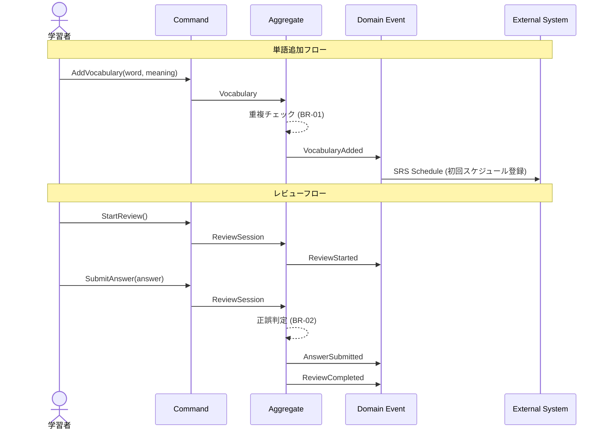
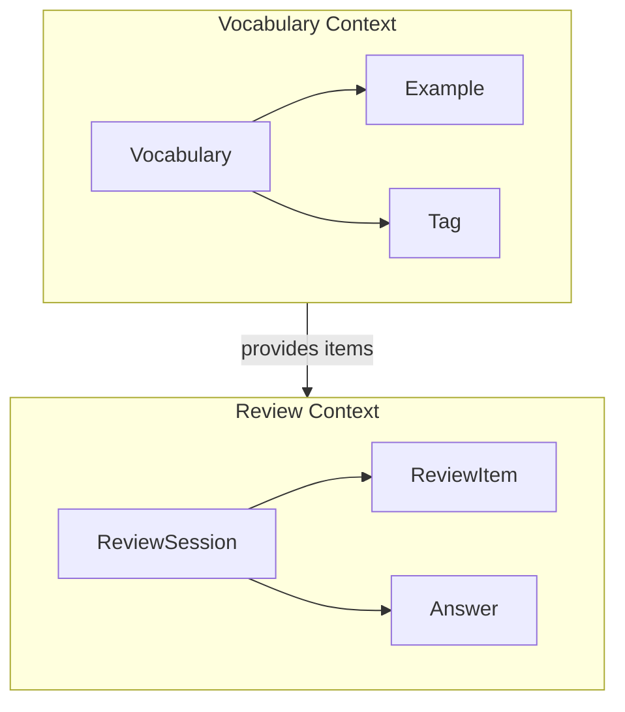
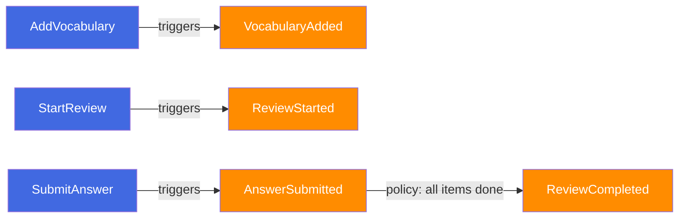

# Event Storming Lite パターンガイド

> **用途**: `domain-modeler` スキルの2段階（Event Storming Lite）で参照するパターンリファレンス。
> Alberto Brandolini の Event Storming メソッドを Hackathon Project プロジェクト向けに簡略化したガイドです。

---

## 1. Event Storming 概要

### 1.1 Event Storming とは

Event Storming は Alberto Brandolini が考案したワークショップ手法で、ドメインの振る舞いをイベント中心に可視化する手法です。ドメインエキスパートと開発者が協力してビジネスプロセスを探索し、ドメインの全体像を把握します。

### 1.2 フルバージョン vs Lite バージョン

| 要素             |          フルバージョン           |   Lite バージョン（本スキル）    |
| ---------------- | :-------------------------------: | :------------------------------: |
| 参加者           | ドメインエキスパート + 開発チーム | AI エージェント（BRIEF.md 基盤） |
| 所要時間         |           数時間〜数日            |               数分               |
| 入力ソース       |            対話・議論             |     BRIEF.md のテキスト分析      |
| Domain Events    |          全プロセス網羅           |     対象機能のスコープ内のみ     |
| Commands         |       全ユーザーアクション        |        主要アクションのみ        |
| Aggregates       |          詳細設計レベル           |       戦略レベルの識別のみ       |
| Read Models      |               含む                |               省略               |
| Policies         |               含む                |          主要ルールのみ          |
| External Systems |               含む                |         関連するもののみ         |

### 1.3 Lite 版の簡略化ポイント

1. **スコープ限定**: 対象機能（BRIEF.md）の範囲内のみ分析
2. **テキストベース**: 対話ではなく文書分析によるイベント抽出
3. **戦略レベル**: 実装詳細には踏み込まず、ドメインの構造理解に注力
4. **主要パス重視**: Happy Path + 主要な異常系のみカバー
5. **Aggregate 簡略化**: エンティティの詳細属性は定義しない

---

## 2. 変換パターン: Events → Commands → Aggregates

### 2.1 ドメインイベント（Domain Events）の抽出

**定義**: ドメイン内で発生した事実を表す。過去形で命名する。

**抽出手順**:

1. BRIEF.md の User Stories から動詞を抽出
2. 各動詞を「完了した状態」に変換
3. ビジネス上意味のあるイベントのみ残す

**命名規則**:

- 英語 PascalCase + 過去形
- `{Entity}{Action}ed` 形式
- 例: `VocabularyAdded`, `ReviewCompleted`, `LevelAssessed`

**抽出テーブル**:

| User Story の動詞    | Domain Event      | 説明                             |
| -------------------- | ----------------- | -------------------------------- |
| 単語を追加する       | `VocabularyAdded` | 新しい単語が単語帳に追加された   |
| レビューを完了する   | `ReviewCompleted` | SRS レビューセッションが完了した |
| レベルテストを受ける | `LevelAssessed`   | レベル評価が実施された           |

### 2.2 コマンド（Commands）の識別

**定義**: イベントを発生させるユーザーの意図・アクション。命令形で命名する。

**抽出手順**:

1. 各 Domain Event に対して「何がこのイベントを引き起こしたか」を問う
2. ユーザーの直接アクション → Command
3. システムの自動処理 → Policy（Lite 版では主要なもののみ）

**命名規則**:

- 英語 PascalCase + 命令形
- `{Action}{Entity}` 形式
- 例: `AddVocabulary`, `StartReview`, `SubmitAnswer`

**変換テーブル**:

| Domain Event      | Command          | Actor   | トリガー           |
| ----------------- | ---------------- | ------- | ------------------ |
| `VocabularyAdded` | `AddVocabulary`  | Learner | ユーザーアクション |
| `ReviewCompleted` | `CompleteReview` | System  | セッション終了時   |
| `LevelAssessed`   | `AssessLevel`    | System  | テスト回答送信時   |

### 2.3 アグリゲート（Aggregates）の識別

**定義**: 関連するエンティティの集合で、整合性の境界を形成する。

**抽出手順**:

1. 各 Command/Event ペアに対して「どのエンティティが責任を持つか」を問う
2. 同じライフサイクルを共有するエンティティをグループ化
3. Aggregate Root を識別

**命名規則**:

- 英語 PascalCase + 単数形
- 例: `Vocabulary`, `ReviewSession`, `LevelTest`

**識別テーブル**:

| Aggregate       | Root Entity | 関連エンティティ   | 主要インバリアント           |
| --------------- | ----------- | ------------------ | ---------------------------- |
| `Vocabulary`    | Vocabulary  | Example, Tag       | 同一単語の重複登録不可       |
| `ReviewSession` | Session     | ReviewItem, Answer | セッション内のアイテム数上限 |

---

## 3. Mermaid での表現パターン

### 3.1 イベントフロー図（Sequence Diagram）



### 3.2 Aggregate 関係図（Flowchart）



### 3.3 コマンド-イベントフロー（Flowchart）



---

## 4. Hackathon Project プロジェクトでの適用ガイドライン

### 4.1 ドメイン固有の考慮事項

Hackathon Project プロジェクトは韓国語学習 Web サービスであり、以下のドメイン特性を考慮する必要があります。

| 特性                      | 影響                             | Event Storming での対応                     |
| ------------------------- | -------------------------------- | ------------------------------------------- |
| **AI 生成コンテンツ**     | コンテンツ生成は非同期・外部依存 | External System として Edge Function を明示 |
| **音声中心学習**          | TTS/音声認識が中核               | 音声関連イベントを独立カテゴリとして扱う    |
| **SRS (間隔反復)**        | 学習スケジュールが自動計算       | Policy として SRS エンジンを明示            |
| **Supabase バックエンド** | RLS + Edge Functions             | 認証・認可イベントを考慮                    |

### 4.2 よく出現するドメインパターン

**学習セッション系**:

```
StartSession → SessionStarted → SubmitAnswer → AnswerEvaluated → CompleteSession → SessionCompleted
```

**コンテンツ生成系**:

```
RequestContent → ContentRequested → (AI Processing) → ContentGenerated → ContentPublished
```

**進捗管理系**:

```
CompleteLesson → LessonCompleted → UpdateProgress → ProgressUpdated → (Policy) → LevelUpAchieved
```

### 4.3 既存 Bounded Context との整合

新機能の Event Storming 実施時には、以下の既存 BC との境界・関係を確認してください:

| 既存 BC（推定） | 主要 Aggregate            | 関連 Edge Function    |
| --------------- | ------------------------- | --------------------- |
| Learning        | LearningSession, Lesson   | `generate-content`    |
| Review          | ReviewSession, SRSItem    | -                     |
| Assessment      | LevelTest, Question       | `level-test-evaluate` |
| Tutoring        | TutorChat, Message        | `ai-tutor-chat`       |
| Audio           | AudioClip, TTSRequest     | `cloud-tts`           |
| User            | UserProfile, Subscription | -                     |

### 4.4 イベント命名の統一規則

Hackathon Project プロジェクトでのイベント命名は以下の規則に従ってください:

1. **ドメイン接頭辞なし**: `Learning.SessionStarted` ではなく `SessionStarted`（BC 内で一意であれば十分）
2. **ビジネス用語使用**: 技術用語（`RowInserted`）ではなくビジネス用語（`VocabularyAdded`）
3. **粒度の目安**: ユーザーが認識できる単位（`ButtonClicked` は細かすぎ、`EverythingDone` は粗すぎ）

---

## 5. 出力テンプレート

### 2段階の出力セクション

```markdown
## 2. Event Storming

### 2.1 Domain Events

|  #  | Event       | Trigger              | Result                   | Aggregate        |
| :-: | ----------- | -------------------- | ------------------------ | ---------------- |
|  1  | {EventName} | {何がトリガーするか} | {結果として何が起きるか} | {所属 Aggregate} |

### 2.2 Commands & Aggregates

|  #  | Command       | Actor    | Aggregate        | Pre-conditions |
| :-: | ------------- | -------- | ---------------- | -------------- |
|  1  | {CommandName} | {実行者} | {対象 Aggregate} | {事前条件}     |

### 2.3 Event Flow

(Mermaid sequence diagram - 上記パターン3.1参照)
```

---

## 変更履歴

| 日付       | バージョン | 変更内容                                      |
| ---------- | ---------- | --------------------------------------------- |
| 2026-02-11 | v1.0       | 新規生成 - Event Storming Lite パターンガイド |
