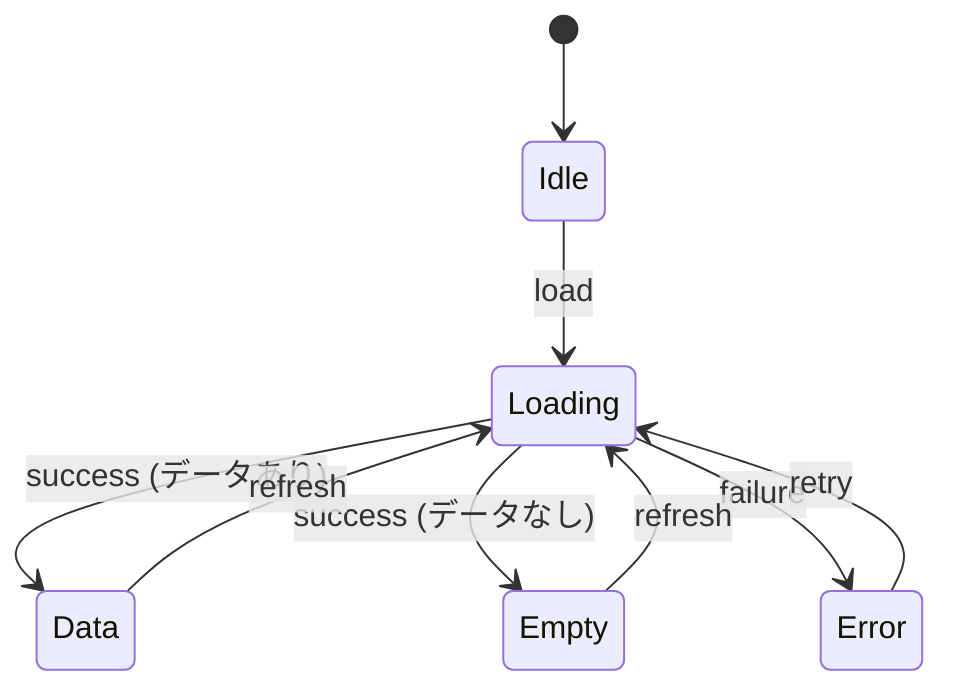

# SPEC セクション詳細ガイド

> Hackathon Project プロジェクトの Feature-First + Simplified Clean Architecture + React 19 + Zod に最適化された SPEC 作成ガイド
>
> **v3.6 (2026-02-11)**: 簡素化 - 過度な抽象化を除去、Next.js/React/TypeScript に適応
>
> - §0.4.0 Domain Model Overview (DDD 用語) 除去
> - §0.4.5 Write Operations (CQRS Command 明細) 除去
> - §0.10 Eventing & Async Processing (イベントソーシング) 除去
> - §0.2.3 State Transitions A~G サブセクション → 簡単な遷移テーブルに統合
> - §5.1 Test Fixtures JSON → テストシナリオ一覧に簡素化

---

## 核心原則: Zero-Context AI 開発可能性

> **目標**: AI が SPEC 文書のみで実装を開始できること (コード探索最小化)

このガイドの全セクションは以下の質問に「Yes」で回答できるよう設計されています:

- AI がファイルをどこに生成するか推測なしに判断できるか?
- AI がネーミング規則を推測なしに従えるか?
- AI がドメイン用語を正確に理解できるか?
- AI がデータスキーマを推測なしに実装できるか?
- AI が API リクエスト/レスポンス形式を正確に把握できるか?
- AI がエラー処理方法を明確に把握できるか?
- AI が性能/セキュリティ要件を満たせるか?
- AI がビジネスロジックを pseudocode で理解できるか?
- AI がテストデータを fixture として再利用できるか?
- AI がメッセージキー名を規則通りに生成できるか?

---

## Tier ベース SPEC (作業効率性考慮)

> **問題**: Full SPEC v3.0 は全セクションが詳細で作成コストが高い
> **解決**: 作業リスク度 (Tier) に応じて必須深度を差等適用

### Tier 判定基準

|    Tier    | リスク度    | 該当条件                                               |
| :--------: | ----------- | ------------------------------------------------------ |
| **Tier 1** | High Risk   | 認証/決済/PII、DB マイグレーション、学習データ影響     |
| **Tier 2** | Medium Risk | 外部 API、複数画面状態、データ同期                     |
| **Tier 3** | Low Risk    | 単一画面 UI、テキスト/スタイル変更、既存パターン再利用 |

### Tier 別必須深度 (v3.6 簡素化)

| セクション                       |  Tier 1 (Full)  | Tier 2 (Standard) |  Tier 3 (Lite)  |
| -------------------------------- | :-------------: | :---------------: | :-------------: |
| **§0.0 Project Context**         |     ✅ 詳細     |      ✅ 簡略      |     📝 1行      |
| §0.1 Target Files                |     ✅ 詳細     |      ✅ 詳細      |     ✅ 簡略     |
| **§0.2.1 Core State**            |  ✅ 全テーブル  |   ✅ 全テーブル   |     ✅ 簡略     |
| **§0.2.2 Architecture Guidance** |  ✅ 基準+例示   |    ✅ 基準のみ    | 📝 "単一 Hook"  |
| **§0.2.3 State Transitions**     | ✅ 遷移テーブル |  ✅ 遷移テーブル  |   📝 テキスト   |
| §0.3 Error Handling              |     ✅ 全体     |    ✅ テーブル    |   📝 テキスト   |
| §0.4.1 Zod スキーマ              |     ✅ 全体     |      ✅ 全体      |  📝 または N/A  |
| §0.4.2 DB スキーマ               |     ✅ 全体     |      ✅ 全体      |  📝 または N/A  |
| **§0.5 API Contract**            |     ✅ 全体     |      ✅ 全体      |  📝 または N/A  |
| **§0.6 NFR**                     |     ✅ 詳細     |     ✅ 標準値     | 📝 "一般 CRUD"  |
| §0.7 AI Logic & Prompts          |   ✅ (AI 時)    |    ✅ (AI 時)     |    N/A 許容     |
| §0.8 Safety & Guardrails         |   ✅ (AI 時)    |    ✅ (AI 時)     |    N/A 許容     |
| **§0.9 Design Tokens**           |     ✅ 詳細     |      ✅ 簡略      |  📝 "既存使用"  |
| §1 概要                          |       ✅        |        ✅         |       ✅        |
| **§1.5 Screen Flow**             | ✅ ダイアグラム |    ✅ テーブル    |   📝 テキスト   |
| §2 FR                            |   ✅ BDD 5列    |    ✅ BDD 5列     |   ✅ BDD 簡略   |
| **§2.X Business Rules**          |  ✅ Pseudocode  |    ✅ テキスト    |     📝 簡略     |
| §3 依存性/リスク                 |    ✅ Top 3     |     ✅ Top 3      |     📝 1行      |
| §4 画面文書                      |     ✅ 詳細     |      ✅ 簡略      |  📝 スキップ可  |
| **§5 検証 & テスト**             | ✅ シナリオ一覧 |      ✅ 簡略      |  📝 スキップ可  |
| **§6 メッセージ定義**            |     ✅ 詳細     |      ✅ 簡略      | 📝 キー一覧のみ |
| §7 変更履歴                      |       ✅        |        ✅         |       ✅        |

**凡例**: ✅ 必須, 📝 簡略/テキスト許容

### SPEC-Lite 例示 (Tier 3)

```markdown
# 029: コード入力 UI 改善

> **状態**: 進行中 (30%) | **優先度**: P2 | **修正日**: 2026-02-11
> **SPEC バージョン**: v3.5 Lite (Tier 3)

---

## 0. AI 実装契約

### 0.0 Project Context

既存 code-input モジュール拡張、新規ファイルなし

### 0.1 Target Files

| レイヤー | 範囲 (Glob)                             | 作業 | 条件 |
| -------- | --------------------------------------- | :--: | ---- |
| UI       | `src/features/code-input/components/**` |  🔄  | -    |

### 0.2 State & Architecture

既存 `useCodeInput` Hook 再利用、UI レイヤーのみ変更 (単一 Hook 維持)

### 0.3 Error Handling

既存パターン維持

### 0.4-0.8

**N/A** - 既存実装再利用

### 0.9 Design Tokens

既存テーマ使用

---

## 1. 概要

目標: コード入力エリアの可読性向上 (シンタックスハイライト追加)

---

## 2. 機能要求事項

### FR-02901: シンタックスハイライト

| AC  | Given          | When         | Then                   | 観測点                      |
| :-: | -------------- | ------------ | ---------------------- | --------------------------- |
| AC1 | コード入力状態 | 言語選択変更 | 対応するハイライト適用 | `language === 'typescript'` |

---

## 6. i18n

- `code_input_language_label`: "言語"
- `code_input_language_typescript`: "TypeScript"

---

## 7. 変更履歴

| 日付       | バージョン | 変更 |
| ---------- | ---------- | ---- |
| 2026-02-11 | v1.0       | 初稿 |
```

### いつ SPEC-Lite を使用するか?

| 状況                   | 推奨                        |
| ---------------------- | --------------------------- |
| 新機能、API 含む       | **Full SPEC v3.5**          |
| 既存機能拡張、API 変更 | **Standard (Tier 2)**       |
| UI 改善、バグ修正      | **SPEC-Lite (Tier 3)** 許容 |

> **注意**: Tier 誤判時 AI 実装品質低下。不確実なら**上位 Tier**を選択

---

## セクション 0: AI 実装契約 (必須)

> **目的**: AI が実装開始前に把握すべき核心情報を一目で提供
> **原則**: コードから抽出可能な情報でも SPEC に要約して AI のコンテキスト収集コストを削減

---

### 0.0 Project Context (v3.0 新規)

> **目的**: AI がネーミング、用語を推測なしに判断できるように
> **ファイル配置**: AI が既存コードベースパターンを参照して自律決定

#### 0.0.1 Naming Conventions

```markdown
#### 0.0.2 Naming Conventions

| 対象           | パターン                         | 例示                             |
| -------------- | -------------------------------- | -------------------------------- |
| Custom Hook    | `use{Feature}`                   | `useCodeInput`                   |
| State 型       | `{Feature}State`                 | `CodeInputState`                 |
| 型定義         | `{Entity}` または `{Entity}Type` | `CodeSubmission`                 |
| イベント       | `on{Action}`                     | `onSubmitCode`, `onAnalyze`      |
| メッセージキー | `{screen}_{element}_{state}`     | `code_input_submit_button_label` |
| コンポーネント | `{Feature}{Role}` (PascalCase)   | `CodeInputPanel`, `QuizOption`   |
| API Route      | `/api/{feature}/{action}`        | `/api/analysis/analyze`          |
```

**作成原則**:

- コードベースの既存コンベンションと一致すること
- AI がネーミングを推測しないよう具体的な例示を含める

#### 0.0.2 Glossary

```markdown
#### 0.0.2 Glossary

> **参照**: [docs/glossary.md](../glossary.md) - プロジェクト全体用語集
> この機能で使用するドメイン用語は glossary.md を参照

**この機能関連の核心用語**:

| 用語    | 定義   | コード表現    |
| ------- | ------ | ------------- |
| {Term1} | {定義} | `{TypeName}`  |
| {Term2} | {定義} | `{fieldName}` |

> ℹ️ 用語追加が必要な場合は glossary.md に先に登録してから参照
```

**作成原則**:

- **SSOT**: `docs/glossary.md` が真実の原泉
- SPEC ではこの機能で使用する核心用語のみ抜粋
- 新しい用語は glossary.md に先に登録

---

### 0.1 Target Files (範囲ベース)

> **v3.1 変更**: 具体的なファイルパス代わりに **Glob パターン** 使用
> **SSOT**: CONTEXT.json の `references.related_code` が実際のファイル一覧管理

```markdown
| レイヤー  | 範囲 (Glob)                             | 作業 | 条件          | 備考                         |
| --------- | --------------------------------------- | :--: | ------------- | ---------------------------- |
| 型定義    | `src/features/code-input/types/**`      |  🆕  | -             | Zod スキーマ + TypeScript 型 |
| Hook      | `src/features/code-input/hooks/**`      |  🆕  | -             | カスタム Hook (状態管理)     |
| API       | `src/features/code-input/api/**`        |  🆕  | -             | API 呼び出し                 |
| UI        | `src/features/code-input/components/**` |  🆕  | -             | React コンポーネント         |
| Test      | `tests/unit/features/code-input/**`     |  🆕  | -             | 単体テスト                   |
| API Route | `src/app/api/analysis/**`               |  🆕  | AI 分析選択時 | 条件付き                     |
```

**作業タイプ**:
| アイコン | 意味 |
|:------:|------|
| 🆕 | 新規作成 |
| 🔄 | 既存修正 |
| ⚡ | 条件付き (条件列参照) |

**作成原則**:

- Glob パターンで範囲指定 (`**`, `*` 使用)
- **条件付きファイル**は条件列にトリガー条件明示
- 具体的なファイル一覧は CONTEXT.json の `references.related_code` 参照
- 実装後 CONTEXT.json 更新が SSOT 維持の核心

**例示: 条件付きファイル処理**:

```markdown
| レイヤー  | 範囲                             | 作業 | 条件            | 備考         |
| --------- | -------------------------------- | :--: | --------------- | ------------ |
| API Route | `src/app/api/analysis/**`        |  ⚡  | Option A 選択時 | サーバー分析 |
| Client    | `src/features/code-input/lib/**` |  ⚡  | Option B 選択時 | ローカル処理 |
```

→ ユーザーが Option A を選択すれば API Route のみ実装

#### §0.1 ↔ §0.4 交差参照検証 (v3.7 新規)

> **目的**: Data Schema(§0.4) で定義した項目が Target Files(§0.1) に漏れなく反映されることを保証
> **検証時点**: SPEC 作成完了後 Phase 4 検証段階

| §0.4 で定義              | §0.1 に必須反映      | 検証ルール                                 |
| ------------------------ | -------------------- | ------------------------------------------ |
| §0.4.1 新規 Zod スキーマ | `型定義` レイヤー    | スキーマ定義時ファイルパス必須             |
| §0.5 新規 API Route      | `API Route` レイヤー | エンドポイント定義時ルートディレクトリ必須 |

**漏れ防止チェックリスト**:

- [ ] §0.4.1 で `AnalysisResultSchema` のような新規スキーマ定義 → §0.1 に `src/features/{domain}/types/{schema}.ts` 追加
- [ ] §0.5 で新規 API Route 定義 → §0.1 に `src/app/api/{name}/route.ts` 追加

**よく発生する漏れパターン**:

```markdown
❌ 誤った例 (型定義レイヤー漏れ):
| レイヤー | 範囲 | 作業 |
|---------|------|:----:|
| Hook | `src/features/analysis/hooks/**` | 🆕 | ← Hook のみあり
| UI | `src/features/analysis/components/**` | 🆕 | ← 型定義レイヤーなし!

§0.4.1 で AnalysisResultSchema 定義 → 型定義レイヤー必須!

✅ 正しい例:
| レイヤー | 範囲 | 作業 |
|---------|------|:----:|
| 型定義 | `src/features/analysis/types/**` | 🆕 | ← 追加
| Hook | `src/features/analysis/hooks/**` | 🆕 |
| UI | `src/features/analysis/components/**` | 🆕 |
```

---

### 0.2 State & Architecture (v3.5 改編)

> **v3.5 変更**: 処方的な Provider リスト → **原則ベースのガイドライン**に転換
> **目的**: AI が機能複雑度に合わせて自律的に設計しつつ、一貫したパターンに従うように

---

#### 0.2.1 Core State (必須)

> **目的**: AI が管理すべき**核心状態要素**を定義
> **原則**: 状態構造は明示するが、実装ファイル数は AI が SRP 基準で決定

````markdown
#### 0.2.1 Core State

##### 状態要素定義

| 状態要素 | 型                   | 必須 | 用途                                     | 初期値   |
| -------- | -------------------- | :--: | ---------------------------------------- | -------- |
| `items`  | `CodeSubmission[]`   |  ✅  | データ一覧                               | `[]`     |
| `status` | `ScreenStatus`       |  ✅  | 画面状態 (idle/loading/data/empty/error) | `'idle'` |
| `error`  | `AppError \| null`   |  ⚪  | エラー情報                               | `null`   |
| `filter` | `CodeFilter \| null` |  ⚪  | フィルター条件                           | `null`   |

##### 状態 enum 定義 (推奨)

```typescript
type ScreenStatus = 'idle' | 'loading' | 'data' | 'empty' | 'error';
```
````

##### 派生状態 (Derived State)

| 派生状態        | 計算式                                        | 用途                   |
| --------------- | --------------------------------------------- | ---------------------- |
| `hasData`       | `status === 'data' && items.length > 0`       | データ表示条件         |
| `filteredItems` | `filter ? applyFilter(items, filter) : items` | フィルタリング済み一覧 |
| `itemCount`     | `filteredItems.length`                        | UI 表示用              |

````

**Core State 作成原則**:
- **核心状態要素**のみ定義 (実装詳細ではない)
- 派生状態は Hook の `useMemo` で実装
- 状態要素の**初期値**を明示して AI がテスト作成時に活用

---

#### 0.2.2 Architecture Guidance (ガイドライン)

> **目的**: AI が **SRP (単一責任原則)** に従い自律的にファイルを分離するよう案内
> **核心**: 具体的なファイルリスト代わりに**分離基準**と**ネーミング規則**を提供

```markdown
#### 0.2.2 Architecture Guidance

##### Hook 分離基準 (SRP 原則)

| 条件 | 推奨行動 | 例示 |
|------|---------|------|
| 画面1つ、単純 CRUD | 単一 Hook | `useCodeInput` |
| 画面2つ+ (一覧/詳細) | 画面別 Hook 分離 | `useCodeList`, `useCodeDetail` |
| 複雑なフォーム検証 | 別途 Form Hook | `useCodeForm` |
| 複数画面で状態共有 | Context + Hook | `CodeInputProvider` + `useCodeInputContext` |

##### API 分離基準

| 条件 | 推奨行動 | 例示 |
|------|---------|------|
| 単純 API 呼び出し | API 関数1つ | `analyzeCode()` |
| 外部 API 連携 (AI 等) | 外部 API 別分離 | `analyzeCode()`, `generateQuiz()` |
| 複雑なビジネスロジック | ドメインサービス分離 | `analysisService` |

##### ネーミング規則 (必須準拠)

| 対象 | パターン | 例示 |
|------|---------|------|
| **Hook (一覧)** | `use{Feature}List` | `useCodeList` |
| **Hook (詳細)** | `use{Feature}Detail` | `useCodeDetail` |
| **Hook (フォーム)** | `use{Feature}Form` | `useCodeForm` |
| **Hook (単一)** | `use{Feature}` | `useCodeInput` |
| **API 関数** | `{action}{Feature}` | `analyzeCode`, `fetchExplanation` |
| **型定義** | `{Feature}State` | `CodeInputState` |
| **コンポーネント** | `{Feature}{Role}` | `CodeInputPanel`, `CodeInputForm` |

##### React ライフサイクルガイドライン

| 状況 | パターン | 理由 |
|------|---------|------|
| 画面別状態 (基本) | `useState` / `useReducer` | メモリ節約、コンポーネントアンマウント時解放 |
| アプリ全域状態 (テーマ等) | `Context` + `useContext` | アプリ終了まで維持 |
| サーバー状態 (API データ) | `fetch` + `useState` / SWR | キャッシュ管理 |
| 高コスト計算 | `useMemo` | 再計算防止 |

##### AI 設計決定フロー

````

1. FR (機能要求事項) 分析
   ↓
2. 画面数把握 (Screen Flow 参照)
   ↓
3. Hook 分離要否決定
   ├── 画面1つ + 単純 → 単一 Hook
   └── 画面2つ+ または複雑 → 分離
   ↓
4. API 分離要否決定
   ├── 単純 API → 単一関数
   └── 外部 API/複雑ロジック → 分離
   ↓
5. ネーミング規則適用
   ↓
6. ライフサイクル決定 (useState/useContext/useMemo)

```

```

**Architecture Guidance 作成原則**:

- **分離基準**を明確にして AI が一貫した判断が可能
- **ネーミング規則**は必須準拠 (一貫性保証)
- **"例示" セクションは選択的** - 複雑な機能でのみ追加
- Tier 別に異なる適用:
  - Tier 3 (単純): 分離基準のみ参照、大部分単一 Hook
  - Tier 1-2 (複雑): 分離基準 + 具体的例示推奨

##### Tier 別 §0.2.2 作成深度

| 項目           |  Tier 1 (Full)  | Tier 2 (Standard) |   Tier 3 (Lite)    |
| -------------- | :-------------: | :---------------: | :----------------: |
| Core State     |  ✅ 全テーブル  |   ✅ 全テーブル   |  ✅ 簡略テーブル   |
| 分離基準参照   | ✅ + 具体的例示 |    ✅ 基準のみ    |   📝 "単一 Hook"   |
| ネーミング規則 |     ✅ 全体     |      ✅ 全体      |      ✅ 全体       |
| ライフサイクル |     ✅ 詳細     |      ✅ 基本      | 📝 "useState 基本" |

---

### 0.2.3 State Transitions (簡素化)

> **目的**: AI が状態遷移を正確に理解するよう核心情報のみ提供

````markdown
#### 0.2.3 State Transitions

##### 状態一覧

| 状態      | 説明           |
| --------- | -------------- |
| `idle`    | 初期状態       |
| `loading` | データロード中 |
| `data`    | データ表示中   |
| `empty`   | データなし     |
| `error`   | エラー発生     |

##### 遷移テーブル

| From      | Event                  | To        | 備考           |
| --------- | ---------------------- | --------- | -------------- |
| `idle`    | `load`                 | `loading` | 画面進入時     |
| `loading` | `success (データあり)` | `data`    | -              |
| `loading` | `success (データなし)` | `empty`   | -              |
| `loading` | `failure`              | `error`   | エラーロギング |
| `data`    | `refresh`              | `loading` | -              |
| `error`   | `retry`                | `loading` | 最大3回        |

##### 状態ダイアグラム (Mermaid)


````

````

**作成原則**:
- 状態一覧と遷移テーブルのみ必須
- 複雑な場合のみ Mermaid ダイアグラム追加
- コードパターンは AI が既存コードベースを参照

---

### 0.3 Error Handling Policy (拡張)

> **v3.0 拡張**: 4つのサブセクションに細分化

#### 0.3.1 Error Classification

```markdown
| エラータイプ | コード範囲 | リトライ可能 | ロギング必須 |
|------------|-----------|:-----------:|:---------:|
| Validation | `VALIDATION_*` | ❌ | ❌ |
| Network | `NETWORK_*` | ✅ | ✅ |
| Auth | `AUTH_*` | 条件付き | ✅ |
| Business | `BIZ_*` | ❌ | ⭕ |
| System | `SYSTEM_*` | ✅ | ✅ |
````

#### 0.3.2 User-Facing Messages

```markdown
| エラーコード          | ユーザーメッセージ (ja)          | メッセージキー              |
| --------------------- | -------------------------------- | --------------------------- |
| `NETWORK_OFFLINE`     | "ネットワークに接続してください" | `error_network_offline`     |
| `VALIDATION_REQUIRED` | "{field}を入力してください"      | `error_validation_required` |
| `AUTH_EXPIRED`        | "再ログインが必要です"           | `error_auth_expired`        |
```

#### 0.3.3 Recovery Actions

```markdown
| エラータイプ |     自動復旧     | ユーザーアクション | UI 表示       |
| ------------ | :--------------: | ------------------ | ------------- |
| Network      |   3回リトライ    | リトライボタン     | Toast + Retry |
| Auth         | トークン更新試行 | 再ログイン         | Dialog        |
| Validation   |        -         | フィールド修正     | Inline error  |
| Business     |        -         | 案内確認           | Dialog        |
```

#### 0.3.4 Logging Requirements

```markdown
| エラータイプ | ログレベル | 含む情報                      | サンプリング |
| ------------ | ---------- | ----------------------------- | ------------ |
| Network      | WARN       | `url`, `status`, `duration`   | 100%         |
| Auth         | ERROR      | `user_id`, `action`, `reason` | 100%         |
| Business     | INFO       | `action`, `params`            | 10%          |
| System       | ERROR      | `stack_trace`, `context`      | 100%         |
```

**Fail-Fast 原則**:

- 不正な入力は即座に検証して失敗処理
- Silent failure 禁止 (`catch (e) {}` 禁止)
- 全てのエラーは logger で記録

---

### 0.4 Data Schema & Security (必須)

> **v3.0**: Zod スキーマだけでなく **API スキーマ** も必須記載
> **SSOT**: `src/features/{feature}/types/` が真実の原泉、SPEC は要約 + 意図記録

#### 0.4.1 Zod スキーマ (フロントエンド側)

```markdown
| スキーマ               | フィールド/型                         | nullable | 備考               |
| ---------------------- | ------------------------------------- | :------: | ------------------ |
| `CodeSubmissionSchema` | `id: z.string()`                      |    ❌    | UUID               |
|                        | `code: z.string()`                    |    ❌    | 提出コード         |
|                        | `language: z.string()`                |    ❌    | プログラミング言語 |
|                        | `errorMessage: z.string().optional()` |    ⭕    | エラーメッセージ   |
|                        | `goal: z.string().optional()`         |    ⭕    | 学習目標           |
|                        | `createdAt: z.string().datetime()`    |    ❌    |                    |
```

**Zod スキーマ規則**:

- `z.object()` でスキーマ定義
- `z.infer<typeof Schema>` で TypeScript 型を導出
- バリデーションメッセージは日本語で定義

##### 0.4.1.1 Model Invariants (v3.3 新規)

> **目的**: モデルレベルで絶対に壊れてはいけないルール定義
> **検証時点**: Zod parse、ファクトリ関数、状態更新時

````markdown
#### Model Invariants

| Model            |  INV-ID  | 不変条件                      | 検証方法                   | 違反時     |
| ---------------- | :------: | ----------------------------- | -------------------------- | ---------- |
| `CodeSubmission` | M-INV-01 | `code` は空文字不可           | `z.string().min(1)`        | `ZodError` |
| `CodeSubmission` | M-INV-02 | `language` はサポート言語のみ | `z.enum([...])`            | `ZodError` |
| `QuizAnswer`     | M-INV-03 | `selectedIndex` >= 0          | `z.number().nonnegative()` | `ZodError` |

**不変条件実装パターン**:

```typescript
import { z } from 'zod';

/** コード提出スキーマ - 不変条件を Zod で保証 */
export const CodeSubmissionSchema = z.object({
  id: z.string().uuid(),
  // M-INV-01: code は空文字不可
  code: z.string().min(1, 'コードを入力してください'),
  // M-INV-02: language はサポート言語のみ
  language: z.enum(['typescript', 'javascript', 'python', 'java']),
  errorMessage: z.string().optional(),
  goal: z.string().optional(),
  createdAt: z.string().datetime(),
});

export type CodeSubmission = z.infer<typeof CodeSubmissionSchema>;
```
````

````

**Model Invariants 作成原則**:
- すべての**ビジネス核心制約**を不変条件として文書化
- 検証失敗時の動作 (例外 vs 自動補正) を明示
- **Zod スキーマで検証** (ランタイム保証)

---

### 0.5 API Contract (必須) - Hybrid v3.1

> **v3.1 更新**: ハイブリッド方式 (Schema テーブル + Example JSON) 導入
> **SSOT 原則**: コードの `route.ts` > Schema テーブル > Example JSON
> **検証**: `spec-validator` が Example ↔ Schema 一致を自動検証

#### API 使用有無判断

| 状況 | 処理 |
|------|------|
| API Route **なし** | `§0.5: N/A - クライアント処理のみ` 明示 |
| エンドポイント **1-2個** | §0.5 にハイブリッド形式で作成 |
| エンドポイント **3個+** または **100行+** | 別途 `API-{NNN}.md` 分離 |

#### §0.5 ハイブリッド形式 (v3.1)

```markdown
### 0.5 API Contract

> **SSOT**: `src/app/api/analysis/route.ts`

#### エンドポイント一覧

| ID | Method | Path | Auth | Idempotent | Description |
|----|--------|------|:----:|:----------:|-------------|
| API-001-01 | POST | `/api/analysis/analyze` | ❌ | ❌ | コード分析 |

#### API-001-01: analyze

##### Request Schema (SSOT)

| Field | Type | Required | Constraints | Description | Example |
|-------|------|:--------:|-------------|-------------|---------|
| `code` | string | ✅ | minLength: 1, maxLength: 10000 | 分析対象コード | `"function add..."` |
| `language` | string | ✅ | enum: typescript, javascript, python, java | 言語 | `"typescript"` |
| `errorMessage` | string | ⚪ | maxLength: 2000 | エラーメッセージ | `"TypeError..."` |
| `goal` | string | ⚪ | maxLength: 500 | 学習目標 | `"配列操作を理解する"` |

##### Request Example

```json
{
  "code": "function add(a, b) { return a + b; }",
  "language": "typescript",
  "goal": "関数の基本を理解する"
}
````

##### Response Schema (SSOT)

| Field              | Type   | Required | Constraints         | Description      | Example              |
| ------------------ | ------ | :------: | ------------------- | ---------------- | -------------------- |
| `status`           | string |    ✅    | enum: `ok`, `error` | 処理結果         | `"ok"`               |
| `data`             | object |    ⚪    | -                   | 成功時結果       | `{}`                 |
| `data.explanation` | string |    ⚪    | -                   | 教育的説明       | `"この関数は..."`    |
| `data.diff`        | object |    ⚪    | -                   | コード改善提案   | `{}`                 |
| `error`            | object |    ⚪    | status=error 時     | エラー情報       | `{}`                 |
| `error.code`       | string |    ⚪    | UPPER_SNAKE_CASE    | エラーコード     | `"INVALID_INPUT"`    |
| `error.message`    | string |    ⚪    | -                   | エラーメッセージ | `"コードは必須です"` |

##### Success Response Example (200 OK)

```json
{
  "status": "ok",
  "data": {
    "explanation": "この関数は2つの引数を受け取り...",
    "diff": {
      "before": "function add(a, b) { return a + b; }",
      "after": "function add(a: number, b: number): number { return a + b; }"
    }
  }
}
```

##### Error Codes

| HTTP | Code             | Condition          | User Message (ja)            | Client Action            |
| :--: | ---------------- | ------------------ | ---------------------------- | ------------------------ |
| 400  | `INVALID_INPUT`  | 必須フィールド漏れ | "入力内容を確認してください" | Inline エラー表示        |
| 429  | `RATE_LIMITED`   | リクエスト過多     | "しばらくお待ちください"     | 指数バックオフ後リトライ |
| 500  | `INTERNAL_ERROR` | サーバーエラー     | "エラーが発生しました"       | リトライ (最大2回)       |

````

#### ハイブリッド形式作成原則

| 要素 | 必須 | 役割 | 検証方法 |
|------|:----:|------|---------|
| **Schema テーブル** | ✅ | 型/制約条件定義 (SSOT) | spec-validator |
| **Request Example** | ✅ | 実際のリクエスト形態 | Schema と一致検証 |
| **Response Example** | ✅ | 実際のレスポンス形態 | Schema と一致検証 |
| **Error Codes テーブル** | ✅ | エラー一覧 + 対応 | - |
| **Error Examples** | ✅ | エラーレスポンス形態 | Error Codes と一致検証 |

---

### 0.6 NFR (Non-Functional Requirements) - 必須

> **目的**: AI が品質基準を満たす実装ができるよう明確な目標提示

```markdown
### 0.6 NFR (非機能要求事項)

#### パフォーマンス (Performance)

| 指標 | 目標 | 測定方法 |
|------|------|---------|
| **初回応答時間** | < 500ms | API 呼び出し開始 → 初バイト受信 |
| **全体応答時間** | < 2s (P95) | API 呼び出し開始 → 完了 |
| **ストリーミング開始** | < 1s | (ストリーミング API のみ) 初チャンク受信 |

#### 同時性 (Concurrency)

| 項目 | 予想値 | 備考 |
|------|--------|------|
| **同時ユーザー** | ~100名 | MVP 基準 |
| **ユーザー当たりリクエスト頻度** | 1回/10秒 | 平均 |
| **ピーク倍数** | 3x | ピーク時300同時リクエスト |

#### 信頼性 (Reliability)

| 項目 | ポリシー | 備考 |
|------|---------|------|
| **リトライ** | 最大2回、指数バックオフ | Network/5xx のみ |
| **タイムアウト** | 30秒 | クライアント側 |

#### コスト (Cost) - AI 使用機能のみ

| 項目 | 上限 | 備考 |
|------|------|------|
| **LLM 呼び出し回数** | 10回/ユーザー/日 | 無料プラン |
| **トークン上限** | 入力 2K、出力 1K | リクエスト当たり |
| **月間コスト上限** | $100 | 全ユーザー合計 |

#### 可観測性 (Observability)

| 項目 | 内容 |
|------|------|
| **ログ項目** | `user_id`, `action`, `duration_ms`, `status` |
| **メトリクス** | `analysis_total`, `analysis_duration_seconds` |
| **アラート条件** | エラー率 > 5% (5分間), P95 > 3s |
````

**NFR 作成原則**:

- すべての数値は**測定可能**であること
- AI 使用機能は**コスト上限**必須
- 該当なしの項目は "N/A" 明示 (空セクション禁止)

---

### 0.7 AI Logic & Prompts (AI 機能必須)

> **目的**: AI が AI 機能を実装する際にプロンプトと動作を正確に再現できるように

```markdown
### 0.7 AI Logic & Prompts

> ⚠️ **AI 機能必須セクション** - LLM/GenAI を使用しない機能は "N/A" 明示

#### 0.7.1 AI 役割定義

| 役割          | 責任                     | 使用モデル | トークン上限      |
| ------------- | ------------------------ | ---------- | ----------------- |
| **Analyzer**  | コード分析、問題点抽出   | Gemini     | 入力 2K, 出力 1K  |
| **Explainer** | 教育的説明生成           | Gemini     | 入力 2K, 出力 2K  |
| **QuizMaker** | 理解度チェッククイズ生成 | Gemini     | 入力 1K, 出力 512 |

#### 0.7.2 System Prompt テンプレート

> SSOT: `src/config/gemini-config.ts` または API Route 内

**Analyzer Prompt**:
```

You are a programming education assistant.
Analyze the submitted code and provide educational feedback.

## Context

- Language: {{language}}
- User Goal: {{goal}}
- Error (if any): {{errorMessage}}

## Analysis Rules

1. Identify key concepts demonstrated in the code
2. Find potential improvements with educational explanations
3. If there's an error, explain why it occurs and how to fix it

## Output Format (JSON only)

{ "concepts": [...], "improvements": [...], "errorAnalysis": {...} }

````

#### 0.7.3 Response Schema (Structured Output)

> **必須**: Gemini responseSchema で強制、自由テキスト応答禁止

**Analyzer Response**:
```json
{
  "type": "object",
  "required": ["concepts", "improvements"],
  "properties": {
    "concepts": { "type": "array", "items": { "type": "string" } },
    "improvements": { "type": "array", "items": { "type": "object" } },
    "errorAnalysis": { "type": "object" }
  }
}
````

#### 0.7.4 Prompt 変数注入

| 変数               | ソース          | 型     | 必須 |
| ------------------ | --------------- | ------ | :--: |
| `{{language}}`     | リクエスト body | string |  ✅  |
| `{{goal}}`         | リクエスト body | string |  ⚪  |
| `{{errorMessage}}` | リクエスト body | string |  ⚪  |

````

**AI Logic 作成原則**:
- System Prompt は**実際に使用する全テキスト**記載 (要約禁止)
- 変数プレースホルダーは `{{variable}}` 形式統一
- Response Schema は**実際のスキーマと同一**であること
- トークン上限はコスト計算の根拠

---

### 0.8 Safety & Guardrails (AI 機能必須)

> **目的**: AI 応答の安全性、一貫性、品質保証

```markdown
### 0.8 Safety & Guardrails

> ⚠️ **AI 機能必須セクション** - LLM/GenAI を使用しない機能は "N/A" 明示

#### 0.8.1 入力検証 (Input Validation)

| 検証項目 | ルール | 失敗時処理 |
|---------|--------|----------|
| 入力長 | max 10000文字 (code) | 400 Bad Request + クライアント通知 |
| 禁止語フィルター | 悪意あるコード検出 | 入力拒否 + 警告メッセージ |
| インジェクション防止 | プロンプトインジェクション除去 | 自動エスケープ |

#### 0.8.2 出力検証 (Output Validation)

| 検証項目 | ルール | 失敗時処理 |
|---------|--------|----------|
| JSON パース | responseSchema 準拠 | リトライ1回 → デフォルト応答 |
| 応答長 | max 5000文字 | 自動 truncate |

#### 0.8.3 Rate Limiting

| 制限項目 | 無料プラン | 超過時 |
|---------|-----------|--------|
| AI 呼び出し/分 | 5回 | 429 + 待機時間表示 |
| AI 呼び出し/日 | 50回 | 日次上限通知 |

#### 0.8.4 Fallback 戦略

| 失敗タイプ | Fallback | ユーザーメッセージ |
|----------|----------|----------------|
| LLM タイムアウト (>30s) | 事前定義応答使用 | "しばらくしてからもう一度お試しください" |
| JSON パース失敗 | リトライ1回後デフォルト応答 | (透過的に処理) |
| Rate Limit 超過 | 拒否 | "リクエストが多すぎます。{{seconds}}秒後にお試しください" |
````

**Safety 作成原則**:

- **すべての AI 機能に必須** (該当なしなら "N/A" 明示)
- Fallback はユーザー体験を考慮した**具体的メッセージ**含む
- Rate Limit は明示

---

### 0.9 Design Tokens (v3.0 新規)

> **目的**: AI がハードコーディングなしにテーマシステムを使用するように
> **SSOT**: `src/app/globals.css` および CLAUDE.md デザインシステムセクション

```markdown
### 0.9 Design Tokens

> **参照**: CLAUDE.md デザインシステムセクション (Terminal Noir)

#### 0.9.1 Color Tokens

| 用途           | トークン                      | 使用コンテキスト           |
| -------------- | ----------------------------- | -------------------------- |
| Primary Action | `text-primary` / `bg-primary` | CTA ボタン、強調テキスト   |
| Error State    | `text-destructive`            | エラーメッセージ、検証失敗 |
| Surface        | `bg-card`                     | カード背景                 |
| On Surface     | `text-card-foreground`        | カード上テキスト           |
| Muted          | `text-muted-foreground`       | 補助テキスト               |

**禁止パターン**:

- ❌ `text-red-500` → ✅ `text-destructive`
- ❌ `bg-[#1e3a8a]` → ✅ `bg-card`
- ❌ `text-white` → ✅ `text-foreground`

#### 0.9.2 Typography Tokens

| 用途           | Tailwind クラス                    | 使用コンテキスト   |
| -------------- | ---------------------------------- | ------------------ |
| Page Title     | `text-2xl font-semibold font-sans` | ヘッダー見出し     |
| Section Header | `text-lg font-semibold font-sans`  | セクションヘッダー |
| Body Text      | `text-sm font-normal font-sans`    | 一般テキスト       |
| Code Text      | `text-sm font-mono`                | コード表示         |

#### 0.9.3 Spacing Tokens

| 用途          | 値             | 使用コンテキスト |
| ------------- | -------------- | ---------------- |
| Card Padding  | `p-4` (16px)   | カード内部余白   |
| List Item Gap | `gap-2` (8px)  | 一覧項目間隔     |
| Section Gap   | `gap-6` (24px) | セクション間間隔 |

#### 0.9.4 Common Components

| コンポーネント   | パス                                                                             | 用途                 |
| ---------------- | -------------------------------------------------------------------------------- | -------------------- |
| `LoadingSpinner` | `src/shared/components/common/`                                                  | ローディング状態表示 |
| `AppHeader`      | `src/shared/components/layout/`                                                  | ヘッダー             |
| Glass Panel      | Tailwind クラス: `backdrop-blur-xl bg-white/5 border border-white/10 rounded-xl` | パネル標準           |
```

**Design Token 作成原則**:

- **ハードコーディング色/フォント禁止** - 必ず CSS 変数 / Tailwind トークン使用
- 既存共通コンポーネント再利用優先
- 新規トークン必要時はデザインシステムに先に登録

#### 0.9.5 UI Interaction Rules 参照 (v3.1 新規)

```markdown
#### 0.9.5 UI Interaction Rules

> **共通ルール参照**: CLAUDE.md デザインシステム - インタラクションセクション
>
> - ホバー/クリック反応: 150ms (micro)
> - トグル/ドロップダウン: 250ms (small)
> - モーダル/パネル遷移: 400ms (medium)
> - easing: `cubic-bezier(0.16, 1, 0.3, 1)`

**この機能の例外/特殊ルール**:

| 項目           | 共通ルール   | この機能の例外              | 理由           |
| -------------- | ------------ | --------------------------- | -------------- |
| ローディング   | スピナー表示 | AI 応答はストリーミング表示 | 長い待機時間   |
| フィードバック | Toast 3秒    | 分析完了は Panel 遷移       | 複雑な結果表示 |

**例外なし時**: "共通ルール全体準拠" 明示
```

---

## セクション 1: 概要 (必須)

### 1.1 目標 (WHY)

```markdown
### 目標 (WHY)

{1-2文でビジネス根拠とユーザー価値}

例: "ユーザーが提出したコードをAIが分析し、教育的フィードバックを提供することで、プログラミング学習の理解度を30%向上させる。"
```

**作成原則**:

- CONTEXT.json の Why & Success Criteria を要約
- 測定可能な目標を含む (可能な場合)

### 1.2 ユーザーストーリー

```markdown
### ユーザーストーリー

AS A プログラミング学習者
I WANT TO 提出したコードについて教育的なフィードバックを受けたい
SO THAT エラーの原因と改善方法を理解できる
```

### 1.3 MVP 範囲

```markdown
### MVP 範囲

| 含む             | 除外                         |
| ---------------- | ---------------------------- |
| コード分析・説明 | リアルタイムコラボレーション |
| Diff 提案        | コード自動修正               |
| 理解度クイズ     | 学習パス推奨                 |
```

### 1.4 Goals / Non-Goals (必須)

```markdown
### Goals (この SPEC が達成すること)

- [ ] ユーザーがコードを提出して AI 分析を受けられる
- [ ] 教育的説明がストリーミングで表示される
- [ ] コード改善の Before/After Diff が表示される

### Non-Goals (この SPEC で扱わないこと)

> ⚠️ **重要**: Non-Goals は "後でやること" ではなく "意図的に除外したこと"

| 除外項目           | 除外理由                 | 代替 (あれば)   |
| ------------------ | ------------------------ | --------------- |
| リアルタイムコラボ | MVP 範囲超過、複雑度増加 | Phase 2 で検討  |
| コード自動修正     | 教育目的と矛盾           | Diff 提案で代替 |
```

### 1.5 Screen Flow (v3.0 新規)

```markdown
### 1.5 Screen Flow

#### 画面フロー図 (Tier 1-2):
```

[ホーム画面]
│
├──[コード入力]──▶ [分析中]
│ │
│ ├──[完了]──▶ [説明表示]
│ │ │
│ │ ├──[Diff タブ]──▶ [Diff 表示]
│ │ └──[クイズタブ]──▶ [クイズ]
│ │
│ └──[エラー]──▶ [エラー表示 + リトライ]

```

#### 画面遷移テーブル:

| From | Action | To | データ伝達 |
|------|--------|-----|-----------|
| Home | コード入力完了 | Analysis | `codeSubmission` |
| Analysis | 分析完了 | Explanation | `analysisResult` |
| Explanation | Diff タブ | DiffView | `diff` |
| Explanation | クイズタブ | Quiz | `quizData` |
```

---

## セクション 2: 機能要求事項 (必須)

> **原則**: 各 FR は独立的に実装およびテスト可能であること

### FR テンプレート

````markdown
### FR-{NNN}01: {機能名}

| 項目             | 内容                                           |
| ---------------- | ---------------------------------------------- |
| **説明**         | {機能の動作を1-2文で明確に}                    |
| **実装ファイル** | `src/features/{feature}/components/{name}.tsx` |
| **テスト**       | `tests/unit/{name}.test.ts`                    |
| **状態変化**     | {例: idle → loading → data/error}              |
| **状態**         | ⬜ 未着手                                      |

**受容基準 (AC)**:

| AC  | Given (事前条件) | When (行動) | Then (期待結果) | 観測点          |
| :-: | ---------------- | ----------- | --------------- | --------------- |
| AC1 | {事前条件}       | {行動}      | {期待結果}      | {検証変数/状態} |
| AC2 | {事前条件}       | {行動}      | {期待結果}      | {検証変数/状態} |

**Edge Cases (EC)**:

- EC1: {例外状況} → {処理方法}
- EC2: ...

**Exception Flows (EF)**:

> 正常フロー以外の**すべての例外パス**を明示

| EF  | トリガー条件            | システム反応 | ユーザーメッセージ                       | 復旧パス           |
| :-: | ----------------------- | ------------ | ---------------------------------------- | ------------------ |
| EF1 | ネットワークオフライン  | エラー表示   | "ネットワークに接続してください"         | リトライボタン表示 |
| EF2 | API タイムアウト (>30s) | リトライ1回  | "しばらくしてからもう一度お試しください" | リトライボタン表示 |

**AI 実装ヒント**:

```typescript
// 参考パターン: src/features/explanation/hooks/use-explanation.ts
// 使用する Hook: useCodeInput
// 状態管理: useState + useEffect
```
````

````

**FR 作成原則**:
- FR ID は機能番号 + 順番 (FR-00101, FR-00102)
- **AC は必ず BDD 5-column テーブル形式使用** (チェックボックス AC 禁止)
- AI ヒントには参考にする既存コードパスを含む

### BDD AC 作成ルール

**5-column 構造**:

| カラム | 役割 | 作成基準 |
|--------|------|---------|
| AC | 識別子 | `AC1`, `AC2`, ... 順番 |
| Given (事前条件) | テストの setUp/Mock 対象 | "ユーザーが X 状態の時", "Y データが存在する時" |
| When (行動) | テストの Act 動作 | "Z ボタンをクリックすると", "API を呼び出すと" |
| Then (期待結果) | テストの Assert 対象 | "W が表示される", "状態が X に遷移" |
| 観測点 | `expect()` マッチャー対象 | 具体的な変数名、状態値、UI 要素 |

**Good 例示**:

| AC | Given (事前条件) | When (行動) | Then (期待結果) | 観測点 |
|:--:|-----------------|------------|---------------|--------|
| AC1 | コードが入力された状態 | 分析ボタンをクリックすると | AI 分析結果が表示される | `status === 'data'`, 説明パネルレンダリング |
| AC2 | ネットワークオフライン状態 | 分析を実行すると | エラーメッセージが表示される | `status === 'error'`, Toast 表示 |

**アンチパターン (禁止)**:

```markdown
❌ Given のない AC:
| AC1 | - | コード分析すると | 結果表示 | - |

❌ Then が不明確な AC:
| AC1 | ログイン状態 | クリックすると | 表示される | - |

❌ 観測点漏れ:
| AC1 | ログイン状態 | 分析ボタン | 結果表示 | - |

✅ 正しい AC:
| AC1 | コード3行入力済み、TypeScript選択 | 分析ボタンクリック | 説明・Diff・クイズが表示 | `status === 'data'`, 3パネル表示確認 |
````

---

### 2.X Business Rules / Logic (v3.0 新規)

> **目的**: AI が複雑なビジネスロジックを pseudocode で正確に理解するように
> **位置**: 各 FR 内部または別セクションにグループ化

#### Pseudocode Style Guide

> **原則**: 言語に依存しない明確な疑似コードで作成

**キーワード規則**:

| キーワード                     | 用途           | 例示                                  |
| ------------------------------ | -------------- | ------------------------------------- |
| `FUNCTION ... END FUNCTION`    | 関数定義       | `FUNCTION calc(x): ... END FUNCTION`  |
| `SET`                          | 変数代入       | `SET rate = 0.01`                     |
| `IF / ELSE IF / ELSE / END IF` | 条件分岐       | `IF x > 0: ... ELSE: ... END IF`      |
| `FOR ... END FOR`              | 反復文         | `FOR item IN items: ... END FOR`      |
| `WHILE ... END WHILE`          | 条件反復       | `WHILE count < 10: ... END WHILE`     |
| `THROW Error(code, message)`   | 例外発生       | `THROW Error("INVALID_INPUT", "...")` |
| `RETURN`                       | 値返却         | `RETURN result`                       |
| `// コメント`                  | インライン説明 | `SET rate = 0.01 // デフォルト1%`     |

**組み込み関数**:

| 関数                      | 説明      | 例示             |
| ------------------------- | --------- | ---------------- |
| `FLOOR(x)`                | 切り捨て  | `FLOOR(3.7)` → 3 |
| `CEIL(x)`                 | 切り上げ  | `CEIL(3.2)` → 4  |
| `ROUND(x)`                | 四捨五入  | `ROUND(3.5)` → 4 |
| `MIN(a, b)` / `MAX(a, b)` | 最小/最大 | `MAX(0, value)`  |
| `LEN(list)`               | 長さ      | `LEN(items)`     |
| `TRIM(str)`               | 空白除去  | `TRIM(input)`    |

**作成例示 - コード分析ロジック**:

```markdown
#### BR-001: コード分析フロー

**ルール**: 提出コードの言語と内容に基づいて分析を実行

**Pseudocode**:
```

FUNCTION analyzeCode(code, language, errorMessage, goal):
// 入力検証
IF code IS EMPTY:
THROW Error("INVALID_INPUT", "コードを入力してください")
END IF

    IF LEN(code) > 10000:
        THROW Error("INPUT_TOO_LONG", "コードは10000文字以内にしてください")
    END IF

    // AI 分析実行
    SET prompt = buildPrompt(code, language, errorMessage, goal)
    SET result = callGeminiAPI(prompt)

    // 結果検証
    IF result IS NULL:
        THROW Error("ANALYSIS_FAILED", "分析に失敗しました")
    END IF

    RETURN {
        explanation: result.explanation,
        diff: result.improvements,
        quiz: generateQuiz(result.concepts)
    }

END FUNCTION

```

**Truth Table**:
| code | language | 結果 |
|------|----------|------|
| 有効なコード | "typescript" | 分析結果返却 |
| 空文字 | ANY | Error: INVALID_INPUT |
| 10001文字 | ANY | Error: INPUT_TOO_LONG |
```

**Business Rules 作成原則**:

- **複雑な条件/計算ロジック**は pseudocode で明示
- 言語に依存しない pseudocode 使用 (キーワード規則準拠)
- **Truth Table** で境界条件を明確化
- **Edge Cases** は BR 内に含む

---

## セクション 3: 依存性 & リスク (必須)

### 3.1 先行依存性

```markdown
### 先行依存性

| 依存対象   | 必要項目       | 状態 | 備考             |
| ---------- | -------------- | :--: | ---------------- |
| Gemini API | API キー設定   |  ✅  | gemini-config.ts |
| SPEC-001   | コード分析機能 |  ⏳  | API Route 必要   |
```

### 3.2 Top 3 リスク

```markdown
### Top 3 リスク

| リスク            | 影響 | 対応                               |
| ----------------- | :--: | ---------------------------------- |
| AI 応答の不安定性 | 中間 | Structured Output + バリデーション |
| レスポンス遅延    | 中間 | ストリーミング + タイムアウト      |
| API コスト超過    | 低い | Rate Limiting + 日次上限           |
```

### 3.4 Sequence Diagrams (Tier 1-2 必須)

> **必須条件**: Tier 1-2 機能、または 3つ以上のコンポーネントが相互作用する場合

```markdown
### Sequence Diagrams

#### SD-001: コード分析フロー (Happy Path)
```

User UI/Component Hook API Route Gemini
│ │ │ │ │
│──[1] コード入力──▶│ │ │ │
│ │──[2] submit()──▶│ │ │
│ │ │──[3] POST /api──▶│ │
│ │ │ │──[4] analyze──▶│
│ │ │ │◀─[5] result───│
│ │ │◀─[6] response───│ │
│ │◀─[7] state update│ │ │
│◀─[8] UI 更新──│ │ │ │

```

**責任分担**:
| ステップ | コンポーネント | 責任 |
|:------:|------------|------|
| 1-2 | UI/Component | ユーザー入力収集、Hook 呼び出し |
| 3 | Hook | API 呼び出し |
| 4-5 | API Route | AI 連携 |
| 6-8 | Hook→UI | 状態更新、UI 反映 |
```

---

## セクション 4: 画面文書 (条件付き)

> UI 変更がある場合のみ作成

```markdown
### 画面文書

| 画面 ID     | 画面名         | 文書                                                       | 状態 |
| ----------- | -------------- | ---------------------------------------------------------- | :--: |
| SCR-001-001 | コード入力画面 | [screens/code-input.md](./screens/code-input.md)           |  ⬜  |
| SCR-001-002 | 分析結果画面   | [screens/analysis-result.md](./screens/analysis-result.md) |  ⬜  |
```

---

## セクション 5: 検証 & テスト (v3.0 新規)

> **目的**: AI がテスト作成時に一貫した fixture と基準を使用するように

### 5.1 Test Scenarios

````markdown
### 5.1 Test Scenarios

> **目的**: テストするシナリオを一覧で定義

#### 必須テストシナリオ

| シナリオ   | 事前条件          | 期待結果                          |
| ---------- | ----------------- | --------------------------------- |
| 正常ロード | API 成功          | データ表示                        |
| 空データ   | API 成功 (空配列) | 空状態表示                        |
| エラー     | API 失敗          | エラーメッセージ + リトライボタン |
| オフライン | ネットワークなし  | オフラインメッセージ              |

#### Mock データ例示 (インライン)

```typescript
// テストファイル内で直接定義
const mockSubmission: CodeSubmission = {
  id: 'sub-001',
  code: 'function add(a, b) { return a + b; }',
  language: 'typescript',
  goal: '関数の基本を理解する',
  createdAt: '2026-02-11T10:30:00Z',
};
```
````

````

### 5.2 Acceptance Checklist

```markdown
### 5.2 Acceptance Checklist

> **用途**: PR マージ前の手動検証項目

#### 機能検証
- [ ] コード入力後分析結果が表示される
- [ ] ストリーミングで説明が表示される
- [ ] Diff ビューで Before/After が正しく表示される

#### パフォーマンス検証
- [ ] 分析開始から初回表示 < 2s
- [ ] ストリーミング中フレームドロップなし

#### エラーシナリオ
- [ ] ネットワークオフライン → 適切なメッセージ表示
- [ ] 空コード提出 → バリデーションエラー表示

#### アクセシビリティ
- [ ] WCAG AAA コントラスト比 (7:1+)
- [ ] フォーカスリング表示 (`ring-blue-500`)
- [ ] `@media (prefers-reduced-motion: reduce)` 対応
````

---

## セクション 6: メッセージ定義 (v3.0 新規)

> **目的**: AI が一貫したメッセージキーネーミングを使用するように
> **SSOT**: `src/shared/constants/messages.ts` (日本語専用)

````markdown
### 6. メッセージ定義

> **テンプレート**: `src/shared/constants/messages.ts` (日本語専用)
> 新キーは必ず **messages.ts に先に追加**

#### 6.1 Message Key Naming Convention

| パターン         | 形式                       | 例示                         |
| ---------------- | -------------------------- | ---------------------------- |
| 画面タイトル     | `{screen}_title`           | `code_input_title`           |
| ボタンラベル     | `{screen}_{action}_button` | `code_input_submit_button`   |
| 入力ヒント       | `{screen}_{field}_hint`    | `code_input_code_hint`       |
| エラーメッセージ | `error_{type}`             | `error_network_offline`      |
| 空状態           | `{screen}_empty_{reason}`  | `code_input_empty_no_result` |

#### 6.2 Required Keys (この機能用)

| メッセージキー               | 値 (日本語)                | 備考         |
| ---------------------------- | -------------------------- | ------------ |
| `code_input_title`           | "コード入力"               | 画面タイトル |
| `code_input_submit_button`   | "分析する"                 | 送信ボタン   |
| `code_input_code_hint`       | "コードを入力してください" | 入力ヒント   |
| `code_input_empty_no_result` | "分析結果がありません"     | 空状態       |
| `error_analysis_failed`      | "分析に失敗しました"       | エラー       |

#### 6.3 Placeholder Usage

```typescript
// messages.ts での定義例
export const MESSAGES = {
  code_input_count: (count: number) => `${count}件の結果`,
} as const;
```
````

````

**メッセージ定義作成原則**:
- **日本語専用**: `messages.ts` がテンプレート
- キーネーミングは一貫したパターン使用
- Placeholder は関数形式で定義

---

## セクション 7: 変更履歴 (必須)

```markdown
### 7. 変更履歴

| 日付 | バージョン | 変更内容 | 根拠 |
|------|-----------|---------|------|
| 2026-02-11 | v1.0 | 初稿作成 | CONTEXT 基盤 |
````

---

## チェックリスト: SPEC 作成完了前確認 (v3.6 簡素化)

### 必須セクション完全性

- [ ] **§0.0 Project Context**: ネーミング規則 + glossary 参照
- [ ] **§0.1 Target Files**: Glob パターン、条件付きファイル条件明示
- [ ] **§0.2.1 Core State**: 核心状態要素、状態 enum 定義
- [ ] **§0.2.2 Architecture Guidance**: Hook/API 分離基準、ネーミング規則
- [ ] **§0.2.3 State Transitions**: 状態一覧 + 遷移テーブル
- [ ] **§0.3 Error Handling**: エラータイプ別処理ポリシー
- [ ] **§0.4.1 Zod スキーマ**: フィールド/型/nullable 定義
- [ ] **§0.5 API Contract**: Request/Response Schema, Error Codes (または N/A)
- [ ] **§0.6 NFR**: パフォーマンス目標、AI コスト上限 (該当時)
- [ ] **§0.7 AI Logic & Prompts**: System Prompt, Response Schema (AI 機能時)
- [ ] **§0.8 Safety & Guardrails**: 入出力検証、Rate Limiting (AI 機能時)
- [ ] **§0.9 Design Tokens**: 使用するトークン、共通コンポーネント

### 概要セクション

- [ ] **§1.4 Goals / Non-Goals**: 範囲明確化
- [ ] **§1.5 Screen Flow**: 画面遷移 (ダイアグラムまたはテーブル)

### 機能要求事項

- [ ] すべての FR に **BDD 5-column AC** 存在 (Given/When/Then/観測点)
- [ ] すべての FR に **Exception Flows (EF)** テーブル存在
- [ ] **§2.X Business Rules**: 複雑なロジック pseudocode
- [ ] CONTEXT の Success Criteria が FR の AC でカバーされている

### 検証 & テスト

- [ ] **§5.1 Test Scenarios**: 正常/空/エラーシナリオ一覧
- [ ] **§5.2 Acceptance Checklist**: 手動検証項目

### メッセージ定義

- [ ] **§6 メッセージ定義**: メッセージキー一覧 (日本語)

### 一般ルール

- [ ] 空セクションなし (該当なしなら "N/A" 明示)
- [ ] SSOT 参照パス正確

---

## MVS (Minimum Viable SPEC) チェックリスト

> **用途**: AI が実装開始前に SPEC 完全性を素早く検証

### ファイル位置明確性

- [ ] Target Files の Glob パターンがレイヤー別に明示
- [ ] 条件付きファイルはトリガー条件明示

### 用語明確性

- [ ] 曖昧な用語なし (glossary.md 参照)
- [ ] コード表現明示 (型名、フィールド名)

### 状態明確性

- [ ] 状態一覧と遷移テーブル存在
- [ ] エラー状態処理明示

### データ明確性

- [ ] Zod スキーマ定義済み (または N/A)
- [ ] API スキーマ定義済み (または N/A)
- [ ] テストシナリオ定義済み

### ロジック明確性

- [ ] 複雑なビジネスロジックが pseudocode で明示
- [ ] Edge case と Exception flow 明示

### UI/UX 明確性

- [ ] 画面フロー明示
- [ ] メッセージキー定義済み
