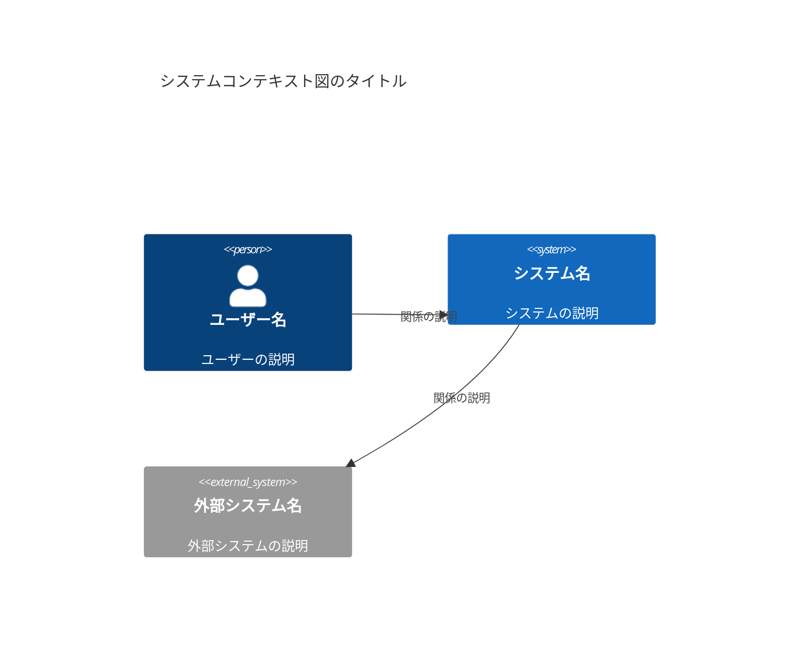
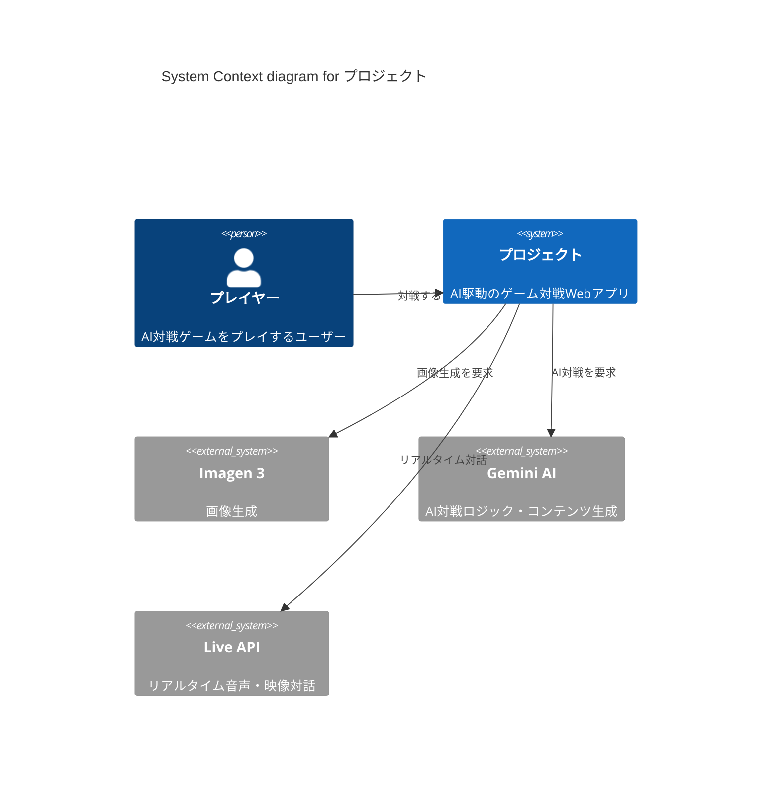
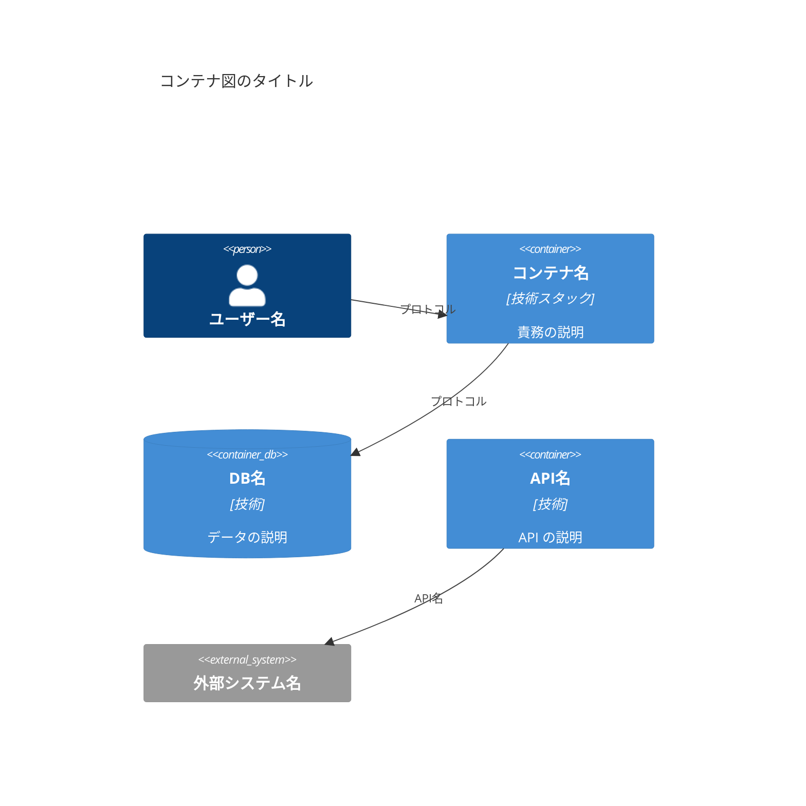
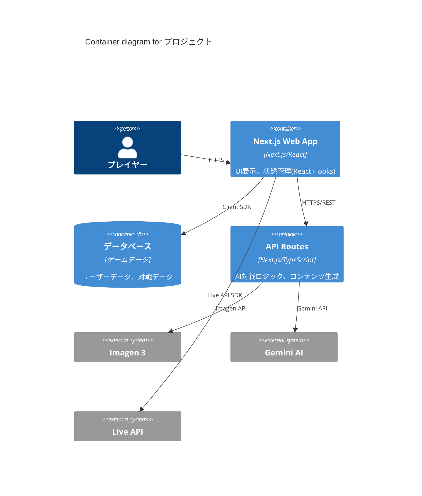
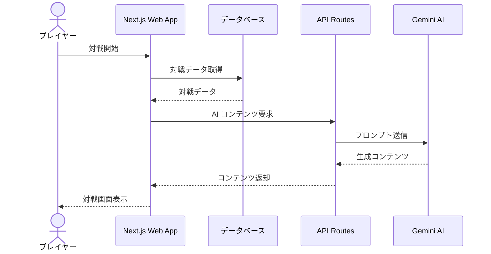
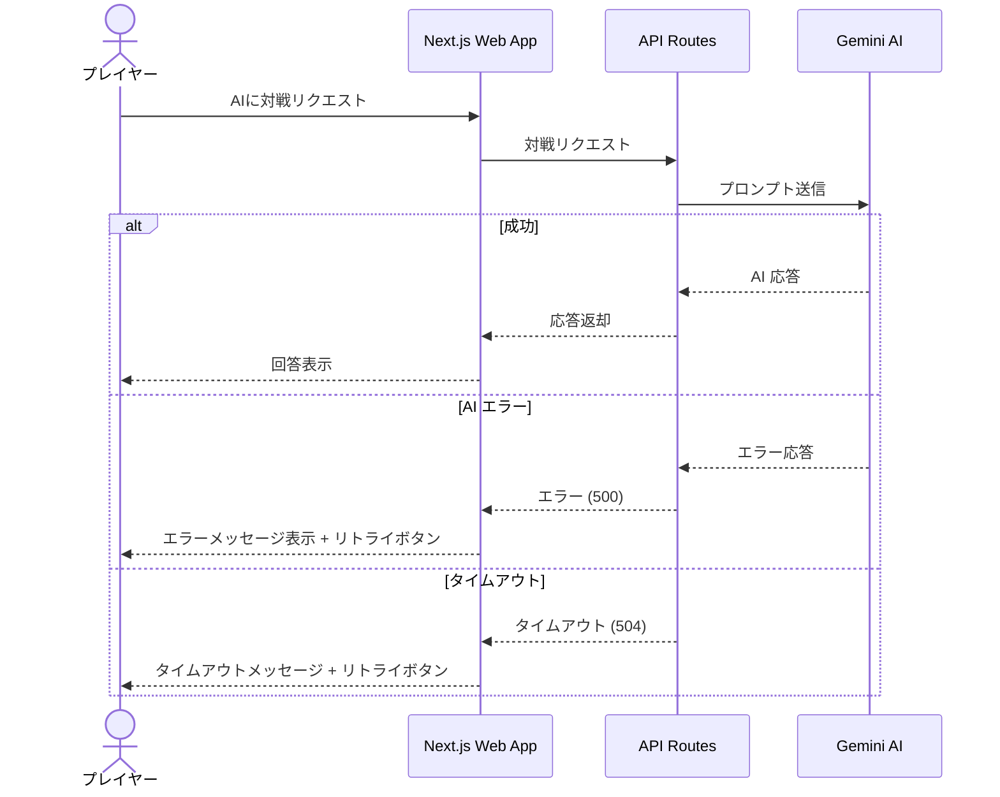
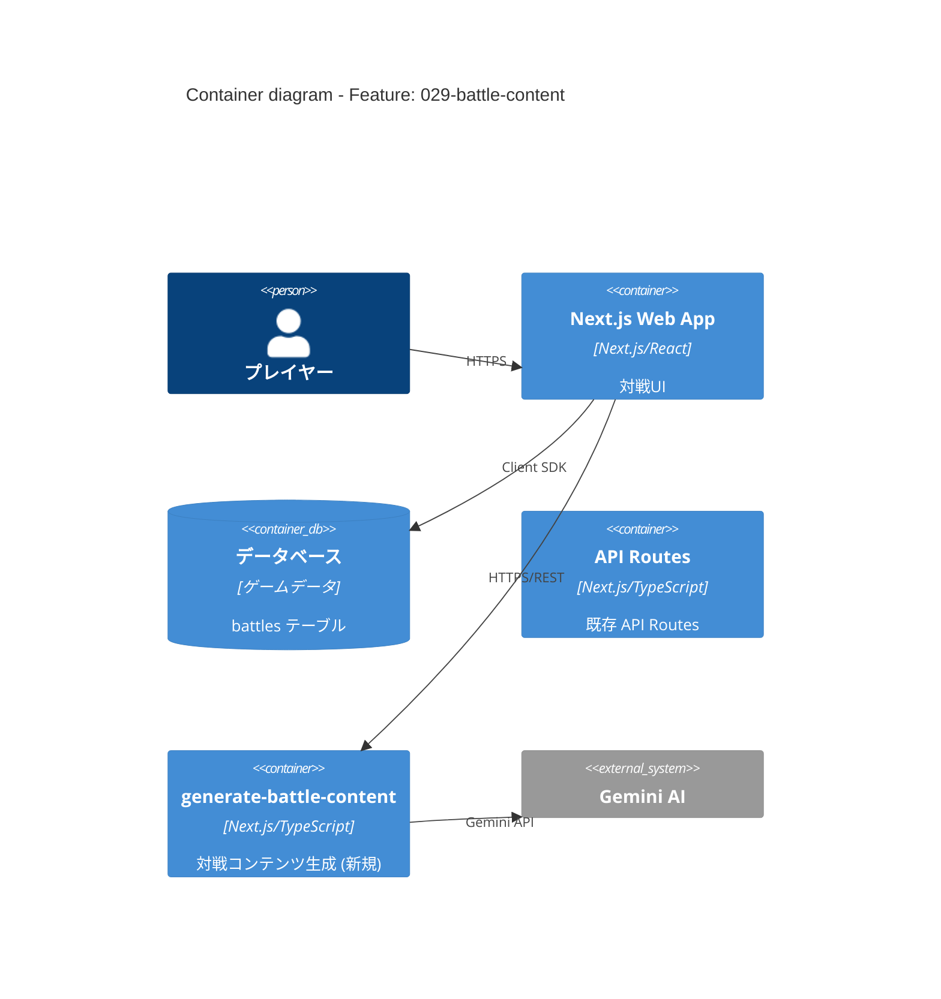
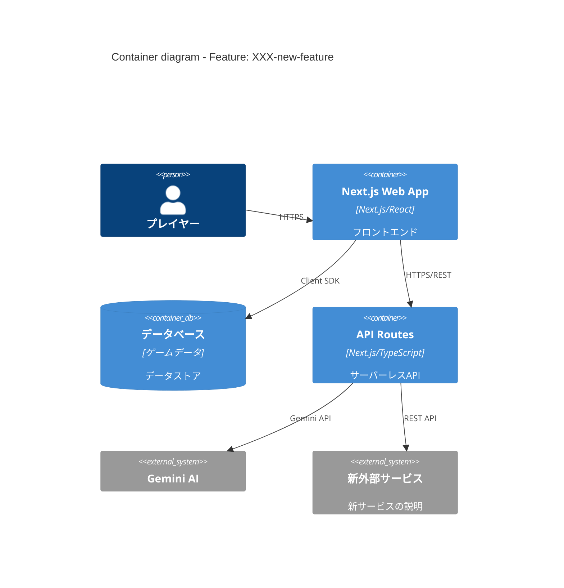

# Mermaid C4 パターンガイド

> Mermaid の C4 拡張構文を使用してシステム設計図を生成するためのガイド。
> プロジェクト プロジェクトでの具体的なサンプルを含む。

---

## 1. Mermaid C4 拡張構文の基本

Mermaid は C4 Model の図を直接サポートしています。以下の図タイプが利用可能です:

| 図タイプ       | Mermaid キーワード | C4 レベル                |
| -------------- | ------------------ | ------------------------ |
| System Context | `C4Context`        | Level 1                  |
| Container      | `C4Container`      | Level 2                  |
| Component      | `C4Component`      | Level 3 (Phase 0 不使用) |
| Dynamic        | `C4Dynamic`        | 動的図 (任意)            |

### 共通要素

| 要素          | 構文                                           | 説明                 |
| ------------- | ---------------------------------------------- | -------------------- |
| Person        | `Person(alias, "名前", "説明")`                | ユーザー/アクター    |
| Person_Ext    | `Person_Ext(alias, "名前", "説明")`            | 外部ユーザー         |
| System        | `System(alias, "名前", "説明")`                | 構築対象システム     |
| System_Ext    | `System_Ext(alias, "名前", "説明")`            | 外部システム         |
| SystemDb      | `SystemDb(alias, "名前", "説明")`              | 外部データベース     |
| SystemDb_Ext  | `SystemDb_Ext(alias, "名前", "説明")`          | 外部データベース     |
| Container     | `Container(alias, "名前", "技術", "説明")`     | コンテナ             |
| ContainerDb   | `ContainerDb(alias, "名前", "技術", "説明")`   | データベースコンテナ |
| Container_Ext | `Container_Ext(alias, "名前", "技術", "説明")` | 外部コンテナ         |
| Relationship  | `Rel(from, to, "ラベル")`                      | 関係線               |
| Relationship  | `Rel(from, to, "ラベル", "技術")`              | 技術付き関係線       |

---

## 2. C4Context Diagram の書き方

### 基本構造

### 記述ルール

1. **title** は必ず先頭に記述する
2. **Person** → **System** → **System_Ext** の順に定義する
3. **Rel** は要素定義の後にまとめて記述する
4. **alias** はキャメルケースまたはスネークケースで一意に命名する
5. **説明文** は日本語で簡潔に記述する（50文字以内目安）

### プロジェクト サンプル: System Context

---

## 3. C4Container Diagram の書き方

### 基本構造

### 記述ルール

1. **title** は必ず先頭に記述する
2. 定義順序: **Person** → **Container/ContainerDb** → **System_Ext** → **Rel**
3. **Container** の第3引数に技術スタックを明記する（例: "Next.js/React", "Next.js/TypeScript"）
4. **ContainerDb** をデータベースに使用する（通常の Container と区別）
5. **Rel** の第3引数に通信プロトコルを明記する（例: "HTTPS", "Client SDK"）
6. 第4引数（任意）でより詳細な技術情報を追加可能

### プロジェクト サンプル: Container

---

## 4. シーケンス図（データフロー用）

C4 の補助として、主要なデータフローを Mermaid シーケンス図で表現します。

### 基本構造

### 記述ルール

1. **actor** を人間のユーザーに使用する
2. **participant** をシステムコンポーネントに使用する
3. `->>` は同期リクエスト、`-->>` はレスポンスに使用する
4. 日本語のラベルで動作を説明する
5. エラーフローは `alt` / `else` ブロックで表現する

### エラーフローの例

---

## 5. スタイリングとレイアウトの Tips

### Boundary（境界線）の使用

システムの境界を視覚的に明示するために `Boundary` を使用できます:

### レイアウトのベストプラクティス

1. **要素数の制限**: 1つの図に15個以上の要素を入れない
2. **左から右への流れ**: ユーザー → フロントエンド → バックエンド → 外部サービスの順
3. **Boundary の活用**: 論理的なグループ化で見やすさを向上
4. **一貫した alias 命名**: 図をまたいで同じ要素には同じ alias を使用
5. **説明の簡潔さ**: 各要素の説明は1-2行以内に収める

### alias 命名規則

| 要素タイプ      | 命名パターン                | 例                      |
| --------------- | --------------------------- | ----------------------- |
| Person          | `<role>`                    | `player`, `admin`      |
| System          | `<systemName>` (camelCase)  | `gameSystem`          |
| Container (App) | `<appType>`                 | `webapp`, `mobileApp`   |
| Container (DB)  | `db` or `<dbName>`          | `db`, `cacheDb`         |
| Container (API) | `<apiName>`                 | `apiRoutes`, `authApi`     |
| External System | `<serviceName>` (camelCase) | `imagen3`, `geminiAI` |

---

## 6. 機能別の拡張パターン

新機能を追加する際、標準コンテナ図に追加要素を重ねる方法:

### パターン A: 新しい Edge Function を追加

### パターン B: 外部サービスを追加

新しい外部サービス連携が必要な場合:

---

## 7. よくある間違いと対策

| 間違い               | 問題点                   | 対策                                     |
| -------------------- | ------------------------ | ---------------------------------------- |
| `Rel` にラベルなし   | 何が流れているか不明     | 必ず通信プロトコルまたはデータ種別を記載 |
| Person に技術を記載  | Level 1 では不要         | Person は名前と説明のみ                  |
| Container に実装詳細 | Level 2 の抽象度を超える | 技術スタック名のみ記載                   |
| alias の重複         | レンダリングエラー       | 図全体で一意の alias を使用              |
| 日本語 alias         | 一部レンダラーで問題     | alias は英語、説明文は日本語             |
| 要素の過多           | 読みにくい               | 1図15要素以下に制限                      |

---

## 8. 参考資料

- [Mermaid C4 公式ドキュメント](https://mermaid.js.org/syntax/c4.html)
- [C4 Model 公式サイト](https://c4model.com/)
- [C4モデルガイド](./c4-model-guide.md) - 本プロジェクトでの C4 適用方針
