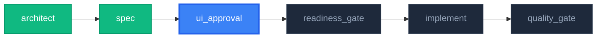

# UI Approval Gate v2.0 (UI/ワイヤーフレーム承認ゲート)

> **核心原則**: "実装前の視覚的確認" - コード作成前に UI を確認・承認して手戻り防止

SPEC 文書と Screen 文書を基にワイヤーフレームを生成し、ユーザー承認後にのみ実装段階に進める品質ゲートです。

## 核心原則

1. **視覚的確認保証**: 実装前に必ず UI ワイヤーフレーム確認
2. **ユーザー承認必須**: 自動通過なし、明示的承認が必要
3. **修正反復制限**: 最大 3 回修正後に強制決定要求
4. **多層表現**: SVG ダイアグラム + Mermaid フロー図 + ASCII UI レイアウト
5. **全 Tier 必須**: S/M/L/XL すべてのパイプラインで実行（スキップ禁止）
6. **Before/After 比較**: MODIFY_FEATURE 時は現状との差分を明示

---

## ワークフロー

```
+-------------------------------------------------------------+
|                    UI Approval Gate v2.0                      |
+-------------------------------------------------------------+
|                                                               |
|  Phase 1: 情報収集 + コンテキスト把握                         |
|  +-- CONTEXT.json ロード                                      |
|  +-- SPEC.md ロード                                           |
|  +-- screens/*.md ロード                                      |
|  +-- [MODIFY] 既存 UI コード読み取り (Before 生成用)          |
|                                                               |
|  Phase 2: パイプライン進行状況の可視化                         |
|  +-- 現在のパイプラインステップを SVG ダイアグラムで表示       |
|  +-- 完了済み / 現在地 / 未着手を色分けで表現                  |
|                                                               |
|  Phase 3: ワイヤーフレーム生成                                 |
|  +-- SVG ダイアグラム: ユーザーフロー図 (画面遷移)            |
|  +-- ASCII UI: 各画面のレイアウト                              |
|  +-- [MODIFY] Before/After 比較レイアウト                     |
|  +-- 状態表示: ローディング / エラー / 空状態                  |
|                                                               |
|  Phase 4: ユーザーレビュー                                    |
|  +-- 「このように変わります、承認しますか？」形式で提示       |
|  +-- 承認 / 修正 / 拒否 の選択要求                            |
|                                                               |
|  Phase 5: 結果処理                                            |
|  +-- 承認 → CONTEXT.json 更新 + 次ステップ進行                |
|  +-- 修正 → フィードバック反映後 Phase 3 再実行 (最大 3回)    |
|  +-- 拒否 → パイプライン中断 + 事由記録                       |
|                                                               |
+-------------------------------------------------------------+
```

---

## プロトコル

### Phase 1: 情報収集

```markdown
## 情報収集

1. CONTEXT.json 確認
   - docs/features/<feature-id>/CONTEXT.json
   - current_state, why, success_criteria 確認
   - work_type (NEW_FEATURE / MODIFY_FEATURE) 判別

2. SPEC.md 確認
   - docs/features/<feature-id>/SPEC-\*.md
   - FR 一覧、画面要件確認

3. Screen 文書確認
   - docs/features/<feature-id>/screens/\*.md
   - 画面別レイアウト、要素定義確認

4. [MODIFY_FEATURE のみ] 既存 UI 読み取り
   - src/features/<feature-name>/components/ のコード読み取り
   - 現在の画面構造を Before レイアウトとして把握
```

### Phase 2: パイプライン進行状況の可視化

**目的**: ユーザーが「今どのステップにいて、次に何が起きるのか」を一目で把握

パイプライン全体の進行状況を **SVG ダイアグラム** で表示します。
beautiful-mermaid スキルが利用可能な場合は SVG レンダリングを使用、
利用不可の場合は Mermaid テキスト + ASCII フォールバックを使用します。

**進行状況ダイアグラム形式**:



**出力テンプレート**:

```markdown
## パイプライン進行状況

> **パイプライン**: {NEW_FEATURE | MODIFY_FEATURE} — Tier {S|M|L|XL}

{Mermaid/SVG ダイアグラム}

|    ステップ     |   状態   |         スキル         |
| :-------------: | :------: | :--------------------: |
|    architect    |   Done   |   feature-architect    |
|      spec       |   Done   | feature-spec-generator |
| **ui_approval** | **現在** |  **ui-approval-gate**  |
| readiness_gate  |  未着手  |         (内蔵)         |
|    implement    |  未着手  |  feature-implementer   |
|  quality_gate   |  未着手  |    pre-quality-gate    |
```

### Phase 3: ワイヤーフレーム生成

AI が SPEC と Screen 文書を基に直接ワイヤーフレームを生成します。

#### 3A: ユーザーフロー SVG ダイアグラム

画面間のナビゲーションを **Mermaid flowchart** で生成。
beautiful-mermaid スキルが利用可能な場合は SVG レンダリングを実行します。

```markdown
### ユーザーフロー図

{Mermaid flowchart ダイアグラム}
```

**生成ルール**:

| 要素               | 表現                             |
| :----------------- | :------------------------------- |
| 画面               | 角丸ボックス `["画面名"]`        |
| ユーザーアクション | 矢印ラベル `--\|アクション\|-->` |
| 条件分岐           | 菱形 `{"条件"}`                  |
| 外部 API 呼出      | 波線ボックス `[/"API 名"/]`      |
| 状態変化           | 丸ボックス `(("状態"))`          |

#### 3B: ASCII UI レイアウト

各画面の構造を ASCII アートで表現。Terminal Noir デザインシステムに準拠。

**レイアウトルール**:

| 要素           | ASCII 表現                    | Tailwind 参照クラス                                             |
| :------------- | :---------------------------- | :-------------------------------------------------------------- |
| パネル         | `┌─ glass-panel ─┐ ... └───┘` | `backdrop-blur-xl bg-white/5 border border-white/10 rounded-xl` |
| ボタン         | `[ボタン名]`                  | `bg-blue-600 hover:bg-blue-700 rounded-lg`                      |
| 入力欄         | `[______入力______]`          | `bg-black/40 font-mono border-l-2 border-blue-500`              |
| アイコン       | `[Icon]`                      | Lucide/Heroicons SVG                                            |
| タブ           | `[Tab1] [Tab2] [Tab3]`        | `border-b-2 border-blue-500`                                    |
| プログレスバー | `████████░░░░ 67%`            | `bg-blue-600 rounded-full`                                      |

**状態バリエーション**（各画面で以下を提示）:

| 状態                  |                  必須                   |
| :-------------------- | :-------------------------------------: |
| 通常表示 (データあり) |                  必須                   |
| ローディング中        |                  必須                   |
| 空状態 (データなし)   |                  必須                   |
| エラー表示            | 任意 (エラーハンドリング FR がある場合) |

#### 3C: Before/After 比較 (MODIFY_FEATURE のみ)

既存機能を修正する場合、**現在の UI** と **変更後の UI** を並べて比較表示します。

**比較テンプレート**:

```markdown
### UI 変更比較: {screen_name}

#### Before (現在)

{ASCII UI: 既存コードから読み取った現在のレイアウト}

#### After (変更後)

{ASCII UI: SPEC 変更を反映した新しいレイアウト}

#### 変更サマリー

| 変更箇所   | Before       | After               | 理由          |
| :--------- | :----------- | :------------------ | :------------ |
| ヘッダー   | テキストのみ | アイコン + テキスト | 視認性向上    |
| カード配置 | 1列          | 2列グリッド         | 情報密度向上  |
| 新規追加   | -            | エクスポートボタン  | FR-00103 対応 |
```

**Before 読み取りルール**:

| 条件                            | Before の生成方法                                                |
| :------------------------------ | :--------------------------------------------------------------- |
| 既存コンポーネントあり          | `src/features/<name>/components/` のコードから ASCII UI を生成   |
| コンポーネントなし (新画面追加) | Before は「なし（新規画面）」と明記、After のみ表示              |
| ワイヤーフレーム既存            | `docs/wireframes/feature-<id>-wireframe.md` を Before として使用 |

### Phase 4: ユーザーレビュー

生成されたワイヤーフレームをユーザーに提示し、**明示的な承認フロー**で確認を得ます。

**レビュー提示テンプレート (NEW_FEATURE)**:

```markdown
---

# このように実装されます。承認しますか？

> **機能**: {feature-id} - {title}
> **作業タイプ**: 新機能開発
> **修正回数**: {revision_count}/3

---

## 1. パイプライン進行状況

{Phase 2 のダイアグラム}

## 2. ユーザーフロー

{Phase 3A のフロー図}

## 3. 画面レイアウト

### 画面: {screen_1_name}

{ASCII UI レイアウト}

### 画面: {screen_2_name}

{ASCII UI レイアウト}

## 4. 状態バリエーション

### ローディング中

{ASCII UI}

### 空状態

{ASCII UI}

---

## レビュー判定

上記の内容を確認し、判定してください:

- **承認**: 上記の設計で実装を進めます
- **修正要求**: 具体的なフィードバックを提供してください（{3 - revision_count}回まで修正可能）
- **拒否**: パイプラインを中断し、SPEC から再検討します

---
```

**レビュー提示テンプレート (MODIFY_FEATURE)**:

```markdown
---

# このように変わります。承認しますか？

> **機能**: {feature-id} - {title}
> **作業タイプ**: 既存機能修正
> **修正回数**: {revision_count}/3
> **変更対象 FR**: {modified_fr_list}

---

## 1. パイプライン進行状況

{Phase 2 のダイアグラム}

## 2. ユーザーフロー変更

{Phase 3A のフロー図 — 変更箇所をハイライト}

## 3. UI 変更比較

{Phase 3C の Before/After 比較}

## 4. 変更影響サマリー

| 影響範囲         | 詳細                 |
| :--------------- | :------------------- |
| 変更される画面   | {screen_list}        |
| 新規追加         | {new_elements}       |
| 削除・変更       | {modified_elements}  |
| 既存機能への影響 | {impact_description} |

---

## レビュー判定

上記の変更内容を確認し、判定してください:

- **承認**: 上記の変更で実装を進めます
- **修正要求**: 具体的なフィードバックを提供してください（{3 - revision_count}回まで修正可能）
- **拒否**: パイプラインを中断し、SPEC から再検討します

---
```

### Phase 5: 結果処理

#### 承認時

```markdown
## 承認処理

1. CONTEXT.json 更新
   - ui_approval.status → "approved"
   - ui_approval.approved_at → 現在時刻
   - ui_approval.revision_count → {count}
   - history に状態遷移記録

2. ワイヤーフレーム保存確定
   - docs/wireframes/feature-<id>-wireframe.md

3. 次ステップへ進行
   - feature-pilot に Go 信号返却
```

#### 修正要求時

```markdown
## 修正処理

1. 修正回数確認
   - revision_count < 3 → Phase 3 へ復帰
   - revision_count >= 3 → 強制決定要求

2. フィードバック収集
   - 具体的修正事項を質問
   - 修正内容記録

3. ワイヤーフレーム再生成
   - フィードバック反映
   - Phase 4 再実行
```

**強制決定 (3 回修正後)**:

```markdown
修正上限到達 (3/3)

これ以上の修正は非効率です。選択してください:

- **現在バージョンで承認**: 現在のワイヤーフレームで進行
- **パイプライン中断**: SPEC 再検討後に再開始
```

#### 拒否時

```markdown
## 拒否処理

1. 事由記録
   - 拒否理由を収集
   - CONTEXT.json に記録

2. CONTEXT.json 更新
   - ui_approval.status → "rejected"
   - ui_approval.rejected_reason → {reason}
   - current_state → "Blocked"

3. パイプライン中断
   - feature-pilot に No-Go 信号返却
   - 次の行動案内: SPEC 再検討または要件再定義
```

---

## SVG ダイアグラム生成プロトコル

### beautiful-mermaid 連携 (推奨)

beautiful-mermaid スキルが利用可能な場合、Mermaid ダイアグラムを SVG/PNG にレンダリングします。

**手順**:

1. Mermaid テキストでダイアグラムを生成
2. beautiful-mermaid スキルに渡して SVG レンダリング
3. SVG ファイルを `docs/wireframes/` に保存
4. ワイヤーフレーム文書から SVG を参照

**ファイル命名規則**:

```
docs/wireframes/
├── feature-{id}-wireframe.md        # ワイヤーフレーム文書
├── feature-{id}-flow.svg            # ユーザーフロー SVG
└── feature-{id}-pipeline.svg        # パイプライン進行状況 SVG
```

### フォールバック (beautiful-mermaid 利用不可時)

beautiful-mermaid が利用不可の場合、以下で代替:

1. **Mermaid テキストブロック**: コードブロック内に Mermaid 記法を出力
2. **ASCII フロー図**: テキストベースの矢印で画面遷移を表現

```
[コード入力] ──→ [分析中...] ──→ [結果表示]
                                    ├──→ [説明パネル]
                                    ├──→ [Diff表示]
                                    └──→ [クイズ]
```

---

## CONTEXT.json スキーマ拡張

ui-approval-gate は CONTEXT.json に `ui_approval` セクションを追加/更新します:

```json
{
  "ui_approval": {
    "status": "pending | in_review | approved | rejected",
    "wireframe_path": "docs/wireframes/feature-xxx-wireframe.md",
    "svg_paths": {
      "flow": "docs/wireframes/feature-xxx-flow.svg",
      "pipeline": "docs/wireframes/feature-xxx-pipeline.svg"
    },
    "work_type": "NEW_FEATURE | MODIFY_FEATURE",
    "revision_count": 0,
    "revisions": [
      {
        "at": "2026-02-14T10:00:00+09:00",
        "feedback": "カードレイアウトをもう少し大きく",
        "applied": true
      }
    ],
    "approved_at": null,
    "rejected_reason": null,
    "last_updated_at": "2026-02-14T10:00:00+09:00"
  }
}
```

**状態定義**:

| 状態        | 説明                                     |
| :---------- | :--------------------------------------- |
| `pending`   | UI 承認ステップ未進入                    |
| `in_review` | ワイヤーフレーム生成後ユーザーレビュー中 |
| `approved`  | ユーザー承認完了                         |
| `rejected`  | ユーザー拒否、SPEC 再検討必要            |

---

## 状態マシン拡張

feature-pilot 状態マシンに `UiApproval` 状態追加:

```
                          +--------------+
                          | SpecDrafting |
                          +------+-------+
                                 | spec_done
                                 v
                          +--------------+
                          | UiApproval   |  (全 Tier 必須)
                          +------+-------+
                                 | ui_approved
                                 v
                          +--------------+
                          | Implementing |
                          +--------------+
```

**遷移規則**:

| 現在状態       | トリガー      | 次状態         | 条件                        |
| :------------- | :------------ | :------------- | :-------------------------- |
| SpecDrafting   | SPEC 完了     | **UiApproval** | SPEC.md, screens/\*.md 存在 |
| SpecUpdating   | SPEC 修正完了 | **UiApproval** | SPEC 変更差分あり           |
| **UiApproval** | UI 承認       | Implementing   | Readiness Gate Go           |
| **UiApproval** | UI 拒否       | Blocked        | 拒否事由記録                |
| Blocked        | 質問解決      | UiApproval     | 再検討後に再開始            |

---

## 出力形式

### 承認完了報告

```markdown
# UI Approval Gate - 承認完了

> **機能**: {feature-id} - {title}
> **承認日**: 2026-02-14 10:30
> **修正回数**: {revision_count}/3

## ワイヤーフレーム保存位置

- 文書: `docs/wireframes/feature-{id}-wireframe.md`
- フロー SVG: `docs/wireframes/feature-{id}-flow.svg`

## 次のステップ

→ Readiness Gate 検証 → 実装段階 (feature-implementer) へ進行します。
```

### 修正要求報告

```markdown
# UI Approval Gate - 修正要求

> **機能**: {feature-id} - {title}
> **修正回数**: {revision_count}/3

## フィードバック内容

{ユーザーフィードバック}

## 次のアクション

→ フィードバックを反映してワイヤーフレームを再生成します。
```

### 拒否報告

```markdown
# UI Approval Gate - 拒否

> **機能**: {feature-id} - {title}
> **拒否事由**: {reason}

## 次のアクション

→ パイプラインが中断されました。
→ SPEC 再検討後に再実行を推奨します。
```

---

## AI 行動指針

### DO (やるべきこと)

- **パイプライン進行状況ダイアグラムを最初に表示**（現在地の明確化）
- 生成されたワイヤーフレームをユーザーに明確に提示
- **「このように変わります、承認しますか？」の形式で提示**
- 承認/修正/拒否の明示的選択を要求
- 修正回数を正確に追跡 (最大 3 回)
- CONTEXT.json の ui_approval セクション更新
- 承認/拒否結果を feature-pilot に明確に伝達
- Terminal Noir デザインシステムに準拠したワイヤーフレーム生成
- **MODIFY_FEATURE 時は Before/After 比較を必ず表示**
- **beautiful-mermaid 利用可能時は SVG レンダリングを試行**
- **全状態バリエーション（通常/ローディング/空状態）を提示**

### DON'T (やってはいけないこと)

- ユーザー承認なしに自動通過
- ワイヤーフレームなしに承認要求
- 3 回を超える修正許可
- 拒否事由記録なしにパイプライン中断
- CONTEXT.json 更新漏れ
- **パイプライン進行状況の表示省略**
- **MODIFY_FEATURE で Before/After 比較の省略**
- **Tier S だから省略（全 Tier 必須）**

---

## 使用例

### feature-pilot からの自動呼出 (推奨)

```bash
# feature-pilot が SPEC 生成後に自動で呼出
# 全 Tier (S/M/L/XL) で必須実行
# ユーザーが直接呼出する必要なし
```

### 直接呼出 (独立使用)

```bash
# 特定機能の UI を事前確認したい場合
/ui-approval-gate code-analysis

# 既存ワイヤーフレーム再レビュー
/ui-approval-gate code-analysis --review
```

---

## 参照文書

- [CLAUDE.md デザインシステム](../../../CLAUDE.md) - Terminal Noir テーマ定義
- feature-pilot スキル - パイプライン統合
- feature-spec-generator スキル - SPEC 生成元
- beautiful-mermaid スキル - SVG レンダリング (利用可能時)

---

## 変更履歴

| 日付       | バージョン | 変更内容                                                                                                                    |
| :--------- | :--------- | :-------------------------------------------------------------------------------------------------------------------------- |
| 2026-02-11 | v1.0       | 新規作成 - Hackathon Project 向け移植。wireframe-manager 依存を AI 直接生成に変更                                               |
| 2026-02-14 | v2.0       | **全面強化**: SVG ダイアグラム生成、パイプライン進行状況可視化、Before/After 比較、全 Tier 必須化、レビューテンプレート改善 |
