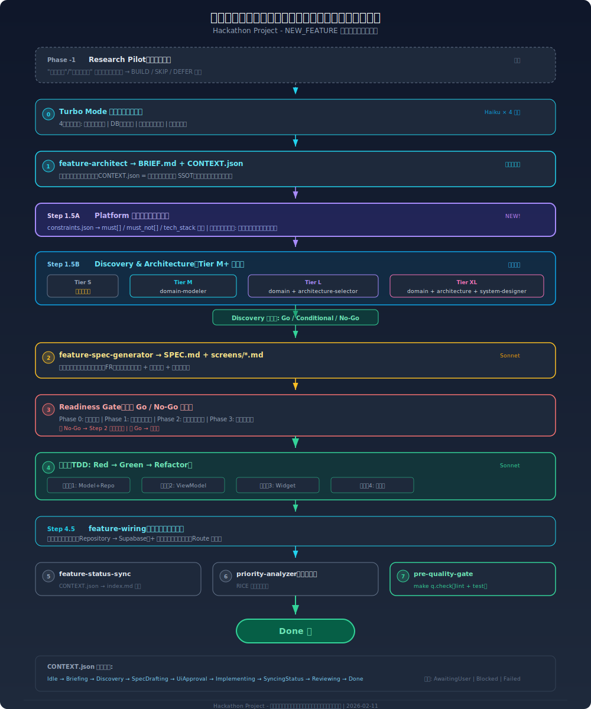
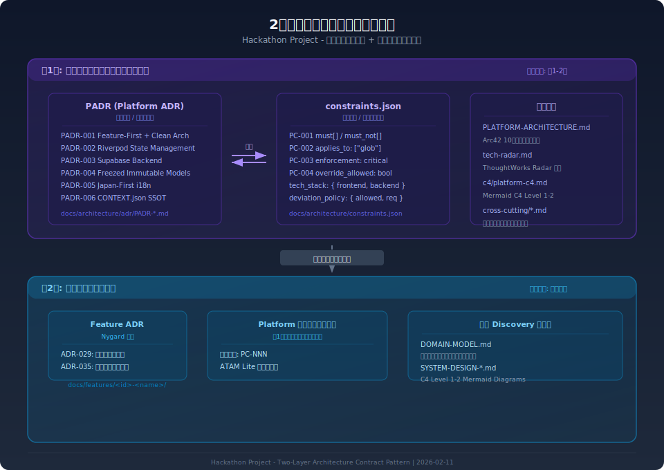
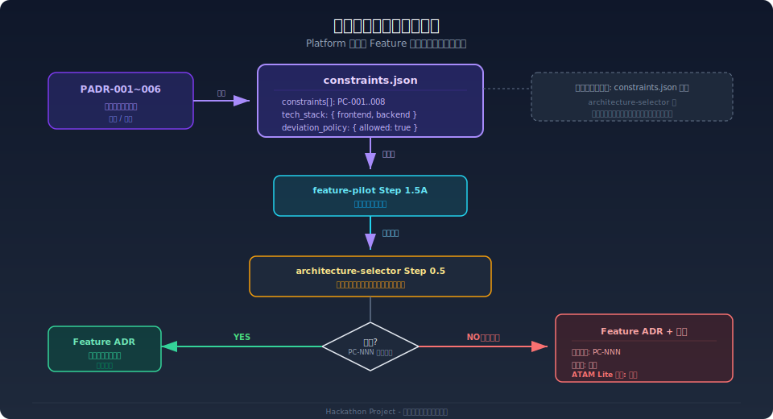
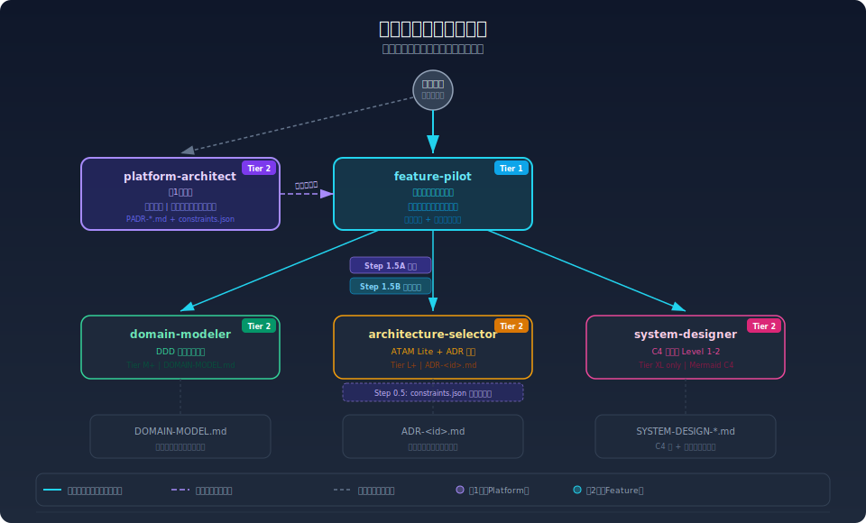

# スクラッチから開発完了まで - 全パイプライン総合ガイド

> **Version**: 1.0 | **Date**: 2026-02-11 | **Status**: Active

Hackathon Project プロジェクトにおいて、ゼロから新機能を開発し、テスト・品質検証を完了するまでの全工程を網羅した総合ガイドです。

---

## 1. エグゼクティブサマリー

### このプロジェクトの開発パイプラインとは

**「ユーザーが一言発話するだけで、リサーチ → 設計 → 文書化 → 品質ゲート → 実装 → 連動 → テスト → 品質検証の全工程がAI主導で自動実行される」** 仕組みです。

| 特徴                       | 説明                                                       |
| -------------------------- | ---------------------------------------------------------- |
| **単一エントリーポイント** | `feature-pilot` がすべての開発要請を受け付け、自動分類する |
| **自動スケーリング**       | 機能の複雑度（Tier S/M/L/XL）に応じてスキル呼び出しを調整  |
| **2層アーキテクチャ契約**  | Platform 制約（constraints.json）が全機能に自動伝播        |
| **状態追跡 SSOT**          | CONTEXT.json で全工程の状態をセッション跨ぎで保存          |
| **品質ゲート内蔵**         | 実装前（Readiness Gate）と実装後（Quality Gate）の二重検証 |

### パイプライン構成（6パイプライン）

| パイプライン | 目的               | 主なスキル                                                          |
| :----------: | ------------------ | ------------------------------------------------------------------- |
|    **P1**    | リサーチ・意思決定 | competitive-tracker, market-intelligence-scanner, priority-analyzer |
|    **P2**    | 製品探索           | research-pilot                                                      |
|    **P3**    | 機能実装           | feature-pilot (統合オーケストレーター)                              |
|    **P4**    | 品質ゲート         | pre-quality-gate, make q.check                                      |
|    **P5**    | 実行自動化         | turbo-mode, persistent-mode                                         |
|    **P6**    | 一気通貫統合       | P1〜P5 の連携                                                       |

---

## 2. 全体フロー図



---

## 3. NEW_FEATURE パイプライン（完全版）

### 3.1 全ステップ一覧

| Step | 名前                        | スキル                                                 | 出力                     |   必須   |   モデル    |
| :--: | --------------------------- | ------------------------------------------------------ | ------------------------ | :------: | :---------: |
|  -1  | Research Pilot              | research-pilot                                         | BUILD/SKIP/DEFER 判定    | 条件付き |   Sonnet    |
|  0   | Turbo Mode コンテキスト収集 | turbo-mode                                             | 既存パターン収集         |   自動   |   Haiku×4   |
|  1   | Feature Architect           | feature-architect                                      | BRIEF.md, CONTEXT.json   | **必須** |   Sonnet    |
| 1.5A | Platform 制約ロード         | (自動)                                                 | 制約一覧                 |   自動   |      -      |
| 1.5B | Discovery & Architecture    | domain-modeler, architecture-selector, system-designer | DOMAIN-MODEL.md, ADR, C4 |  Tier別  | Sonnet/Opus |
|  2   | SPEC 生成                   | feature-spec-generator                                 | SPEC.md, screens/\*.md   | **必須** |   Sonnet    |
|  3   | Readiness Gate              | (内蔵)                                                 | Go/No-Go 判定            | **必須** |   Sonnet    |
|  4   | 実装                        | feature-implementer                                    | コード + テスト          | **必須** |   Sonnet    |
| 4.5  | Feature Wiring              | feature-wiring                                         | データ連動 + ナビ連動    | **必須** |   Sonnet    |
|  5   | 状態同期                    | feature-status-sync                                    | index.md 更新            |   自動   |    Haiku    |
|  6   | 優先度再計算                | priority-analyzer                                      | RICE スコア              |   選択   |    Haiku    |
|  7   | 品質ゲート                  | pre-quality-gate                                       | lint + test 結果         | **必須** |      -      |

### 3.2 Tier 別スケーリング

Discovery & Architecture（Step 1.5B）は機能の複雑度に応じてスケーリングされます:

|  Tier  | 目安                           | 呼び出されるスキル                      | 所要時間 |
| :----: | ------------------------------ | --------------------------------------- | :------: |
| **S**  | 単純変更（1-2ファイル）        | 全スキップ → Step 2 へ                  |   最短   |
| **M**  | 中規模（DB + UI）              | domain-modeler (--lightweight)          |    中    |
| **L**  | 大規模（複数画面 + API）       | domain-modeler + architecture-selector  |    長    |
| **XL** | 基盤変更（アーキテクチャ影響） | domain + architecture + system-designer |   最長   |

### 3.3 各ステップの詳細

#### Phase -1: Research Pilot（条件付き）

**発動条件**: "リサーチ"、"タダ性"、"ゼロベース" キーワード検出時のみ

```
research-pilot 実行
  ├── OST + Double Diamond + Shape Up フレームワーク
  ├── 市場/競合/技術タダ性を検証
  └── 判定: BUILD → Step 0 へ / SKIP・DEFER → 終了
```

#### Step 0: Turbo Mode コンテキスト収集

**目的**: 並列スキャンで既存コードベースの関連情報を高速収集

```
4並列タスク（Haiku）:
  T1: 既存 ViewModel パターン検索       → lib/features/ 内を Grep
  T2: DB スキーマ関連テーブル確認        → infra/supabase/migrations/ 参照
  T3: 類似機能テストパターン調査          → test/ 配下を探索
  T4: 再利用候補探索                    → lib/shared/, lib/components/ 探索
```

#### Step 1: feature-architect → BRIEF.md + CONTEXT.json

**核心原則**: CONTEXT.json 生成の**唯一の責任者**

```
入力: ユーザーの発話（ユーザーストーリー / Why / 要件）
処理:
  1. 意図分析 + Feature ID 割り当て
  2. コードベーススキャン（既存パターン、関連テーブル）
  3. BRIEF.md 作成（What / Why / Scope）
  4. CONTEXT.json 初期化（SSOT）
出力:
  docs/features/<id>-<name>/
  ├── BRIEF.md
  └── CONTEXT.json  ← 以後すべてのスキルが参照・更新
```

**CONTEXT.json の主要セクション**:

| セクション       | 目的               | 活用タイミング               |
| ---------------- | ------------------ | ---------------------------- |
| `quick_resume`   | 3秒内状況把握      | セッション再開時に最初に読む |
| `progress`       | FR ベース進捗率    | 実装段階で継続更新           |
| `references`     | 参照文書の優先順位 | 現作業に応じて動的変更       |
| `decisions`      | 決定履歴           | コンテキスト復元時に参照     |
| `history`        | 状態遷移履歴       | デバッグ・監査追跡           |
| `open_questions` | 未解決質問         | Blocked 状態管理             |

#### Step 1.5A: Platform 制約ロード（自動）

**Two-Layer Architecture Contract Pattern** の中核。constraints.json からプラットフォーム制約を自動ロード。

```
constraints.json 存在確認
  ├── EXISTS → JSON パース
  │     ├── PC-001: Feature-First Architecture（依存方向遵守）
  │     ├── PC-002: Riverpod @riverpod Notifier（setState 禁止）
  │     ├── PC-003: Supabase Backend（RLS 必須）
  │     ├── PC-004: Freezed Immutable Models（@freezed 必須）
  │     ├── PC-005: Japan-First i18n（app_ja.arb 先行）
  │     ├── PC-006: CONTEXT.json SSOT
  │     ├── PC-007: Code Quality Enforcement
  │     └── PC-008: Supabase Security
  │
  └── NOT EXISTS → フォールバック（ハードコードデフォルト使用）
```

> **後方互換性 100%**: constraints.json の有無に関わらず動作

#### Step 1.5B: Discovery & Architecture（Tier M+ のみ）

**domain-modeler 出力例**:

```markdown
# DOMAIN-MODEL.md

## Bounded Context: VocabularyManagement

## Aggregates: VocabularyBook, WordEntry

## Domain Events: WordAdded, WordReviewed

## Ubiquitous Language: 単語帳, エントリー, 復習間隔
```

**architecture-selector 出力例**（constraints.json を Step 0.5 で自動参照）:

```markdown
# ADR-029.md

## 代替案比較（ATAM Lite）

- 案A: ローカルのみ → 可用性○ / 同期✕
- 案B: サーバーのみ → 同期○ / オフライン✕
- 案C: ローカル + Supabase 同期 → ✅ 採用

## Platform 制約: 全準拠（逸脱なし）
```

**Discovery Gate**: Go / Conditional Go / No-Go 判定

- Go → Step 2 へ
- No-Go → Step 1 へ差し戻し

#### Step 2: feature-spec-generator → SPEC.md + screens/\*.md

**「どう作るか」の契約文書**

```
出力:
  docs/features/029-vocabulary/
  ├── SPEC-029.md           ← FR 一覧 + テスト条件 + API 仕様
  └── screens/
      ├── SCR-029-01.md     ← 画面レイアウト + Element ID
      ├── SCR-029-02.md
      └── SCR-029-03.md
```

**SPEC の核心 10 要素**:

|  #  | 要素               | 内容                      |
| :-: | ------------------ | ------------------------- |
|  1  | FR（機能要件）     | FR-02901〜FR-029NN        |
|  2  | AC（受入基準）     | Given-When-Then 形式      |
|  3  | EC（エッジケース） | 異常系・境界値            |
|  4  | API 仕様           | エンドポイント + スキーマ |
|  5  | データモデル       | Freezed クラス定義        |
|  6  | 状態管理           | Riverpod Provider 設計    |
|  7  | 画面設計           | screens/\*.md 参照        |
|  8  | セキュリティ       | RLS ポリシー              |
|  9  | i18n               | ARB キー一覧              |
| 10  | テスト計画         | 単体 + Widget テスト      |

#### Step 3: Readiness Gate（内蔵 Go/No-Go 判定）

```
Phase 0: 機械検証
  └── validate_spec.py で JSON Schema バリデーション

Phase 1: 上流契約検証
  └── CONTEXT.json ↔ SPEC.md の整合性チェック

Phase 2: 技術契約検証
  └── コア5完備チェック（Model / Repository / ViewModel / Widget / Test）

Phase 3: 実装安全性検証
  └── Tier 判定 + 3ゲート確認

→ 🟢 Go: Step 4 へ
→ 🔴 No-Go: SPEC を修正して Step 2 から再実行
```

#### Step 4: 実装（TDD: Red → Green → Refactor）

**レイヤー順バッチ実装**:

```
バッチ1（並列）: Data 層
  ├── @freezed Model（word_entry.dart, vocabulary_book.dart）
  └── Repository（vocabulary_repository.dart）

バッチ2（順次）: Domain 層
  └── ViewModel / Notifier（vocabulary_list_notifier.dart）← @riverpod

バッチ3（順次）: Presentation 層
  └── Page + Widget（vocabulary_list_page.dart, word_card.dart）

バッチ4（順次）: テスト
  ├── Repository テスト（mocktail ベース）
  ├── Notifier テスト（ProviderContainer パターン）
  └── Widget テスト
```

**TDD サイクル**:

1. **Red**: テスト作成 → 実行 → 失敗確認
2. **Green**: 最小限の実装で通過
3. **Refactor**: コード品質改善（パターン遵守）

#### Step 4.5: feature-wiring（アトミック連動）

```
データソース連動:
  └── VocabularyRepository → Supabase Client 接続

ナビゲーション連動:
  └── BottomNav / GoRouter に単語帳ページを追加
```

> **アトミック原則**: データ連動とナビ連動は一括実行。片方だけ完了した中間状態を防止。

#### Steps 5-7: 同期・品質検証

```
Step 5: feature-status-sync
  └── CONTEXT.json の progress → index.md に反映

Step 6: priority-analyzer（選択的）
  └── 進捗率 ≥ 10% 変化時に RICE スコア再計算

Step 7: pre-quality-gate
  └── make q.check 実行
      ├── flutter analyze → エラー0 必須
      ├── flutter test → 全通過必須
      └── コード生成チェック → 最新性確認
  └── 通過: CONTEXT.json → current_state: "Done" ✅
  └── 失敗: make q.fix → 自動修正 → 再検証
```

---

## 4. 状態管理: CONTEXT.json State Machine

### 4.1 正常フロー

```
Idle → Briefing → Discovery → SpecDrafting → UiApproval → Implementing → SyncingStatus → Reviewing → Done
```

### 4.2 全状態遷移表

| 現在の状態    | トリガー                  | 次の状態      | 条件                     |
| ------------- | ------------------------- | ------------- | ------------------------ |
| Idle          | 作業開始                  | Briefing      | -                        |
| Briefing      | Phase 0 実行 (Tier M+)    | Discovery     | NEW_FEATURE, Tier M/L/XL |
| Briefing      | Phase 0 スキップ (Tier S) | SpecDrafting  | Tier S                   |
| Discovery     | Discovery Gate Go         | SpecDrafting  | ゲート通過               |
| SpecDrafting  | SPEC.md 完了              | UiApproval    | SPEC + screens 存在      |
| UiApproval    | UI 承認                   | Implementing  | Readiness Gate Go        |
| Implementing  | 実装完了                  | SyncingStatus | テスト通過               |
| SyncingStatus | 同期完了                  | Reviewing     | index.md 更新            |
| Reviewing     | 品質検証通過              | **Done**      | analyze + test 通過      |

### 4.3 例外状態

| 状態             | 発動条件                       | 脱出条件         |
| ---------------- | ------------------------------ | ---------------- |
| **Blocked**      | 未解決質問発生                 | 質問 resolved    |
| **AwaitingUser** | 質問上限7問到達                | ユーザー応答受信 |
| **Failed**       | 3回連続 No-Go / 復旧不可エラー | 手動介入         |

---

## 5. Two-Layer Architecture 制約統合

### 5.1 2層の分離



```
第1層: Platform Architecture（全体共通・年1-2回更新）
  ├── PADR-*.md           ← Why / Context（人間向け）
  ├── constraints.json    ← What / Rules（AI向け）
  └── tech-radar.md       ← 技術採用状況

         制約が下位層に伝播 ↓

第2層: Feature Architecture（機能別・高頻度更新）
  ├── ADR-<id>.md         ← 機能別決定
  ├── DOMAIN-MODEL.md     ← DDD 成果物
  └── SYSTEM-DESIGN-*.md  ← C4 図
```

### 5.2 制約の伝播経路



```
PADR-001〜006 ──(抽出)──→ constraints.json ──(ロード)──→ feature-pilot Step 1.5A
                                                                │
                                                         ──(引き渡し)──→ architecture-selector Step 0.5
                                                                              │
                                                                      ┌──────┴──────┐
                                                                   準拠?         逸脱?
                                                                      │              │
                                                              標準 ADR    ADR + 逸脱正当化
```

### 5.3 制約逸脱時のルール

Feature ADR が Platform 制約から逸脱する場合、以下のセクションが**必須**:

```markdown
## Platform Deviation Justification

### Deviating from

- PC-001: Feature-First Architecture

### Justification

{なぜこの機能では Platform 制約から逸脱する必要があるのか}

### ATAM Lite Evidence

{品質属性比較による正当性証明}
```

---

## 6. 作業タイプ別パイプライン

### 6.1 全タイプ一覧

| タイプ                | トリガー             | パイプライン                                             |
| --------------------- | -------------------- | -------------------------------------------------------- |
| **NEW_FEATURE**       | "新機能", "追加して" | architect → spec → gate → impl → wiring → sync → quality |
| **MODIFY_FEATURE**    | "修正", "変更"       | spec-update → gate → impl → wiring → sync → quality      |
| **BUG_FIX**           | "バグ", "エラー"     | analyze → impl → test                                    |
| **CONVERT_CANDIDATE** | "候補承認"           | approve → architect → spec → gate → impl → wiring → sync |
| **RESEARCH**          | "調査して"           | research-gap-analyzer                                    |
| **DOCS_ONLY**         | "文書だけ"           | 該当スキルのみ                                           |

### 6.2 BUG_FIX パイプライン

```
Phase 1: バグ分析
  ├── 症状整理
  ├── 関連コード探索
  └── ログ/エラーメッセージ分析

Phase 2: 根本原因分析
  ├── 仮説立案
  ├── コードフロー追跡
  └── 原因検証

Phase 3: 修正実装
  ├── 回帰テスト作成 → 失敗確認 (Red)
  └── コード修正 (Green)

Phase 4: 検証完了
  ├── 全テスト通過
  └── flutter analyze 通過
```

**核心原則**:

- 症状だけ見て修正しない → 根本原因を必ず特定
- 回帰テストなしに修正完了禁止
- 失敗確認（Red）なしに修正ステップ進行禁止

### 6.3 MODIFY_FEATURE パイプライン

```
Step 1: feature-spec-updater → 既存 SPEC の差分分析
Step 2: 変更履歴追加 + 連鎖影響確認
Step 3: Readiness Gate
Step 4: 実装（修正された FR 基準）
Step 4.5: feature-wiring（必要時）
Step 5-7: 同期 + 品質検証
```

---

## 7. スキルエコシステム

### 7.1 スキル依存関係



### 7.2 スキル一覧（49スキル）

| カテゴリ       | スキル数 | 主なスキル                                                                                    |
| -------------- | :------: | --------------------------------------------------------------------------------------------- |
| 機能開発       |    9     | feature-pilot, feature-architect, feature-spec-generator, feature-implementer, feature-wiring |
| アーキテクチャ |    4     | platform-architect, domain-modeler, architecture-selector, system-designer                    |
| リサーチ       |    7     | research-pilot, competitive-tracker, market-intelligence-scanner, priority-analyzer           |
| 品質           |    6     | flutter-qa, pre-quality-gate, security-scan, edge-function-validator                          |
| 実行制御       |    3     | turbo-mode, persistent-mode, cancel                                                           |
| ユーティリティ |    20    | feature-status-sync, arb-sync, feature-doctor, hardcoded-scan 等                              |

### 7.3 モデルルーティング

| 複雑度 | モデル | コスト | 用途例                                   |
| ------ | :----: | :----: | ---------------------------------------- |
| 低     | Haiku  |   $    | 探索、スキャン、単純検索                 |
| 中     | Sonnet |   $$   | 実装、SPEC生成、ゲート検証               |
| 高     |  Opus  |  $$$   | アーキテクチャ決定、セキュリティレビュー |

**自動フォールバック**: 3回連続エラー時に自動昇格（Haiku → Sonnet → Opus）

---

## 8. 品質ゲートシステム

### 8.1 二重ゲート構造

```
実装前ゲート                    実装後ゲート
─────────────                 ─────────────
Readiness Gate (Step 3)       Quality Gate (Step 7)
  ├── 機械検証                   ├── flutter analyze（エラー0必須）
  ├── 上流契約整合                ├── flutter test（全通過必須）
  ├── 技術契約完備                ├── コード生成チェック
  └── 実装安全性                  └── Gemini スキーマ検証（該当時）
```

### 8.2 make q.check で実行される検査

```bash
make q.check              # 全検査実行
```

| 検査                | 内容                   |  重要度  |
| ------------------- | ---------------------- | :------: |
| flutter analyze     | 静的解析               | Critical |
| flutter test        | 全テスト実行           | Critical |
| コード生成チェック  | build_runner 最新性    |  Major   |
| ARB 同期チェック    | 多言語キー整合         |  Major   |
| Gemini スキーマ検証 | AI 出力スキーマ        |  Major   |
| アーキテクチャ検証  | Feature-First 依存方向 |  Major   |

### 8.3 Evidence Caching（検証キャッシュ）

| 検証タイプ      | 有効時間 | 無効化条件                 |
| --------------- | :------: | -------------------------- |
| flutter analyze |   30分   | `lib/**/*.dart` 変更時     |
| flutter test    |   30分   | `test/**/*.dart` 変更時    |
| Readiness Gate  |   60分   | SPEC, screens 変更時       |
| Security Scan   |   60分   | `infra/**`, `.env*` 変更時 |

---

## 9. 具体サンプル: 「単語帳」機能の開発フロー

### 前提

```
ユーザー発話: 「ユーザーが学習した単語を管理する単語帳機能が必要」
自動分類: NEW_FEATURE
Tier 判定: L（DB + API + UI = 中規模）
```

### Step 0: コンテキスト収集

```
Turbo Mode 4並列タスク（Haiku）:
  T1: lib/features/ 内の既存 Notifier パターン → AsyncNotifier + ref.watch パターン発見
  T2: infra/supabase/migrations/ → words テーブル既存、vocabulary_books テーブル未作成
  T3: test/ 配下 → mocktail + ProviderContainer パターンが標準
  T4: lib/shared/ → PaginatedListWidget 再利用可能
```

### Step 1: BRIEF.md + CONTEXT.json 生成

```
docs/features/029-vocabulary/
├── BRIEF.md
│   § 0. Feature ID: 029-vocabulary
│   § 1. What: 学習単語の保存・復習・管理機能
│   § 2. Why: 復習効率最大化 → 離脱率低減 → LTV向上
│   § 3. Scope: CRUD + 復習間隔管理
│   § 4. References: words テーブル, PaginatedListWidget
│
└── CONTEXT.json
    {
      "feature_id": "029-vocabulary",
      "title": "単語帳管理",
      "why": "学習した単語の復習効率を最大化する",
      "quick_resume": {
        "current_state": "Briefing",
        "current_task": "Discovery フェーズ待ち",
        "next_actions": ["domain-modeler 実行", "architecture-selector 実行"]
      },
      "progress": { "percentage": 0, "fr_total": 0 }
    }
```

### Step 1.5A: 制約ロード

```
constraints.json ロード完了:
  PC-001: presentation/ → domain/ → data/ の依存方向必須
  PC-002: @riverpod Notifier 必須、setState() 禁止
  PC-004: @freezed 不変モデル必須
  PC-005: app_ja.arb に先行キー追加必須
```

### Step 1.5B: Discovery（Tier L）

```
domain-modeler → DOMAIN-MODEL.md
  Bounded Context: VocabularyManagement
  Aggregates: VocabularyBook(root), WordEntry
  Domain Events: WordAdded, WordReviewed, BookCreated

architecture-selector → ADR-029.md
  代替案3つ（ATAM Lite 評価）:
  - 案A: ローカルのみ（Hive）→ 可用性○ / 同期✕
  - 案B: サーバーのみ（Supabase）→ 同期○ / オフライン✕
  - 案C: ローカルキャッシュ + Supabase 同期 → ✅ 採用
  Platform 制約: 全8項目に準拠（逸脱なし）

Discovery Gate: 🟢 Go
```

### Step 2: SPEC 生成

```
SPEC-029.md:
  FR-02901: 単語帳一覧表示
  FR-02902: 新規単語追加
  FR-02903: 単語編集・削除
  FR-02904: 復習間隔管理（SM-2 アルゴリズム）
  FR-02905: Supabase 同期

screens/SCR-029-01.md: 単語帳一覧画面
screens/SCR-029-02.md: 単語追加/編集画面
screens/SCR-029-03.md: 復習画面
```

### Step 3: Readiness Gate

```
Phase 0: SPEC JSON Schema ✅
Phase 1: CONTEXT ↔ SPEC 整合性 ✅ (FR 5件一致)
Phase 2: コア5完備（Model/Repo/VM/Widget/Test）✅
Phase 3: 実装安全性 ✅
→ 🟢 Go
```

### Step 4: 実装

```
バッチ1（並列）:
  lib/features/vocabulary/data/models/word_entry.dart        ← @freezed
  lib/features/vocabulary/data/models/vocabulary_book.dart   ← @freezed
  lib/features/vocabulary/data/repositories/vocabulary_repository.dart

バッチ2:
  lib/features/vocabulary/presentation/vocabulary_list_notifier.dart  ← @riverpod

バッチ3:
  lib/features/vocabulary/presentation/vocabulary_list_page.dart
  lib/features/vocabulary/presentation/widgets/word_card.dart

バッチ4:
  test/features/vocabulary/data/repositories/vocabulary_repository_test.dart
  test/features/vocabulary/presentation/vocabulary_list_notifier_test.dart
```

### Step 4.5: Wiring

```
データ連動: VocabularyRepository → SupabaseClient 接続
ナビ連動: GoRouter に /vocabulary ルート追加 + BottomNav に単語帳タブ追加
```

### Steps 5-7: 完了

```
Step 5: CONTEXT.json → current_state: "Reviewing", progress: 100%
Step 6: priority-analyzer → RICE スコア: 8.2
Step 7: make q.check → flutter analyze ✅ + flutter test ✅
→ CONTEXT.json → current_state: "Done" ✅
```

---

## 10. 現状分析と推奨事項

### 10.1 パイプライン完成度

| 領域               |       状態       | スコア | 根拠                                    |
| ------------------ | :--------------: | :----: | --------------------------------------- |
| スキル基盤         |    ⚠ PARTIAL     |  65%   | 49スキル中 MANIFEST.json 65% カバレッジ |
| テンプレート       |    ✅ MATURE     |  95%   | 7テンプレート + JSON Schema 完備        |
| 品質ゲート         | ✅ COMPREHENSIVE |  95%   | Makefile + 23スクリプト                 |
| アーキテクチャ文書 |     ✅ GOOD      |  90%   | Two-Layer Architecture 完全実装         |
| **運用実績**       |  **❌ DORMANT**  | **0%** | **CONTEXT.json 0件、SPEC 0件**          |

### 10.2 未作成リソース

| リソース                  |  状態  | 影響                           |
| ------------------------- | :----: | ------------------------------ |
| `docs/features/` フォルダ | 未作成 | パイプライン実行前に作成が必要 |
| CONTEXT.json 実例         |  0件   | パイプライン未使用             |
| scan-status.json          | 未作成 | 候補管理機能が未稼働           |
| index.md                  | 未作成 | 機能一覧追跡なし               |

### 10.3 推奨アクション

| 優先度 | アクション                             | 理由                         |
| :----: | -------------------------------------- | ---------------------------- |
| **P0** | Tier S 機能で1回パイプライン通し実行   | ボトルネック発見、実用性検証 |
|   P1   | MANIFEST.json の status フィールド統一 | スキル健全性チェック正常化   |
|   P1   | docs/features/ 初期構造作成            | パイプライン実行の前提条件   |
|   P2   | 全スキルの deprecated チェック         | 2件が deprecated のまま残存  |

---

## 11. 関連文書

| 文書                                                                                       | 内容                        |
| ------------------------------------------------------------------------------------------ | --------------------------- |
| [開発パイプライン運用マニュアル](../development/development-pipeline-manual-ja.md)         | P1〜P6 パイプライン詳細     |
| [Two-Layer Architecture ガイド](TWO-LAYER-ARCHITECTURE-GUIDE.md)                           | 2層アーキテクチャの全体像   |
| [constraints.json](constraints.json)                                                       | 機械可読制約（PC-001〜008） |
| [PLATFORM-ARCHITECTURE.md](PLATFORM-ARCHITECTURE.md)                                       | Arc42 10セクション全体像    |
| [pipeline-overview.md](../../.claude/skills/feature-pilot/references/pipeline-overview.md) | パイプライン技術詳細        |
| [feature-pilot SKILL.md](../../.claude/skills/feature-pilot/SKILL.md)                      | オーケストレーター仕様      |
| [TDD ガイドライン](../development/tdd-guidelines.md)                                       | テスト駆動開発ルール        |
| [ESP ルール](../development/esp-rules.md)                                                  | 強制スキルパターン          |

---

**文書ステータス**: Active
**メンテナンス**: パイプライン変更時に同期更新
