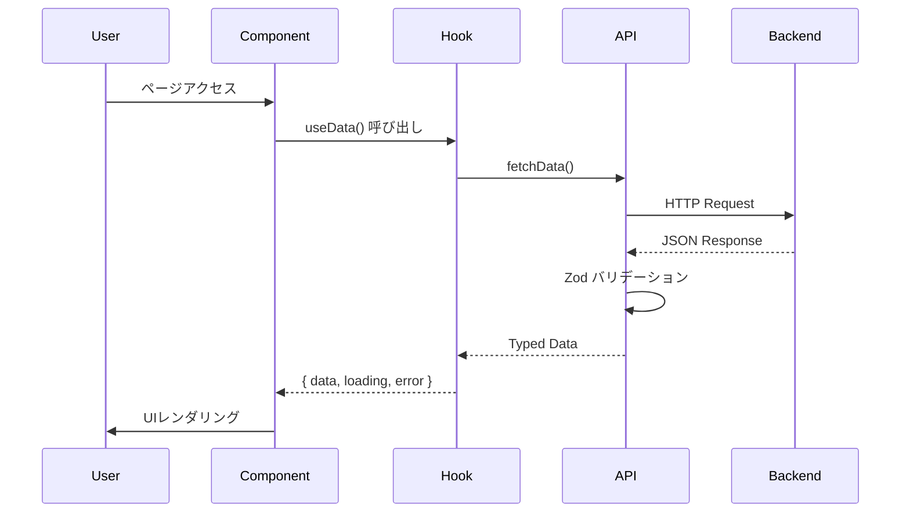

# Web Project Template - Platform Architecture

> **arc42準拠プラットフォームアーキテクチャ文書**
>
> **最終更新**: 2026-02-11
> **文書ステータス**: Active
> **メンテナンス**: アーキテクチャ変更時に同期更新

このドキュメントは、Web Project Templateのアーキテクチャをarc42テンプレートに基づいて記述します。

---

## 目次

1. [Introduction and Goals（導入と目標）](#1-introduction-and-goals導入と目標)
2. [Constraints（制約）](#2-constraints制約)
3. [Context and Scope（コンテキストと境界）](#3-context-and-scopeコンテキストと境界)
4. [Solution Strategy（ソリューション戦略）](#4-solution-strategyソリューション戦略)
5. [Building Blocks View（構成要素ビュー）](#5-building-blocks-view構成要素ビュー)
6. [Runtime View（ランタイムビュー）](#6-runtime-viewランタイムビュー)
7. [Deployment View（デプロイメントビュー）](#7-deployment-viewデプロイメントビュー)
8. [Cross-Cutting Concepts（横断的関心事）](#8-cross-cutting-concepts横断的関心事)
9. [Architecture Decisions（アーキテクチャ決定）](#9-architecture-decisionsアーキテクチャ決定)
10. [Quality Requirements（品質要求）](#10-quality-requirements品質要求)
11. [Risks and Technical Debt（リスクと技術的負債）](#11-risks-and-technical-debtリスクと技術的負債)
12. [Glossary（用語集）](#12-glossary用語集)

---

## 1. Introduction and Goals（導入と目標）

### 1.1 Requirements Overview

**プロジェクト名**: Web Project Template

**概要**: Next.js/React/TypeScriptをベースとしたWebアプリケーションテンプレート。Feature-Firstアーキテクチャを採用し、AI主導開発に最適化。

**コアバリュープロポジション**:

- Feature-First構造による保守性の高い設計
- TypeScript厳格モードによる型安全性
- AI主導開発のための明確な規約
- 日本語専用UI

**ターゲット**: 小規模〜中規模のWebアプリケーション開発

### 1.2 Quality Goals

プロジェクトの品質目標を優先度順に記載します。

| 優先度 | 品質属性                                 | 説明                                         | 測定指標                         |
| ------ | ---------------------------------------- | -------------------------------------------- | -------------------------------- |
| 1      | **Maintainability（保守性）**            | AI主導開発での変更容易性。機能単位の独立性。 | 機能追加時の影響範囲 < 3ファイル |
| 2      | **Testability（テスト容易性）**          | 自動テストによる品質保証。                   | カバレッジ ≥ 80%                 |
| 3      | **Security（セキュリティ）**             | 認証・認可の堅牢性。入力検証。               | セキュリティスキャン 0 Critical  |
| 4      | **Usability（使いやすさ）**              | 直感的なUI。                                 | -                                |
| 5      | **Developer Productivity（開発生産性）** | AI主導開発での実装速度。                     | 機能実装時間 ≤ 2日               |

### 1.3 Stakeholders

| 役割                   | 期待                 | 関心事                                     |
| ---------------------- | -------------------- | ------------------------------------------ |
| **ユーザー**           | 使いやすいWebアプリ  | UX品質、パフォーマンス                     |
| **開発チーム**         | 高速開発、保守容易性 | アーキテクチャの明確さ、AI開発パイプライン |
| **プロダクトオーナー** | ビジネス目標達成     | 開発速度、品質                             |
| **AIエージェント**     | 実装可能な仕様       | SPEC文書の構造化、CONTEXT.json SSOT        |

---

## 2. Constraints（制約）

プロジェクトに課せられた技術的・組織的制約を記載します。

### 2.1 Technical Constraints

| ID    | 制約                | 背景・理由                             |
| ----- | ------------------- | -------------------------------------- |
| TC-01 | **Next.js 14+**     | App Router、サーバーコンポーネント対応 |
| TC-02 | **TypeScript 5.0+** | 厳格モード、型安全性                   |
| TC-03 | **React 18+**       | Concurrent Features、Suspense          |
| TC-04 | **Zod 3.0+**        | スキーマバリデーション                 |
| TC-05 | **Node.js LTS**     | 安定した実行環境                       |

### 2.2 Organizational Constraints

| ID    | 制約                                       | 背景・理由                                |
| ----- | ------------------------------------------ | ----------------------------------------- |
| OC-01 | **小規模チーム（1-2名 + AIエージェント）** | AI主導開発必須                            |
| OC-02 | **AI主導開発**                             | CONTEXT.json SSOTベース                   |
| OC-03 | **MVP優先スケジュール**                    | 過剰な抽象化の回避                        |
| OC-04 | **日本語コメント必須**                     | 公開API（クラス・メソッド）は日本語文書化 |

### 2.3 Business Constraints

| ID    | 制約             | 背景・理由               |
| ----- | ---------------- | ------------------------ |
| BC-01 | **低コスト運用** | インフラ管理コスト最小化 |

---

## 3. Context and Scope（コンテキストと境界）

### 3.1 Business Context

```
┌─────────────────────────────────────────────────────┐
│                  Web Application                     │
├─────────────────────────────────────────────────────┤
│  ┌──────────────────┐                               │
│  │  Next.js App     │  (Browser)                    │
│  │  (Client)        │                               │
│  └────────┬─────────┘                               │
│           │ HTTPS                                    │
│  ┌────────▼─────────────────────────────────────┐   │
│  │  Backend Services (Configurable)             │   │
│  ├─────────────────────────────────────────────┤   │
│  │  • API Routes                                │   │
│  │  • Database (TBD)                            │   │
│  │  • Authentication (TBD)                      │   │
│  └─────────────────────────────────────────────┘   │
└─────────────────────────────────────────────────────┘
```

### 3.2 Technical Context

| 外部システム    | 役割               | インターフェース | 依存度                   |
| --------------- | ------------------ | ---------------- | ------------------------ |
| **Backend API** | データ永続化・認証 | REST API (JSON)  | プロジェクトに応じて設定 |
| **CDN**         | 静的アセット配信   | HTTPS            | 🟢 Medium                |

---

## 4. Solution Strategy（ソリューション戦略）

プロジェクトのコアアーキテクチャ決定の概要を記載します。

### 4.1 Core Architecture Decisions

| ID           | 決定                                          | 理由                                         | トレードオフ               |
| ------------ | --------------------------------------------- | -------------------------------------------- | -------------------------- |
| **PADR-001** | Feature-First + Simplified Clean Architecture | 機能単位の独立性、依存方向の明確化           | 機能間コード重複リスク     |
| **PADR-002** | React Hooks + Custom Hooks                    | useState/useEffect標準パターン、テスト容易性 | グローバル状態管理の複雑さ |
| **PADR-003** | 設定可能なバックエンド                        | プロジェクトに応じた柔軟な選択               | 初期設定コスト             |
| **PADR-004** | TypeScript + Zod                              | 型安全性、ランタイムバリデーション           | 学習コスト                 |
| **PADR-006** | CONTEXT.json SSOT                             | AI読み書き容易性、VCS追跡                    | JSON手動編集困難           |

### 4.2 Technology Stack Summary

| レイヤー           | 技術スタック                                      |
| ------------------ | ------------------------------------------------- |
| **Frontend**       | Next.js 14+, React 18+, TypeScript 5.0+, Zod 3.0+ |
| **Backend**        | Next.js API Routes (設定可能)                     |
| **Authentication** | 設定可能 (NextAuth.js等)                          |
| **Styling**        | Tailwind CSS (推奨)                               |

詳細は [tech-stack-rules.md](../technical/tech-stack-rules.md) を参照。

---

## 5. Building Blocks View（構成要素ビュー）

### 5.1 Level 1: System Decomposition

```
┌─────────────────────────────────────────────────────┐
│               Web Application System                 │
├─────────────────────────────────────────────────────┤
│  ┌──────────────────┐                               │
│  │  Next.js App     │  (Browser + Server)           │
│  │                  │                               │
│  └────────┬─────────┘                               │
│           │ HTTPS                                    │
│  ┌────────▼─────────────────────────────────────┐   │
│  │  Backend (Configurable)                      │   │
│  ├─────────────────────────────────────────────┤   │
│  │  • API                                       │   │
│  │  • Database                                  │   │
│  │  • Authentication                            │   │
│  └─────────────────────────────────────────────┘   │
└─────────────────────────────────────────────────────┘
```

### 5.2 Level 2: Container Diagram

#### Next.js App Container

| コンポーネント | 技術               | 責務                       |
| -------------- | ------------------ | -------------------------- |
| **Components** | React + TypeScript | UI表示、ユーザー入力       |
| **Hooks**      | Custom Hooks       | 状態管理、ビジネスロジック |
| **API Layer**  | API Client         | バックエンド連携           |
| **Types**      | TypeScript + Zod   | 型定義、バリデーション     |

---

## 6. Runtime View（ランタイムビュー）

### 6.1 Data Fetch Flow



---

## 7. Deployment View（デプロイメントビュー）

### 7.1 Deployment Diagram

```
┌─────────────────────────────────────────────────────┐
│                    Client Devices                    │
├─────────────────────────────────────────────────────┤
│  ┌──────────────────────────────────────────────┐   │
│  │  Web Browser (Chrome/Safari/Firefox/Edge)   │   │
│  └──────────────────────────────────────────────┘   │
│                      │ HTTPS                         │
└──────────────────────┼─────────────────────────────┘
                       │
┌──────────────────────▼─────────────────────────────┐
│           Hosting Platform (Vercel/AWS/etc)         │
├────────────────────────────────────────────────────┤
│  ┌──────────────────────────────────────────────┐  │
│  │  Next.js Application                         │  │
│  │  - Static Generation                         │  │
│  │  - Server-Side Rendering                     │  │
│  │  - API Routes                                │  │
│  └──────────────────────────────────────────────┘  │
└────────────────────────────────────────────────────┘
```

---

## 8. Cross-Cutting Concepts（横断的関心事）

### 8.1 Error Handling

**原則**: Fail-Fast + 構造化ロギング

```typescript
// ✅ 推奨パターン
async function fetchData() {
  try {
    const data = await apiClient.getData();
    return data;
  } catch (error) {
    logger.error('データ取得失敗', error);
    throw new Error('データを読み込めません');
  }
}
```

### 8.2 Logging

**原則**: 適切なロガー使用（`console.log()` 禁止）

| レベル      | 用途                      |
| ----------- | ------------------------- |
| **Debug**   | 開発中のデバッグ情報      |
| **Info**    | 一般的な情報ログ          |
| **Warning** | 警告（エラーではない）    |
| **Error**   | エラー + スタックトレース |

### 8.3 Security

#### 8.3.1 Input Validation

すべてのユーザー入力をZodで検証。

```typescript
import { z } from 'zod';

const UserInputSchema = z.object({
  name: z.string().min(1).max(100),
  email: z.string().email(),
});

// バリデーション
const result = UserInputSchema.safeParse(input);
if (!result.success) {
  throw new Error('Invalid input');
}
```

#### 8.3.2 Authentication & Authorization

| 機能               | 実装                      |
| ------------------ | ------------------------- |
| **認証**           | 設定可能（NextAuth.js等） |
| **認可**           | ミドルウェアで実装        |
| **セッション管理** | セキュアなトークン管理    |

#### 8.3.3 Secret Management

| シークレット | 管理方法                                     |
| ------------ | -------------------------------------------- |
| **API Keys** | `.env.local` / `.env.production` (gitignore) |
| **Tokens**   | 環境変数                                     |

---

## 9. Architecture Decisions（アーキテクチャ決定）

### 9.1 Platform Architecture Decision Records (PADR)

| ID                                                             | タイトル                                      | 決定                        | ステータス  |
| -------------------------------------------------------------- | --------------------------------------------- | --------------------------- | ----------- |
| [PADR-001](./adr/PADR-001-feature-first-clean-architecture.md) | Feature-First + Simplified Clean Architecture | Feature-Firstアーキテクチャ | ✅ Accepted |
| [PADR-002]                                                     | React Hooks State Management                  | React Hooks + Custom Hooks  | ✅ Accepted |
| [PADR-003]                                                     | Configurable Backend                          | 設定可能なバックエンド      | ✅ Accepted |
| [PADR-004]                                                     | TypeScript + Zod                              | 型安全性 + バリデーション   | ✅ Accepted |
| [PADR-006](./adr/PADR-006-context-json-ssot.md)                | CONTEXT.json SSOT                             | 機能メタデータ単一管理      | ✅ Accepted |

---

## 10. Quality Requirements（品質要求）

### 10.1 Quality Attribute Scenarios

| 品質属性                   | シナリオ               | 測定指標               | 目標値      |
| -------------------------- | ---------------------- | ---------------------- | ----------- |
| **Maintainability**        | 新機能追加時の影響範囲 | 変更ファイル数         | ≤ 3ファイル |
| **Testability**            | 単体テストカバレッジ   | カバレッジ率           | ≥ 80%       |
| **Security**               | 入力検証               | バリデーションエラー   | 0件         |
| **Performance**            | ページロード時間       | First Contentful Paint | ≤ 1.5秒     |
| **Developer Productivity** | 機能実装時間           | 実装〜テスト完了       | ≤ 2日       |

---

## 11. Risks and Technical Debt（リスクと技術的負債）

### 11.1 Architecture Risks

| リスク                    | 影響度 | 発生確率 | 緩和策                     |
| ------------------------- | ------ | -------- | -------------------------- |
| **TypeScript厳格モード**  | Medium | Low      | 段階的導入、型定義整備     |
| **Feature間の重複コード** | Medium | Medium   | Sharedレイヤーの適切な活用 |

### 11.2 Technical Debt

| 項目                      | 説明             | 優先度 | 対応計画                   |
| ------------------------- | ---------------- | ------ | -------------------------- |
| **shared レイヤー肥大化** | 共通コードの増加 | Medium | 四半期ごとリファクタリング |

---

## 12. Glossary（用語集）

| 用語                              | 定義                                                   |
| --------------------------------- | ------------------------------------------------------ |
| **Feature-First**                 | 機能単位でフォルダを分割するアーキテクチャパターン     |
| **SSOT (Single Source of Truth)** | 唯一の真実のソース。CONTEXT.jsonが機能メタデータのSSOT |
| **Custom Hook**                   | React hooksをカプセル化した再利用可能なロジック        |
| **Zod**                           | TypeScriptのスキーマバリデーションライブラリ           |

---

## 参照文書

- [CLAUDE.md（プロジェクトガイドライン）](../../CLAUDE.md)
- [Tech Stack Rules](../technical/tech-stack-rules.md)
- [All PADR Documents](./adr/)
- [arc42 Template](https://arc42.org/)

---

**文書メンテナンス**:

- アーキテクチャ変更時に即座に更新
- 四半期ごとに全体レビュー

**次回レビュー**: 2026年5月
