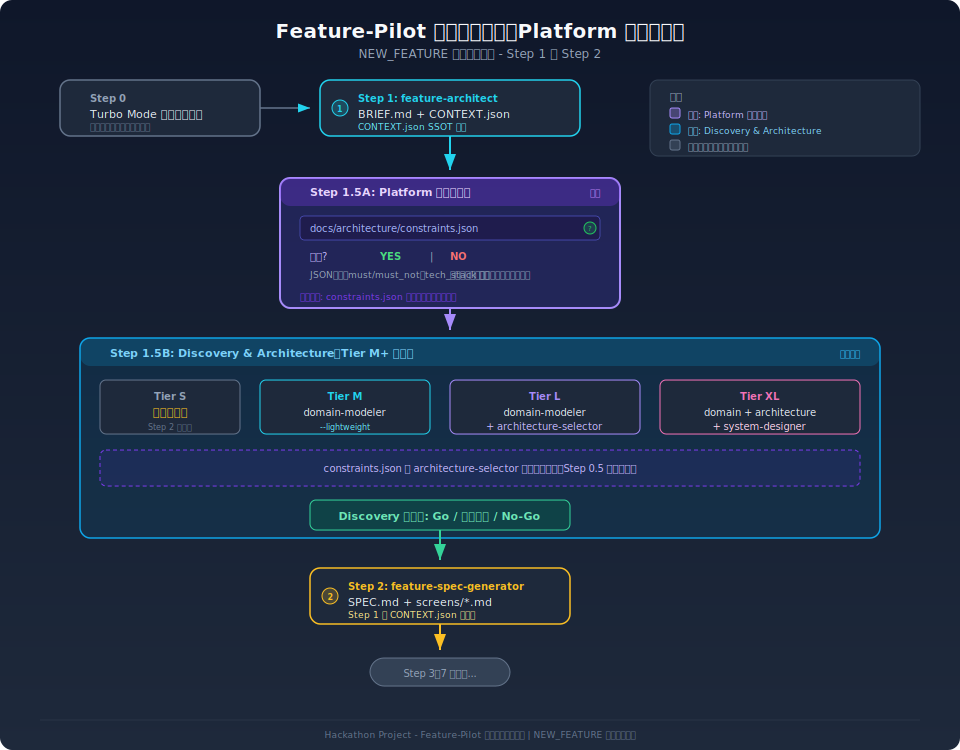
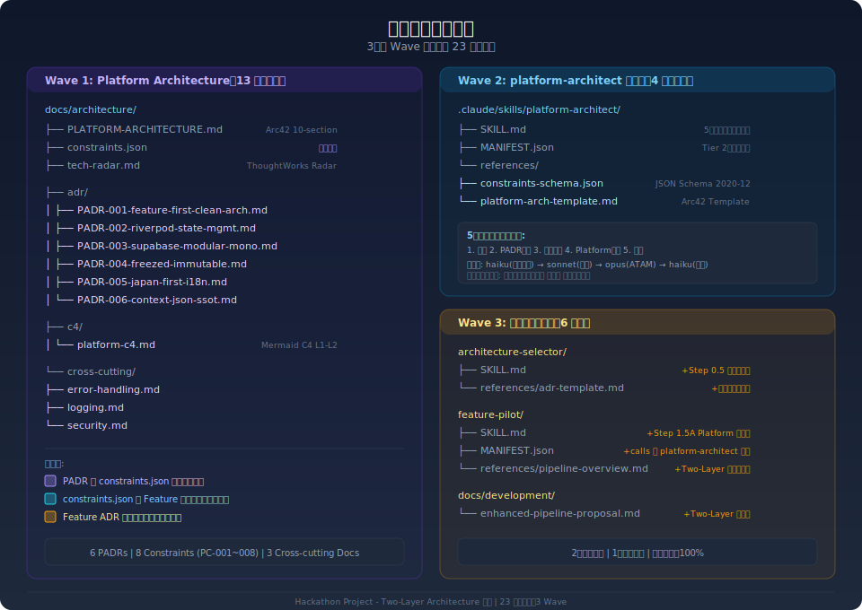

# Two-Layer Architecture Contract Pattern - 総合ガイド

> **Version**: 1.0 | **Date**: 2026-02-11 | **Status**: Active

Hackathon Project プロジェクトのアーキテクチャ管理を体系化する **Two-Layer Architecture Contract Pattern** の総合ガイドです。

---

## 1. エグゼクティブサマリー

### 解決した問題

| Before                                                                 | After                                                 |
| ---------------------------------------------------------------------- | ----------------------------------------------------- |
| コアアーキテクチャが CLAUDE.md と tech-stack-rules.md に散在（暗黙知） | PADR + constraints.json で明示化・機械可読化          |
| architecture-selector が制約をハードコード                             | constraints.json から自動ロード（フォールバック付き） |
| 6つの暗黙決定が ADR 化されていない                                     | PADR-001〜006 として Nygard 形式で文書化              |
| AI が制約を正確に参照できない                                          | JSON 形式で 100% 正確な制約参照を実現                 |

### コアコンセプト

**Architecture Contract Pattern** = PADR（人間可読 Why/Context）+ constraints.json（AI/機械可読 What/Must/Must-Not）

- **Layer 1 (Platform Architecture)**: 全機能に適用される共通制約。更新頻度: 年 1-2 回
- **Layer 2 (Feature Architecture)**: 機能ごとの個別アーキテクチャ決定。更新頻度: 機能開発時

---

## 2. アーキテクチャ概要図


### Two-Layer の分離原則

```
Layer 1: Platform Architecture（全体共通・低頻度更新）
│
├── PADR-*.md           ← Why/Context（人間向け）
├── constraints.json    ← What/Rules（AI向け）
├── PLATFORM-ARCHITECTURE.md
├── tech-radar.md
├── c4/platform-c4.md
└── cross-cutting/*.md
│
│  constraints flow down ↓
│
Layer 2: Feature Architecture（機能別・高頻度更新）
│
├── ADR-<id>.md         ← Feature-level decisions
├── DOMAIN-MODEL.md     ← DDD artifacts
└── SYSTEM-DESIGN-*.md  ← C4 diagrams
```

**なぜ 2 層に分けるのか？**

1. **関心の分離**: Platform 決定（年単位）と Feature 決定（週単位）は変更頻度が全く異なる
2. **制約の伝播**: Platform 制約を 1 箇所で更新すれば全 Feature に自動伝播
3. **逸脱の追跡**: Feature が Platform 制約から外れる場合、明示的な正当化を要求

---

## 3. Architecture Contract Pattern

### 3.1 二重構造の仕組み

| 側面     | PADR (Markdown)                   | constraints.json (JSON)              |
| -------- | --------------------------------- | ------------------------------------ |
| **対象** | 人間（開発者、レビュアー）        | AI エージェント、自動化ツール        |
| **内容** | Why/Context/Tradeoffs             | What/Must/Must-Not/Rules             |
| **形式** | Nygard 形式 ADR                   | JSON Schema 準拠                     |
| **配置** | `docs/architecture/adr/PADR-*.md` | `docs/architecture/constraints.json` |
| **更新** | 手動（platform-architect スキル） | PADR から自動生成                    |

### 3.2 PADR と Constraint の対応

| PADR     | Constraint     | 決定内容                                      |
| -------- | -------------- | --------------------------------------------- |
| PADR-001 | PC-001         | Feature-First + Simplified Clean Architecture |
| PADR-002 | PC-002         | Riverpod @riverpod Notifier Pattern           |
| PADR-003 | PC-003, PC-008 | Supabase Backend + Security                   |
| PADR-004 | PC-004         | Freezed Immutable Models                      |
| PADR-005 | PC-005         | Japan-First i18n Strategy                     |
| PADR-006 | PC-006         | CONTEXT.json SSOT                             |
| (複合)   | PC-007         | Code Quality Enforcement                      |

### 3.3 Constraint の構造

```json
{
  "id": "PC-001",
  "source_padr": "PADR-001",
  "category": "architecture",
  "rule": "Feature-First + Simplified Clean Architecture",
  "must": [
    "presentation/ → domain/ → data/ の依存方向を守る",
    "feature → core, feature → shared の参照のみ許可"
  ],
  "must_not": ["core → feature の逆依存", "feature間の直接import（バレルファイル経由のみ）"],
  "applies_to": ["lib/features/**/*"],
  "override_allowed": false,
  "enforcement": "critical"
}
```

---

## 4. パイプライン統合



### 4.1 Feature-Pilot パイプライン変更点

NEW_FEATURE ワークフローに 2 つのステップが追加されました:

|   Step   | 名前                      | 実行条件           | 内容                                                     |
| :------: | ------------------------- | ------------------ | -------------------------------------------------------- |
| **1.5A** | Platform Constraints Load | **全 NEW_FEATURE** | constraints.json の存在確認・自動ロード                  |
| **1.5B** | Discovery & Architecture  | Tier M+ のみ       | domain-modeler / architecture-selector / system-designer |

### 4.2 Step 1.5A の動作フロー

```
constraints.json 存在確認
  │
  ├── EXISTS → JSON Parse
  │            ├── constraints[] 展開 → Technical Constraints ベース設定
  │            ├── tech_stack 抽出 → フレームワーク/バージョン制約
  │            └── deviation_policy 確認 → 逸脱条件把握
  │
  └── NOT EXISTS → フォールバック
                   └── architecture-selector 内蔵のハードコード制約を使用
                       (後方互換性 100% 維持)
```

### 4.3 architecture-selector 内部変更

architecture-selector に **Step 0.5** が追加され、constraints.json を自動ロードします:

1. `docs/architecture/constraints.json` の存在確認
2. 存在する場合: JSON パースし、`constraints[]` と `tech_stack` を読み込む
3. Technical Constraints セクションの前提制約として設定
4. Feature ADR で逸脱が必要な場合、Platform Deviation Justification セクションが必須

---

## 5. スキル依存関係


### 5.1 スキル一覧と役割

| スキル                    | Layer |       Tier       | 責務                    | 出力                   |
| ------------------------- | :---: | :--------------: | ----------------------- | ---------------------- |
| **platform-architect**    |   1   | 2 (Independent)  | Platform 全体の制約管理 | PADR, constraints.json |
| **feature-pilot**         |   -   | 1 (Orchestrator) | パイプライン統制        | CONTEXT.json state     |
| **domain-modeler**        |   2   |   2 (Pipeline)   | DDD ドメインモデル      | DOMAIN-MODEL.md        |
| **architecture-selector** |   2   |   2 (Pipeline)   | Feature ADR 生成        | ADR-\<id\>.md          |
| **system-designer**       |   2   |   2 (Pipeline)   | C4 システム設計         | SYSTEM-DESIGN-\*.md    |

### 5.2 呼び出し関係

```
User ─── (直接) ──→ platform-architect   [Layer 1, Independent]
  │
  └── (自動) ──→ feature-pilot            [Orchestrator]
                    │
                    ├── Step 1.5A: constraints.json ロード
                    │                (platform-architect の成果物を参照)
                    │
                    └── Step 1.5B: (Tier 別)
                         ├── Tier M:  domain-modeler
                         ├── Tier L:  domain-modeler + architecture-selector
                         └── Tier XL: domain-modeler + architecture-selector + system-designer
```

---

## 6. 制約の消費と逸脱フロー


### 6.1 制約の伝播経路

```
PADR-001~006  ──(extract)──→  constraints.json  ──(load)──→  feature-pilot Step 1.5A
                                                                      │
                                                               ──(pass)──→  architecture-selector Step 0.5
                                                                                    │
                                                                             ┌──────┴──────┐
                                                                        Comply?         Deviate?
                                                                             │                │
                                                                     Standard ADR    ADR + Deviation
                                                                                    Justification
```

### 6.2 Platform Deviation Justification

Feature ADR が Platform 制約から逸脱する場合、以下のセクションが**必須**です:

```markdown
## Platform Deviation Justification

### Deviating from

- PC-001: Feature-First Architecture

### Justification

{なぜこの機能では Platform 制約から逸脱する必要があるのか}

### ATAM Lite Evidence

{逸脱の正当性を品質属性比較で証明}
```

**逸脱ポリシー**:

- `deviation_policy.allowed`: true（逸脱は許可される）
- **条件**: Feature ADR に Deviation Justification セクション必須
- **承認**: ATAM Lite 評価で正当性を証明すること

---

## 7. ファイル構造



### 7.1 Wave 別ファイル一覧

#### Wave 1: Platform Architecture 基盤 (13 files)

```
docs/architecture/
├── PLATFORM-ARCHITECTURE.md    ← Arc42 10-section overview
├── constraints.json            ← Machine-readable constraints (PC-001~008)
├── tech-radar.md               ← ThoughtWorks Radar (Adopt/Trial/Assess/Hold)
├── adr/
│   ├── PADR-001-feature-first-clean-architecture.md
│   ├── PADR-002-riverpod-state-management.md
│   ├── PADR-003-supabase-modular-monolith.md
│   ├── PADR-004-freezed-immutable-models.md
│   ├── PADR-005-japan-first-i18n.md
│   └── PADR-006-context-json-ssot.md
├── c4/
│   └── platform-c4.md          ← Mermaid C4 Level 1-2
└── cross-cutting/
    ├── error-handling.md        ← Fail-Fast, AsyncValue patterns
    ├── logging.md               ← LogUtils mandatory, PII exclusion
    └── security.md              ← RLS, Auth, input validation
```

#### Wave 2: platform-architect Skill (4 files)

```
.claude/skills/platform-architect/
├── SKILL.md                    ← 5-phase protocol
├── MANIFEST.json               ← Tier 2, Independent
└── references/
    ├── constraints-schema.json  ← JSON Schema 2020-12
    └── platform-architecture-template.md  ← Arc42 template
```

#### Wave 3: Existing Skill Integration (6 edits)

| File                                             | Change                                                        |
| ------------------------------------------------ | ------------------------------------------------------------- |
| architecture-selector/SKILL.md                   | +Step 0.5 constraints load, Section 1.3 constraints.json 参照 |
| architecture-selector/references/adr-template.md | +Platform Deviation Justification section                     |
| feature-pilot/SKILL.md                           | +Step 1.5A Platform Constraints load                          |
| feature-pilot/MANIFEST.json                      | +`platform-architect` in calls array                          |
| feature-pilot/references/pipeline-overview.md    | +Two-Layer Architecture section                               |
| docs/development/enhanced-pipeline-proposal.md   | +Two-Layer Architecture Errata                                |

---

## 8. 運用ガイド

### 8.1 初回セットアップ（完了済み）

```bash
# platform-architect スキルで全 Phase 実行
/platform-architect
```

これにより PADR-001〜006、constraints.json、PLATFORM-ARCHITECTURE.md が生成されます。

### 8.2 新技術導入時

```bash
# platform-architect で更新
/platform-architect --update "新技術名の追加"
```

1. 新しい PADR-NNN を作成
2. constraints.json に新 PC-NNN を追加
3. PLATFORM-ARCHITECTURE.md を更新
4. 整合性検証を実行

### 8.3 Feature 開発時（自動）

```
ユーザー: "新機能を実装して"
  ↓
feature-pilot が自動起動
  ↓
Step 1.5A: constraints.json を自動ロード（存在する場合）
  ↓
Step 1.5B: architecture-selector が制約を参照して Feature ADR 生成
  ↓
→ Platform 制約準拠の Feature Architecture が自動で保証される
```

### 8.4 定期レビュー

| タイミング     | アクション                                            |
| -------------- | ----------------------------------------------------- |
| **四半期**     | `/platform-architect --phase verify` で整合性チェック |
| **年次**       | Tech Radar レビュー + PADR の Superseded 確認         |
| **技術変更時** | 新 PADR 追加 + constraints.json 更新                  |

---

## 9. 業界標準との対応

| Hackathon Project            | 業界標準                    | 備考                                |
| ------------------------ | --------------------------- | ----------------------------------- |
| PADR (Platform ADR)      | Michael Nygard ADR (2011)   | Nygard 形式を Platform レベルに拡張 |
| constraints.json         | TOGAF Architecture Contract | 機械可読化した制約契約              |
| PLATFORM-ARCHITECTURE.md | Arc42 Template              | 10 セクション構成                   |
| tech-radar.md            | ThoughtWorks Tech Radar     | Adopt/Trial/Assess/Hold の 4 リング |
| c4/platform-c4.md        | C4 Model (Simon Brown)      | Level 1-2 Mermaid 図                |
| ATAM Lite                | SEI/CMU ATAM                | 軽量版トレードオフ分析              |
| Feature-First            | Hexagonal Architecture 変形 | Clean Architecture 簡略化           |

---

## 10. FAQ

### Q: constraints.json がなくても動作しますか？

**A**: はい。全箇所にフォールバック機構があり、constraints.json が存在しない場合はハードコードされたデフォルト制約を使用します。後方互換性は 100% 維持されています。

### Q: Feature ADR で Platform 制約に従わないことは可能ですか？

**A**: はい。`deviation_policy.allowed: true` です。ただし、Feature ADR に **Platform Deviation Justification** セクションを追加し、ATAM Lite 評価で逸脱の正当性を証明する必要があります。

### Q: PADR と constraints.json が矛盾した場合はどうなりますか？

**A**: PADR が正式な Source of Truth です。constraints.json は PADR から自動生成される派生物であり、矛盾が発見された場合は PADR の内容が優先されます。`/platform-architect --phase verify` で整合性チェックを実行してください。

### Q: 新しい制約を追加するにはどうすればよいですか？

**A**: `/platform-architect --update "制約の説明"` を実行します。新しい PADR が作成され、対応する PC-NNN が constraints.json に自動追加されます。

---

## 参照

- [PLATFORM-ARCHITECTURE.md](PLATFORM-ARCHITECTURE.md) - Arc42 全体像
- [constraints.json](constraints.json) - 機械可読制約
- [tech-radar.md](tech-radar.md) - 技術採用状況
- [platform-architect スキル](../../.claude/skills/platform-architect/SKILL.md) - 管理スキル
- [architecture-selector スキル](../../.claude/skills/architecture-selector/SKILL.md) - Feature ADR 生成
- [feature-pilot スキル](../../.claude/skills/feature-pilot/SKILL.md) - パイプライン
- [enhanced-pipeline-proposal](../development/enhanced-pipeline-proposal.md) - 元提案書

---

**文書ステータス**: Active
**メンテナンス**: Architecture 変更時に同期更新
