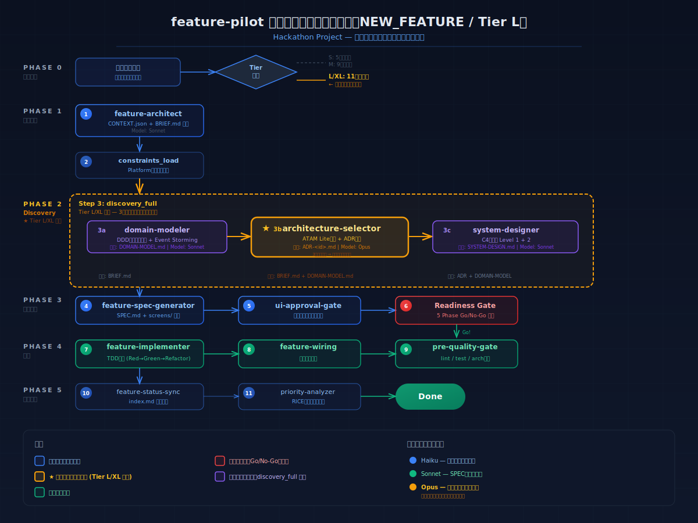
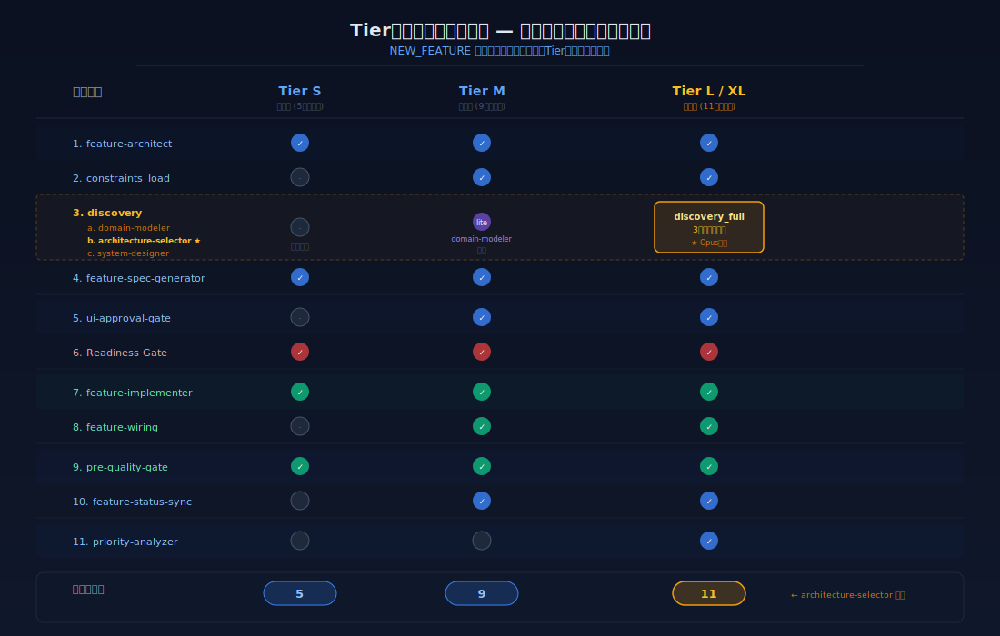
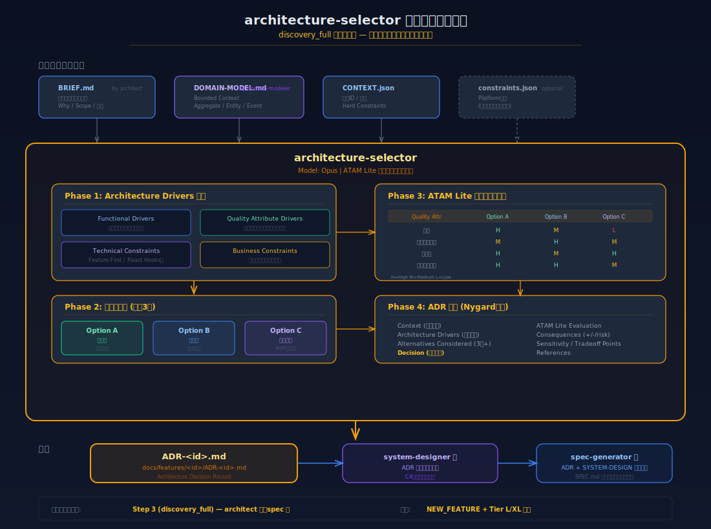

# feature-pilot パイプラインにおけるアーキテクチャ選定のタイミング

> **作成日**: 2026-02-12
> **対象**: Hackathon Project 開発チーム
> **関連スキル**: `feature-pilot`, `architecture-selector`, `domain-modeler`, `system-designer`

---

## 1. 概要

`architecture-selector` は、feature-pilot パイプラインの **discovery_full** ステップ内で実行される設計スキルです。**Tier L/XL（大規模機能）の NEW_FEATURE パイプラインでのみ**呼び出されます。

### 一言で言うと

> **「何を作るか」を決めた後、「どう実装するか」を決める前に、「どう構成するか」を選定するフェーズ**

---

## 2. 全体パイプラインフロー

### 図1: パイプライン全体フロー（Tier L）



### 時系列での位置づけ

```
Phase 0  ユーザー要求 → 作業タイプ・Tier 自動判別
           │
Phase 1  [Step 1] feature-architect     → CONTEXT.json + BRIEF.md
         [Step 2] constraints_load      → Platform制約読み込み
           │
Phase 2  [Step 3] discovery_full        ← ★ ここでアーキテクチャ選定
         ┌──────────────────────────────────────┐
         │ 3a. domain-modeler (Sonnet)          │
         │      → DOMAIN-MODEL.md              │
         │                                      │
         │ 3b. architecture-selector (Opus) ★   │
         │      → ADR-<id>.md                  │
         │                                      │
         │ 3c. system-designer (Sonnet)         │
         │      → SYSTEM-DESIGN.md             │
         └──────────────────────────────────────┘
           │
Phase 3  [Step 4] feature-spec-generator → SPEC.md + screens/
         [Step 5] ui-approval-gate       → ワイヤーフレーム承認
         [Step 6] Readiness Gate         → Go/No-Go 検証
           │
Phase 4  [Step 7] feature-implementer   → TDD実装
         [Step 8] feature-wiring         → 統合連動検証
         [Step 9] pre-quality-gate       → lint/test/arch検査
           │
Phase 5  [Step 10] feature-status-sync  → index.md 同期
         [Step 11] priority-analyzer     → RICE優先順位再計算
```

**核心ポイント**: アーキテクチャ選定は **仕様書（SPEC）生成の直前** に位置します。これにより、SPECにはアーキテクチャ決定が反映された具体的な技術契約が含まれます。

---

## 3. Tier別比較

### 図2: Tier別パイプライン比較



### Tier別のアーキテクチャ関連ステップ

| Tier              | discovery ステップ | architecture-selector | 理由                          |
| ----------------- | ------------------ | --------------------- | ----------------------------- |
| **S** (小規模)    | なし               | **実行されない**      | 5ファイル以下の小機能では不要 |
| **M** (中規模)    | discovery_lite     | **実行されない**      | domain-modeler のみ実行       |
| **L** (大規模)    | **discovery_full** | **★ 実行される**      | 複雑なトレードオフ分析が必要  |
| **XL** (超大規模) | **discovery_full** | **★ 実行される**      | L と同じパイプライン          |

### 判定基準

- **Tier S**: 影響ファイル 5個以下、単一機能
- **Tier M**: 影響ファイル 6〜20個、複数コンポーネント
- **Tier L/XL**: 影響ファイル 20個以上、アーキテクチャ判断が必要

---

## 4. architecture-selector の内部プロセス

### 図3: architecture-selector 詳細フロー



### 4フェーズの処理

#### Phase 1: Architecture Drivers 分析

入力ドキュメント（BRIEF.md, DOMAIN-MODEL.md, CONTEXT.json, constraints.json）から以下の4カテゴリのドライバーを抽出します。

| カテゴリ                  | 内容                   | 例                         |
| ------------------------- | ---------------------- | -------------------------- |
| Functional Drivers        | データフロー、統合要件 | API連携、リアルタイム性    |
| Quality Attribute Drivers | 品質特性要件           | 性能 < 200ms、可用性 99.9% |
| Technical Constraints     | 技術的制約             | Feature-First、React Hooks |
| Business Constraints      | ビジネス制約           | 2週間以内、チーム2名       |

#### Phase 2: 代替案生成（最低3案）

| 案           | 性格     | 説明                              |
| ------------ | -------- | --------------------------------- |
| **Option A** | 推奨案   | 全Driversをバランスよく満たす構成 |
| **Option B** | 代替案   | 特定の品質属性を優先した構成      |
| **Option C** | 最小構成 | MVP向けの軽量構成                 |

#### Phase 3: ATAM Lite 評価マトリクス

品質属性 × 各Optionのトレードオフを可視化し、以下を特定します。

- **Sensitivity Points**: 小さな変更で大きな影響がある箇所
- **Tradeoff Points**: 品質属性間のトレードオフが発生する箇所
- **Risk Themes**: 潜在的リスクのテーマ

#### Phase 4: ADR生成（Nygard形式）

最終成果物として `docs/features/<id>/ADR-<id>.md` を生成。

```
ADR-<id>.md 構成:
├── Context（決定背景）
├── Architecture Drivers（分析結果）
├── Alternatives Considered（3案以上）
├── ATAM Lite Evaluation（評価マトリクス）
├── Decision（選択と理由）
├── Consequences（正・負・リスク）
└── References（BRIEF, DOMAIN-MODEL等）
```

---

## 5. 前後のスキルとの関係

### データフロー

```
feature-architect ──→ domain-modeler ──→ architecture-selector ──→ system-designer ──→ spec-generator
    │                    │                      │                       │                    │
  BRIEF.md          DOMAIN-MODEL.md        ADR-<id>.md          SYSTEM-DESIGN.md      SPEC-<id>.md
  CONTEXT.json                                                                         screens/*.md
```

### 各スキルの責務分担

| スキル                     | 問い               | 出力                   | モデル   |
| -------------------------- | ------------------ | ---------------------- | -------- |
| **feature-architect**      | 何を作るか？       | BRIEF.md, CONTEXT.json | Sonnet   |
| **domain-modeler**         | どんなドメインか？ | DOMAIN-MODEL.md        | Sonnet   |
| **architecture-selector**  | どう構成するか？   | ADR-\<id\>.md          | **Opus** |
| **system-designer**        | どう配置するか？   | SYSTEM-DESIGN.md       | Sonnet   |
| **feature-spec-generator** | どう実装するか？   | SPEC.md, screens/      | Sonnet   |

> **注目**: architecture-selector は唯一 **Opus** モデルを使用します。複雑なトレードオフ分析にはより高い推論能力が必要なためです。

---

## 6. 呼び出し条件まとめ

```
architecture-selector が実行される条件:
  ✅ 作業タイプ = NEW_FEATURE
  ✅ Tier = L または XL
  ✅ discovery_full ステップ内
  ✅ feature-architect 完了後（BRIEF.md 存在）
  ✅ domain-modeler 完了後（DOMAIN-MODEL.md 参照可能）

architecture-selector が実行されない条件:
  ❌ Tier S / Tier M
  ❌ MODIFY_FEATURE パイプライン
  ❌ BUG_FIX パイプライン
  ❌ DOCS_ONLY パイプライン
```

---

## 7. 関連ファイル

| ファイル                       | 場所                                                          |
| ------------------------------ | ------------------------------------------------------------- |
| feature-pilot スキル           | `.claude/skills/feature-pilot/`                               |
| architecture-selector スキル   | `.claude/skills/architecture-selector/`                       |
| NEW_FEATURE パイプライン       | `.claude/pipelines/new-feature.yaml`                          |
| MODIFY_FEATURE パイプライン    | `.claude/pipelines/modify-feature.yaml`                       |
| SVG: パイプライン全体フロー    | `docs/architecture/diagrams/pipeline-overview.svg`            |
| SVG: Tier別比較                | `docs/architecture/diagrams/tier-comparison.svg`              |
| SVG: architecture-selector詳細 | `docs/architecture/diagrams/architecture-selector-detail.svg` |
