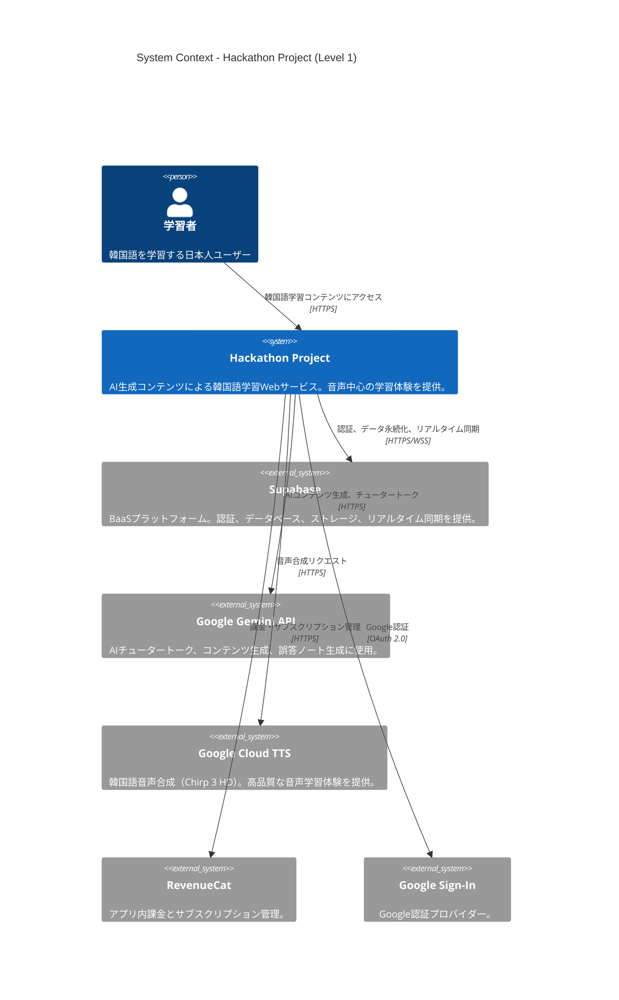
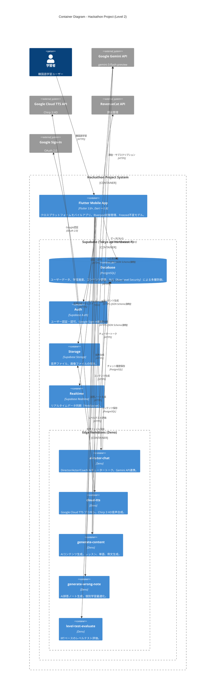

# Hackathon Project - C4 Architecture Diagrams

このドキュメントはHackathon ProjectプラットフォームのC4モデル図を提供します。

## 目次

1. [Level 1: System Context](#level-1-system-context)
2. [Level 2: Container](#level-2-container)
3. [図の凡例](#図の凡例)

---

## Level 1: System Context

システムコンテキスト図は、Hackathon Projectシステムと外部システム、ユーザーとの関係を示します。

### 主要要素

| 要素                  | タイプ          | 説明                                         |
| --------------------- | --------------- | -------------------------------------------- |
| **学習者**            | Person          | 韓国語を学習する日本人ユーザー               |
| **Hackathon Project**     | System          | AIベースの韓国語学習プラットフォーム         |
| **Supabase**          | External System | バックエンドサービス（Tokyo ap-northeast-1） |
| **Google Gemini API** | External System | AI生成エンジン（gemini-3-flash-preview）     |
| **Google Cloud TTS**  | External System | 音声合成サービス（Chirp 3 HD）               |
| **RevenueCat**        | External System | 収益化プラットフォーム                       |
| **Google Sign-In**    | External System | 認証プロバイダー                             |

---

## Level 2: Container

コンテナ図はHackathon Projectシステム内部のコンテナとその関係を示します。

### 主要コンテナ

#### フロントエンド

| コンテナ               | 技術スタック                                          | 説明                                                                                  |
| ---------------------- | ----------------------------------------------------- | ------------------------------------------------------------------------------------- |
| **Flutter Mobile App** | Flutter 3.8+, Dart >=3.8, Riverpod 2.6+, Freezed 2.4+ | クロスプラットフォームモバイルアプリ。Feature-First + Simplified Clean Architecture。 |

#### バックエンド（Supabase）

| コンテナ     | 技術スタック                   | 説明                                                                              |
| ------------ | ------------------------------ | --------------------------------------------------------------------------------- |
| **Database** | PostgreSQL (Supabase Postgres) | リレーショナルデータベース。RLS（Row Level Security）による行レベルセキュリティ。 |
| **Auth**     | Supabase Auth                  | ユーザー認証・認可。Google Sign-In統合。JWT トークンベース。                      |
| **Storage**  | Supabase Storage               | オブジェクトストレージ。音声ファイル、画像の保存。                                |
| **Realtime** | Supabase Realtime              | WebSocketベースのリアルタイムデータ同期。                                         |

#### Edge Functions（Deno Runtime）

| 関数名                  | 用途               | 説明                                                          |
| ----------------------- | ------------------ | ------------------------------------------------------------- |
| **ai-tutor-chat**       | AIチュータートーク | Director/Actor/Coach AI。Gemini API（JSON Schema強制）。      |
| **cloud-tts**           | 音声合成           | Google Cloud TTS プロキシ。Chirp 3 HD（韓国語高品質音声）。   |
| **generate-content**    | AIコンテンツ生成   | レッスン、単語、例文をAI生成。Gemini API（JSON Schema強制）。 |
| **generate-wrong-note** | 誤答ノート生成     | ユーザーの誤答を分析しパーソナライズされた学習ノート生成。    |
| **level-test-evaluate** | レベルテスト評価   | IRT（Item Response Theory）ベースのレベルテスト評価。         |

#### 外部サービス

| サービス                 | 用途           | 説明                                                      |
| ------------------------ | -------------- | --------------------------------------------------------- |
| **Google Gemini API**    | AI生成エンジン | gemini-3-flash-preview。JSON Schema強制による構造化出力。 |
| **Google Cloud TTS API** | 音声合成       | Chirp 3 HD。韓国語ネイティブ品質の音声合成。              |
| **RevenueCat API**       | 収益化         | アプリ内課金とサブスクリプション管理。                    |
| **Google Sign-In**       | 認証           | OAuth 2.0ベースのGoogle認証。                             |

---

## 図の凡例

### C4モデルレベル

| レベル      | 対象           | 詳細度                           | この文書での提供           |
| ----------- | -------------- | -------------------------------- | -------------------------- |
| **Level 1** | System Context | システム全体と外部システムの関係 | ✅ 提供                    |
| **Level 2** | Container      | システム内部のコンテナとその関係 | ✅ 提供                    |
| **Level 3** | Component      | コンテナ内部のコンポーネント     | ❌ 各機能SPEC-XXX.mdで提供 |
| **Level 4** | Code           | クラス・インターフェース         | ❌ ソースコードで提供      |

### 要素タイプ

| 要素                   | 意味                         | 表記                            |
| ---------------------- | ---------------------------- | ------------------------------- |
| **Person**             | ユーザー                     | `Person(...)`                   |
| **System**             | 対象システム                 | `System(...)`                   |
| **System_Ext**         | 外部システム                 | `System_Ext(...)`               |
| **Container**          | コンテナ（実行可能ユニット） | `Container(...)`                |
| **ContainerDb**        | データベースコンテナ         | `ContainerDb(...)`              |
| **Container_Boundary** | コンテナグループの境界       | `Container_Boundary(...) { }`   |
| **Rel**                | 関係（矢印）                 | `Rel(from, to, "説明", "技術")` |

### 技術スタック略語

| 略語          | 正式名称               |
| ------------- | ---------------------- |
| **HTTPS**     | HTTP over TLS/SSL      |
| **WSS**       | WebSocket Secure       |
| **RLS**       | Row Level Security     |
| **IRT**       | Item Response Theory   |
| **OAuth 2.0** | Open Authorization 2.0 |
| **JWT**       | JSON Web Token         |

---

## 参照

- [PLATFORM-ARCHITECTURE.md - 第5章: Building Blocks](../PLATFORM-ARCHITECTURE.md#5-building-blocks-view構成要素ビュー)
- [PADR-003: Supabase Modular Monolith](../adr/PADR-003-supabase-modular-monolith.md)
- [tech-stack-rules.md](../../technical/tech-stack-rules.md)
- [C4 Model 公式サイト](https://c4model.com/)

---

**最終更新**: 2026-02-11
**文書ステータス**: Active
**メンテナンス**: アーキテクチャ変更時に同期更新
