## TL;DR

Google DeepMind × Cerebral Valley共催の **Gemini 3 Tokyo Hackathon** で準優勝しました。作ったのは **KAIJU VOICE** — マイクに向かって叫ぶと、Geminiがその声の「迫力」「創造性」「感情」を分析し、ダメージに変換する怪獣バトルゲームです。

Gemini APIを3つ組み合わせ（音声分析・AI対戦・画像生成）、各APIを「専門エージェント」として設計し、Structured Output + プリフェッチ最適化で安定したリアルタイム体験を実現しました。

素晴らしいAPIと、最高のハッカソンの場を提供してくださったGoogle DeepMindチーム、Cerebral Valley、Supercellの皆様に心から感謝しています。

**デモ動画**: https://www.youtube.com/watch?v=uF3PV5CS03M

---

## 何を作ったのか

**KAIJU VOICE** は「声で戦う」怪獣バトルゲームです。
ボタンを押す、カードを選ぶ、そういう従来のゲーム入力ではなく、**「どれだけ魂を込めて叫べるか」がそのままゲームメカニクスになる**のが特徴です。

### ゲーム画面


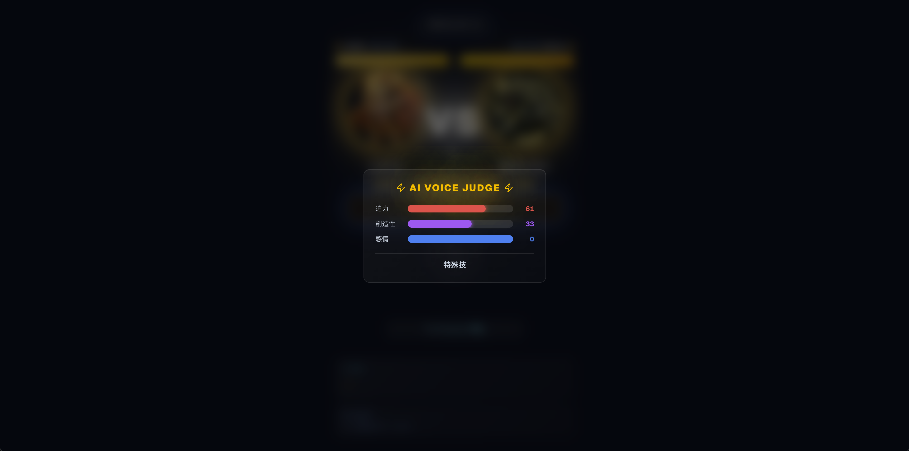
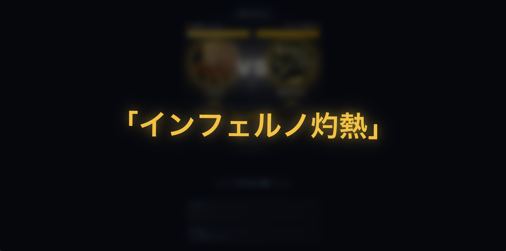


---

## Gemini API 3モデル統合

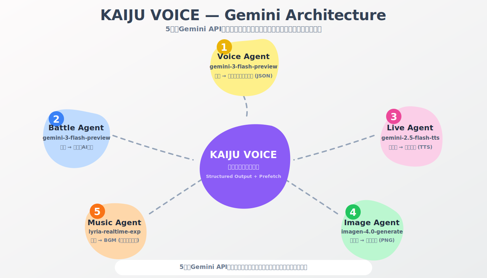

このプロジェクトの核心は、**1つのゲームの中でGemini APIの異なる能力を3つ組み合わせた**ことです。

### 1. 音声分析 — gemini-3-flash-preview

プレイヤーの叫び声をGeminiに送り、Structured Outputで3軸スコアを抽出します。

```json
{
  "intensity": 85,
  "creativity": 72,
  "emotion": 90,
  "language": "mixed",
  "transcript": "ファイヤーーー！Burn everything!!",
  "attackType": "ultimate"
}
```

**設計のポイント**:

- `intensity`（迫力）: 声の大きさ・勢い・威圧感
- `creativity`（創造性）: 技名のユニークさ、言葉遊び、詩的表現
- `emotion`（感情）: 叫びに込められた怒り・決意・情熱

日英混在で叫ぶと「創造性ボーナス」が加算される仕様にしました。ハッカソン会場では「インフェルノ喰らえ」のつもりが「人類よ、くだばれ！」？！になって非常にウケましたw

`attackType`も3段階に分かれていて:

- `physical`: 普通の叫び
- `special`: 技名を叫んだ場合
- `ultimate`: 詩的・多言語混在・独創的な叫び

### 2. AI対戦ロジック — gemini-3-flash-preview

AI対戦相手は単なるランダムではなく、**戦況を読んで「感情」を持つ**ように設計しました。`temperature: 1.0`、`maxOutputTokens: 150` で毎回異なる叫びを生成します。

システムプロンプトではAIに「怪獣としての人格」を与えています:

```
あなたは怪獣バトルゲーム「KAIJU VOICE」に登場するAI怪獣「グレイシアス」です。
属性: ice（使える技のヒント: 氷結・絶零・凍牙・吹雪）
```

HP比率に応じて状況説明（`situationNote`）が切り替わります:

```
AI HP < 25% → 「絶体絶命。必死で、感情的で、必殺技を繰り出す。」
AI HP < 50% → 「追い詰められている。焦りと怒りが混じった攻撃をする。」
相手HP < 25% → 「圧倒的優勢。余裕と高揚感を持って畳み掛ける。」
それ以外     → 「互角の戦い。力強く、自信を持って攻撃する。」
```

属性ごとの技名ヒントテーブルも渡しています:

| 属性    | ヒント                 |
| ------- | ---------------------- |
| fire    | 灼熱・炎・業火・爆炎   |
| ice     | 氷結・絶零・凍牙・吹雪 |
| thunder | 雷鳴・迅雷・電撃・雷光 |
| earth   | 地震・岩砕・大地・崩壊 |
| void    | 虚無・消滅・暗黒・混沌 |

**HPが減るにつれてAIが必死になっていく**のが見えるので、プレイヤーの没入感が段違いでした。

### 3. 怪獣画像生成 — Imagen 4 (imagen-4.0-generate-001)

怪獣・ヒーローの画像をImagen 4で動的に生成します。1:1アスペクト比で、属性とカテゴリに応じたプロンプトを構築:

```
怪獣: "Infernus, fire element kaiju, [action], dark background, epic lighting"
ヒーロー: "Solaris, light element hero, [action], golden aura, dark background, epic lighting"
```

プリセットの10体にそれぞれ個性的なビジュアルを持たせました。

---

## 技術アーキテクチャ

### Tech Stack

| カテゴリ   | 技術                               |
| ---------- | ---------------------------------- |
| Framework  | Next.js 16 / React 19              |
| Language   | TypeScript (strict)                |
| Styling    | Tailwind CSS 4                     |
| AI         | `@google/genai` + `@ai-sdk/google` |
| State      | XState 5 + useReducer              |
| Animation  | Framer Motion 12                   |
| Validation | Zod 4                              |
| Testing    | Vitest + Testing Library           |

---

## Gemini APIマルチモデル設計パターン

### 「専門エージェント」としてのAPI設計

本プロジェクトでは、3つのGemini APIをそれぞれ**専門エージェント**として独立設計しました。各エージェントが得意な領域に特化し、ゲーム体験全体を支えています。

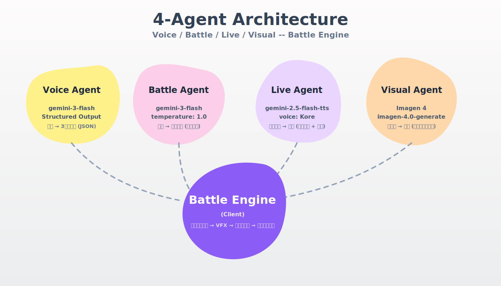

---

## AIエージェント（スキル）を活用した爆速UI/UX構築

今回のハッカソンではバックエンドのGemini API連携だけでなく、フロントエンドのUI・UX構築にもAIエージェント（スキル）をフル活用しました。専門的なデザイン知識がなくても、以下のような特化型スキルを組み合わせることで、見栄えが良く没入感のあるUIを驚くべきスピードで構築できました。

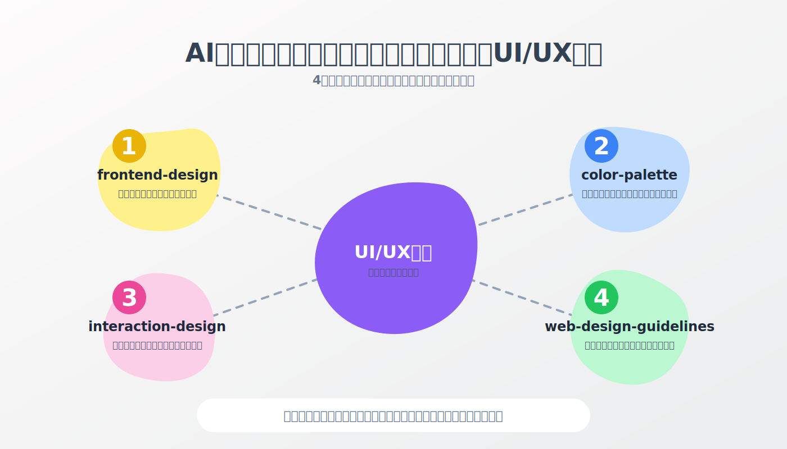

- **ui-ux-pro-max / frontend-design**: アプリ全体のモダンなコンポーネント設計や、Tailwind CSSを用いた高品質なスタイリングのベースを生成。
- **color-palette**: 怪獣バトルにふさわしいダークモードベースの配色や、属性（火・氷・雷など）ごとのセマンティックなアクセントカラーを自動生成し、統一感のあるデザインシステムを構築。
- **interaction-design**: 攻撃時の画面の揺れ（PinchOverlay）や、HP減少時の心音パルス、クリティカルヒット時のフラッシュなど、ゲーム体験に不可欠なマイクロインタラクションの実装を支援。
- **web-design-guidelines**: 出来上がったUIに対してアクセシビリティやレイアウトのチェックを行い、コントラスト比の調整や視認性の最適化を実施。

これらの専用スキルを活用することで、「AIにコードを書かせる」だけでなく「AIにデザインとUXを考えさせる」ことができ、限られた開発時間の中でUIのクオリティを大幅に引き上げることができました。

---

## AIエージェントを活用した開発パイプライン — feature-pilot

**ここが今回のプロジェクトで一番伝えたいポイントです。**

Gemini APIの統合やVFX演出など、プロダクト側の技術も重要ですが、それを**ハッカソンの限られた時間内に実現できた理由**は、開発プロセスそのものをAIエージェントで自動化したことにあります。

今回のプロジェクトでは、単にコードを書くフェーズだけでなく、**要件定義 → 設計 → 仕様書生成 → TDD実装 → 品質検証 → 完了**までの開発パイプライン全体を、**`feature-pilot`** というオーケストレーターエージェントが統括する仕組みを構築しました。

### feature-pilot — 開発の「単一進入点」

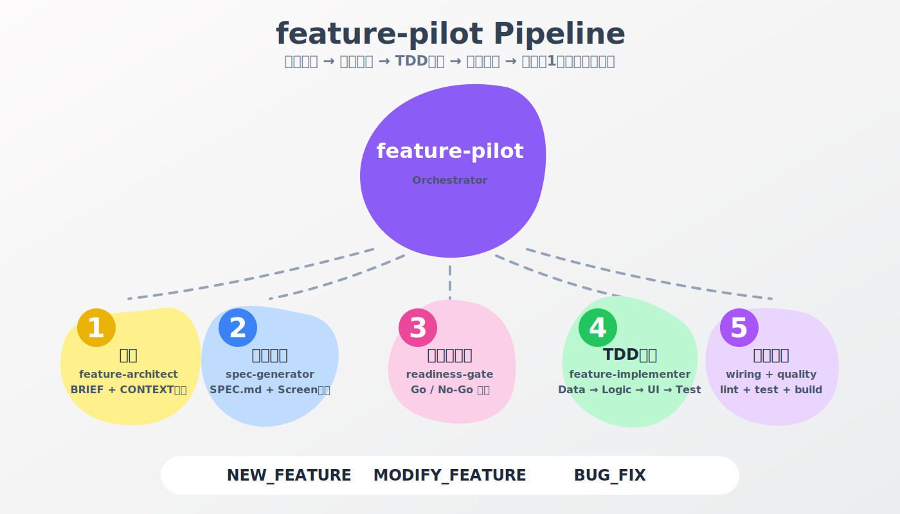

`feature-pilot` はすべての開発要求の**単一進入点（Single Entry Point）**です。「〜を追加して」「〜が動かない」「〜を変更して」といった自然言語の入力を受け取ると、以下を自動的に判別します：

1. **作業タイプ判別**: `NEW_FEATURE` / `MODIFY_FEATURE` / `BUG_FIX` を自動分類
2. **Tier判定**: 規模に応じて S（単純）/ M（中規模）/ L（大規模）/ XL を判定
3. **パイプライン選択**: 作業タイプとTierに応じた最適なパイプラインを自動選択

つまり、**「音声分析機能を追加して」と一言伝えるだけで、設計からテスト完了まで自律的に実行される**のです。

### Pipeline as Code — YAMLで定義された再現可能なワークフロー

パイプラインは `.claude/pipelines/` にYAML形式で定義されています。これにより**パイプラインそのものがGit管理され、再現可能**です。

```yaml
# .claude/pipelines/new-feature.yaml (抜粋)
tiers:
  S: # 単純機能 (<5 FR)
    - architect # BRIEF + CONTEXT生成
    - spec # SPEC.md + Screen文書
    - readiness_gate # Go / No-Go 判定
    - implement # TDD実装 (Data→Logic→UI→Test)
    - quality_gate # lint + test + build
    - dod_verification # 完了契約検証
  M: # 中規模 (5-10 FR) — S + 以下を追加
    - constraints_load
    - ui_approval # UIワイヤーフレーム承認
    - wiring # 統合検証 (Export/ルート/データフロー)
    - status_sync # CONTEXT.json ↔ コード同期

global:
  evidence_caching: true # 同一検証の再実行を30-60分キャッシュ
  model_fallback:
    order: [haiku, sonnet, opus] # コスト最適化 + 自動昇格
```

#### 3種のパイプライン — 作業タイプに応じた最適なフロー

`feature-pilot` は入力を解析し、以下の3種のパイプラインから最適なものを自動選択します。それぞれが異なる課題に対して最適化されたワークフローを持っています。

---

#### Pipeline 1: NEW_FEATURE — ゼロから機能を構築する完全フロー

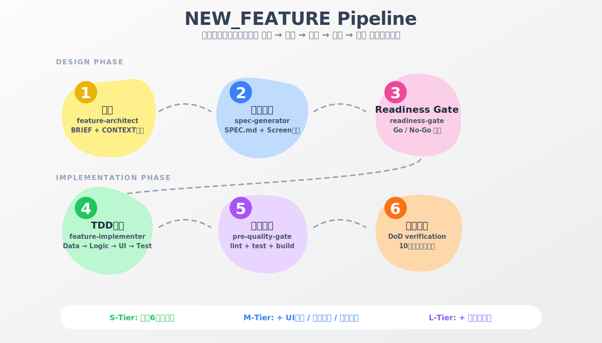

**トリガー**: 「〜を追加して」「〜機能が欲しい」

新機能開発は最も複雑なパイプラインです。**何もない状態から、設計・仕様・実装・検証を一気通貫で実行**します。

| Phase  | ステップ    | エージェント             | 成果物                   |
| ------ | ----------- | ------------------------ | ------------------------ |
| 設計   | 1. 要件整理 | `feature-architect`      | BRIEF.md + CONTEXT.json  |
| 設計   | 2. 仕様生成 | `feature-spec-generator` | SPEC.md + Screen文書     |
| ゲート | 3. Go/No-Go | `readiness-gate`         | 5項目の実装可能性検証    |
| 実装   | 4. TDD実装  | `feature-implementer`    | Data → Logic → UI → Test |
| 検証   | 5. 品質検証 | `pre-quality-gate`       | lint + test + build      |
| 完了   | 6. 完了検証 | `DoD verification`       | 10項目の完了契約         |

**Tier別の追加ステップ**:

- **M-Tier**（中規模機能）: 上記に加え `constraints_load`（技術制約読込）、`ui-approval-gate`（UIワイヤーフレーム承認）、`feature-wiring`（統合検証）、`status-sync`（CONTEXT.json同期）が追加
- **L/XL-Tier**（大規模機能）: さらに `discovery_full`（技術調査）、`priority_calc`（優先度分析）が追加

**設計のポイント**: Step 3のreadiness-gateが**実装前の最後の砦**です。SPECのJSON Schema整合性、上流文書との矛盾、技術制約違反を検出し、「実装してから気づく手戻り」を防止します。KAIJU VOICEでは、この仕組みにより音声分析APIのスキーマ不整合を実装前に2回検出し、大幅な手戻りを回避できました。

---

#### Pipeline 2: MODIFY_FEATURE — 既存機能の安全な変更

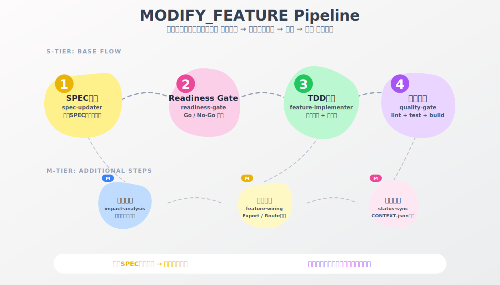

**トリガー**: 「〜を変更して」「〜の仕様を修正して」

既存機能の変更は、新規開発とは異なるリスクを持ちます。**既に動いているコードを壊さずに変更する**ことが最大の課題です。

| Phase  | ステップ    | エージェント          | 特徴                           |
| ------ | ----------- | --------------------- | ------------------------------ |
| 分析   | 1. SPEC更新 | `spec-updater`        | 既存SPECをロードし差分のみ更新 |
| ゲート | 2. Go/No-Go | `readiness-gate`      | 変更後SPECの整合性検証         |
| 実装   | 3. 差分実装 | `feature-implementer` | 影響範囲を限定したTDD実装      |
| 検証   | 4. 品質検証 | `quality-gate`        | lint + test + build            |

**M-Tier追加ステップ**: `impact-analysis`（影響範囲分析） → `feature-wiring`（統合検証） → `status-sync`（状態同期）

**NEW_FEATUREとの違い**: spec-generatorではなく**spec-updater**を使用します。spec-updaterは既存のSPEC.mdをロードし、変更された箇所のみを更新します。変更履歴がSPEC内に記録されるため、「なぜこの仕様に変わったのか」が追跡可能です。

KAIJU VOICEでは「AI対戦のtemperature値を0.8→1.0に変更」「属性相性テーブルの倍率調整」といった変更でこのパイプラインが活躍しました。既存のテストが壊れていないことを自動検証してくれるので、バランス調整を安心して繰り返せました。

---

#### Pipeline 3: BUG_FIX — 根本原因の特定と回帰防止

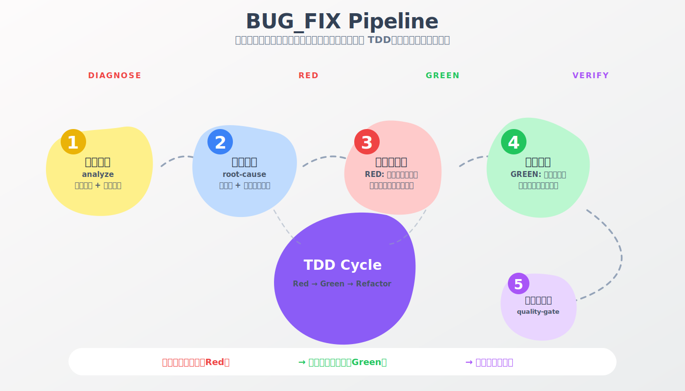

**トリガー**: 「〜が動かない」「〜でエラーが出る」

バグ修正パイプラインは**TDDの原則に最も忠実**です。「まず失敗するテストを書き、それを通すコードを書く」という Red → Green サイクルを徹底します。

| Phase | ステップ      | エージェント      | TDDサイクル                            |
| ----- | ------------- | ----------------- | -------------------------------------- |
| 診断  | 1. 問題分析   | `analyze`         | 再現手順 + エラーログ収集              |
| 診断  | 2. 根本原因   | `root-cause`      | コード + 依存関係の解析                |
| Red   | 3. 回帰テスト | `regression-test` | **バグを再現する失敗テストを先に作成** |
| Green | 4. 修正実装   | `fix`             | **テストが通る最小限の修正**           |
| 検証  | 5. 品質検証   | `quality-gate`    | lint + test + build                    |

**このパイプラインの核心はStep 3（Red）です。** バグを直す前に「バグを確実に再現するテスト」を書くことで、以下の効果を得ます:

1. **修正の正確性を証明** — テストが Red → Green に変わることで、修正が確実にバグに対処したことを機械的に証明
2. **回帰防止** — 同じバグが将来再発した場合、テストが即座に検知
3. **スコープの限定** — 「最小限の修正でテストを通す」制約が、不要な変更の混入を防止

KAIJU VOICEでは「属性相性の計算結果がNaNになる」「音声分析APIのタイムアウト処理が不適切」といったバグでこのパイプラインが発動し、いずれも回帰テスト付きで修正されました。ハッカソン中の緊急バグ修正でも「テストなしの場当たり的修正」を防げたのは大きかったです。

### 10以上の専門エージェントが連携する

`feature-pilot` 単体がすべてをこなすわけではありません。**10以上の専門エージェント（スキル）を適切な順序で呼び出す**のがオーケストレーターの役割です。

```
ユーザー: 「怪獣の画像生成機能を追加して」
  ↓
feature-pilot（オーケストレーター）
  ├─ feature-architect:     意図を整理し、BRIEF.md + CONTEXT.json生成
  ├─ feature-spec-generator: 実装可能なSPEC.md + Screen文書を生成
  ├─ ui-approval-gate:      UIワイヤーフレームを生成し、人間が承認
  ├─ readiness-gate:        5項目のGo/No-Go検証
  ├─ feature-implementer:   TDD方式で4フェーズ順序実装
  ├─ feature-wiring:        Export/ルート/データフローの統合検証
  ├─ feature-status-sync:   CONTEXT.json(SSOT)とコードの同期
  └─ pre-quality-gate:      lint + test + build + アーキテクチャ検証
```

各エージェントは**Tier別のモデルルーティング**で動作します。探索や単純検証は軽量な`Haiku`で、実装は`Sonnet`で、アーキテクチャ判断は`Opus`で — コストを30-50%削減しつつ品質を維持する仕組みです。

### TDD駆動の実装フェーズ

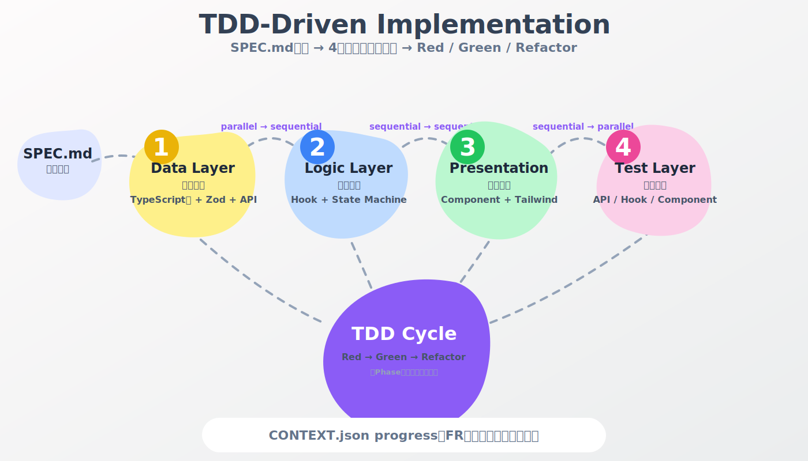

`feature-implementer` はSPEC.mdを「契約」として受け取り、**4フェーズの決まった順序**で実装を進めます：

| Phase | レイヤー     | 内容                             | 実行方式 |
| ----- | ------------ | -------------------------------- | -------- |
| 1     | Data Layer   | TypeScript型 + Zodスキーマ + API | 並列実行 |
| 2     | Logic Layer  | Custom Hook + State Machine      | 順次実行 |
| 3     | Presentation | React Component + Tailwind       | 順次実行 |
| 4     | Test Layer   | API / Hook / Component テスト    | 並列実行 |

各Phase内で **Red（失敗テスト作成）→ Green（実装）→ Refactor** のTDDサイクルを回します。進捗はCONTEXT.jsonの `progress` セクションにFR（機能要件）単位で自動記録されるので、セッションが中断されても正確に再開できます。

### 3-Tier品質ゲートシステム

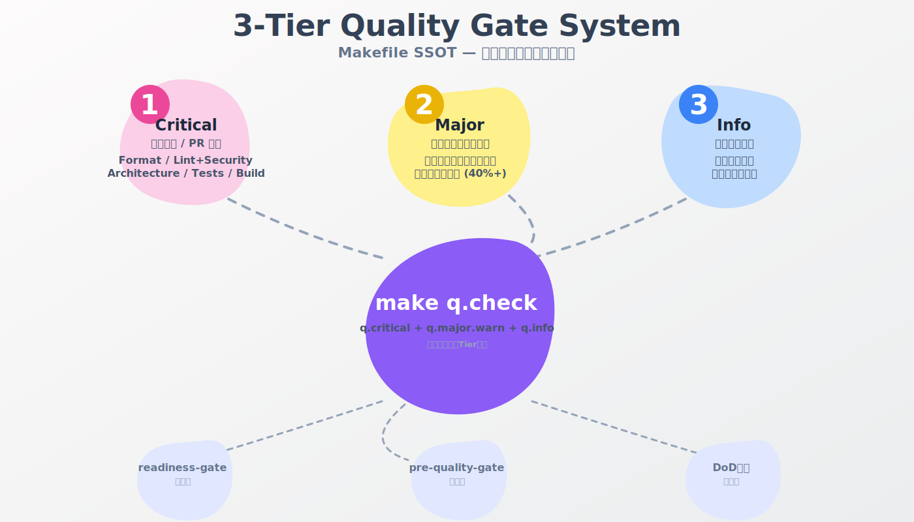

品質検証は**深刻度別の3-Tier構成**で、Makefile（SSOT）に定義されています：

| Tier         | 失敗時の扱い       | 検証項目                                          |
| ------------ | ------------------ | ------------------------------------------------- |
| **Critical** | コミット/PR不可    | Format, Lint+Security, Architecture, Tests, Build |
| **Major**    | 警告表示、進行可能 | テストファイル存在確認, カバレッジ閾値(40%+)      |
| **Info**     | 参考情報のみ       | 品質サマリー, メトリクス                          |

パイプライン内では**3つの検証ポイント**で品質を担保します：

1. **readiness-gate**（実装前）: SPECのスキーマ検証、上流契約、技術制約の確認
2. **pre-quality-gate**（実装後）: `make q.check` で lint + test + build + アーキテクチャ検証
3. **DoD検証**（完了前）: 10項目の完了契約（Definition of Done）を機械的に検証

```bash
make q.check  # Critical + Major + Info を一括実行
# → Format Check → Lint+Security → Architecture → Tests → Build
```

### CONTEXT.json — セッションを超える記憶

`feature-pilot` が管理する `CONTEXT.json` は、開発状態の**唯一の真実のソース（SSOT）**です。

```json
{
  "quick_resume": "音声分析機能の実装中。Phase 2完了、Phase 3に着手",
  "progress": {
    "percentage": 60,
    "completed_frs": ["FR-001", "FR-002", "FR-003"],
    "current_fr": "FR-004"
  },
  "decisions": [{ "what": "Zodスキーマから型を導出", "why": "SSOT維持のため" }],
  "current_state": "Implementing"
}
```

これにより、**AIのコンテキストウィンドウが溢れてセッションが圧縮されても、作業状態は完全に保存**されます。次のセッションで `quick_resume` を読むだけで状況を把握し、中断した正確な地点から再開できます。

### 実際の効果 — ハッカソンでの体感

この仕組みがハッカソンにもたらした効果は劇的でした：

| 効果                     | 詳細                                                                             |
| ------------------------ | -------------------------------------------------------------------------------- |
| **人間の役割が変わった** | コーディングではなく「何を作るか(What)、なぜ作るか(Why)」の意思決定と最終レビューに集中                 |
| **品質が落ちない**       | 急いでも品質ゲートがCriticalエラーを自動的にブロック                             |
| **手戻りが激減**         | readiness-gateが実装前にSPECの不整合を検出し、実装後の「思ってたのと違う」を防止 |
| **中断に強い**           | CONTEXT.jsonにより、休憩後や翌日の再開もスムーズ                                 |
| **一貫性の維持**         | TDD + Feature-First構造の強制により、急ぎでも一貫したコードベースを維持          |

**「ハッカソンでここまでやるのか」と思われるかもしれません。** しかし実際には、この仕組みがあったからこそ、Gemini APIの3モデル統合、7種のVFXコンポーネント、感情駆動AI対戦といった複雑な機能群を、限られた時間内に品質を保ちながら構築できました。

AIエージェントは「コードを書く道具」ではなく、**「開発プロセスそのものを自動化するインフラ」**として使うことで、その真価を発揮します。

---

## 審査でのフィードバック

ハッカソンの審査基準は:

- **デモ (50%)**: 実際に動作する形で示す
- **インパクト (25%)**: 将来性・有用性
- **技術 (25%)**: Gemini APIの活用度

KAIJU VOICEが評価されたと思われるポイント:

1. **デモの盛り上がり** — 「叫び声バトル」は見ている人も巻き込むエンターテインメント
2. **Gemini APIの多角的活用** — 3つのモデルを1つのゲーム体験に統合。審査員の方々からは、**「デモの斬新さと独創的な面白さが評価の決め手となった」**とのフィードバックを直接いただきました。

---

## 振り返り

### うまくいったこと

- **意思決定のスピード** — 一人チームという特性を活かし、Geminiをリサーチやブレストなどフル活用。その結果、検討プロセスを大幅に短縮し、スピード感のある開発ができた
- **「声で戦う」コンセプト** — シンプルで直感的。特にデモ試演でインパクトがあった。英語が苦手なためなるべく見るだけ説明不要で面白さが伝わることに専念
- **Gemini 3-flash の安定性** — Structured Outputの精度が高く、安定性が重要でパースエラーがほぼゼロ

### 改善したかったこと

- **リアルタイムAI実況（TTS）が不安定** — `gemini-2.5-flash-preview-tts`を使ったプロレス中継風AI実況を実装したが、音声生成が不安定でバグが多く、結局本番では使えなかった。コンセプトとしてはデモ映えする機能だっただけに残念。最終的にコードから削除した
- **音声認識の精度** — 会場の騒音環境では認識が不安定になった（私の発音が良くなかった可能性もあります）
- **戦況連動BGMに** — Lyria Realtime APIを初めて使いましたが、テンポよく進むと間に合わない時があった
- **マルチプレイヤー** — WebSocket対応のリアルタイムPvPまでは実装しきれなかった

### 学び

1. **ハッカソンでは「デモ映え」が全て** — 技術的に凄くても、デモで伝わらなければ意味がない。KAIJU VOICEは「叫ぶ」という行為自体がデモ映えする
2. **AIの「感情」は没入感を生む** — AI対戦相手に感情的な振る舞いをさせると、プレイヤーの没入度が段違いに上がる
3. **Structured Outputの安定性** — Gemini + JSON Schema の組み合わせで、AIの出力が安定的にパースできる。ゲームのようなリアルタイムアプリでは必須
4. **パイプライン化されたAIエージェントは神** — 単なるコード生成ではなく、`feature-pilot` のように開発ワークフロー全体をオーケストレーションする仕組みを作ったことで、ハッカソンの限られた時間でも迷いなく実装を進められました。

---

## 最後に

「声で怪獣を戦わせる」というバカバカしいコンセプトですが、そこにGeminiのマルチモーダル能力（音声分析 × 言語生成 × 画像生成）を全力で投入した結果、想像以上にエキサイティングなゲーム体験になりました。

特にgemini-3-flash-previewの**Structured Outputの安定性**は驚異的で、ゲームという「パースエラー即死」の環境で一度もクラッシュしませんでした。音声入力→JSON構造化データ→ダメージ計算というリアルタイムパイプラインが安定動作したのは、Gemini 3の推論精度とJSON Schema制約の組み合わせがあってこそです。

そして何より、**Gemini 3の100万トークン超のコンテキストウィンドウ**がなければ、Agent Skillsパイプラインという開発手法自体が成り立ちませんでした。仕様書・制約ルール・既存コードを丸ごと読み込ませて一貫性のある実装を自律的に生成する — この体験は、Geminiだからこそ実現できたものです。

素晴らしいAPIと、最高のハッカソンの場を提供してくださったGoogle DeepMindチーム、Cerebral Valley、Supercellの皆様に心から感謝しています。

**リポジトリ**: https://github.com/buddypia/kaiju-voice
**デモ動画**: https://www.youtube.com/watch?v=uF3PV5CS03M

ハッカソン、最高に楽しかったです。次も出ます。
